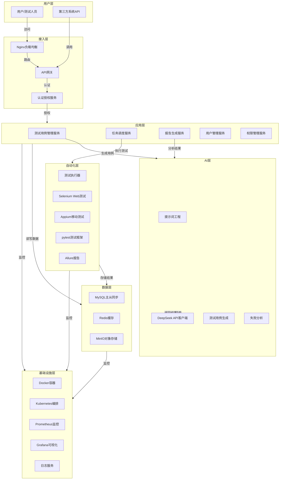
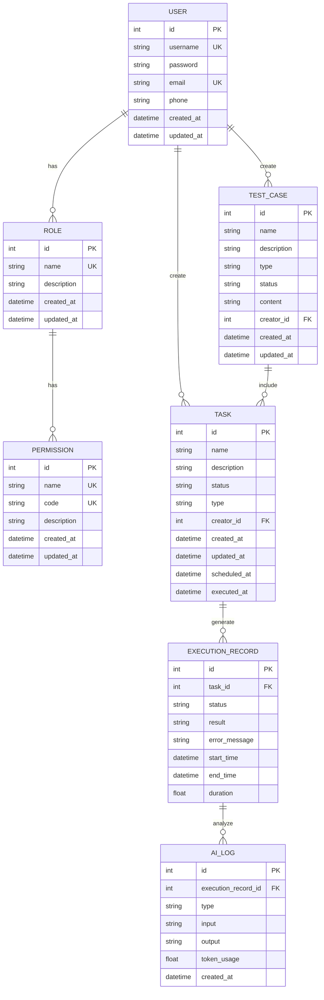

# AI TestMaster（AI自动化测试平台）上市级技术架构设计

## 1. 整体架构

### 1.1 分层架构图

### 1.2 架构设计原则

- **高可用性**：采用Nginx负载均衡、MySQL主从同步、Kubernetes编排等技术，确保系统24/7稳定运行
- **高扩展性**：服务化架构设计，支持水平扩展，应对业务增长
- **易维护性**：模块化设计，代码结构清晰，文档完善，便于维护和升级
- **安全合规**：符合ISO27001标准，实现数据加密、访问控制、操作审计等安全措施

## 2. 技术栈

| 分层 | 技术 | 版本 | 用途 |
|------|------|------|------|
| 前端 | Vue | 3.4 | 前端框架 |
| 前端 | Vite | 5.0 | 构建工具 |
| 前端 | Element Plus | 2.8 | UI组件库 |
| 前端 | Pinia | 2.0 | 状态管理 |
| 前端 | Axios | 1.6 | HTTP客户端 |
| 后端 | Python | 3.10 | 编程语言 |
| 后端 | FastAPI | 0.104 | Web框架 |
| 后端 | Uvicorn | 0.24 | ASGI服务器 |
| 后端 | SQLAlchemy | 2.0 | ORM框架 |
| 自动化层 | Selenium | 4.15 | Web自动化测试 |
| 自动化层 | Appium | 2.5 | 移动自动化测试 |
| 自动化层 | pytest | 7.4 | 测试框架 |
| 自动化层 | Allure | 2.24 | 测试报告 |
| AI层 | DeepSeek | deepseek-chat | AI模型 |
| AI层 | LangChain | 0.1 | 提示词工程 |
| 数据层 | MySQL | 8.0 | 关系型数据库 |
| 数据层 | Redis | 7.0 | 缓存 |
| 数据层 | MinIO | - | 对象存储 |
| 基础设施 | Docker | 25.0 | 容器化 |
| 基础设施 | Nginx | 1.25 | 负载均衡 |
| 基础设施 | Prometheus | 2.45 | 监控 |
| 基础设施 | Grafana | 10.2 | 监控可视化 |

## 3. 数据库ER图

## 4. 非功能需求

### 4.1 性能
- **响应时间**：单接口响应时间≤200ms
- **并发能力**：支持100个并发测试任务
- **查询性能**：万级用例查询响应时间≤1s
- **AI处理**：测试用例生成响应时间≤5s，失败分析响应时间≤3s

### 4.2 安全
- **合规标准**：符合ISO27001信息安全管理体系标准
- **传输安全**：支持HTTPS加密传输
- **数据安全**：敏感数据脱敏存储，数据库加密
- **权限控制**：基于RBAC（基于角色的访问控制）模型
- **操作审计**：记录所有关键操作日志，支持审计追踪
- **API安全**：实现API密钥认证、请求频率限制

### 4.3 部署
- **部署模式**：支持公有云、私有化部署
- **容器化**：使用Docker容器化部署
- **编排方案**：提供Docker Compose（单机）和Kubernetes（集群）两种部署方案
- **CI/CD**：支持持续集成/持续部署
- **监控**：集成Prometheus + Grafana监控体系
- **日志**：集中式日志管理，支持日志分析和告警

### 4.4 可靠性
- **可用性**：系统可用性≥99.9%
- **容错**：实现服务降级、熔断机制
- **备份**：定期数据备份，支持灾难恢复
- **故障转移**：MySQL主从复制，支持自动故障转移

### 4.5 可维护性
- **代码规范**：遵循PEP8（Python）和ESLint（前端）代码规范
- **文档**：提供完整的API文档、部署文档、使用文档
- **日志**：详细的系统日志，便于问题定位
- **监控**：关键指标监控，及时发现和解决问题
