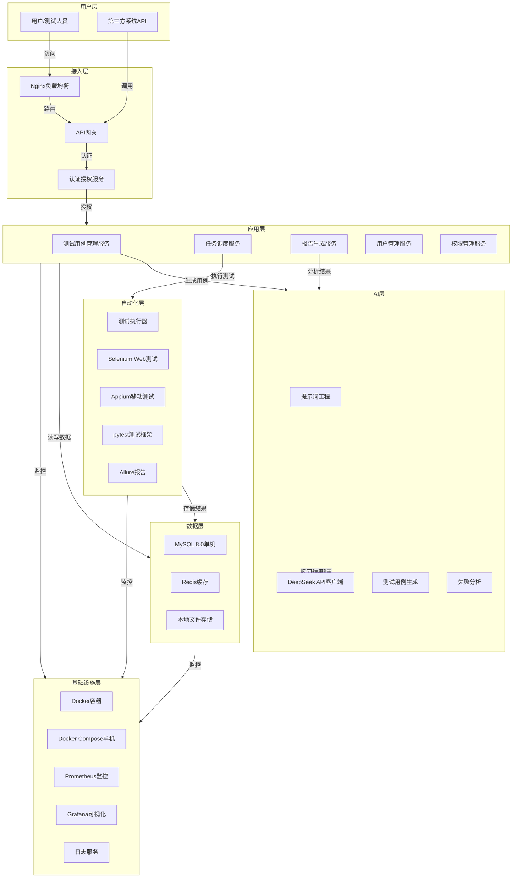
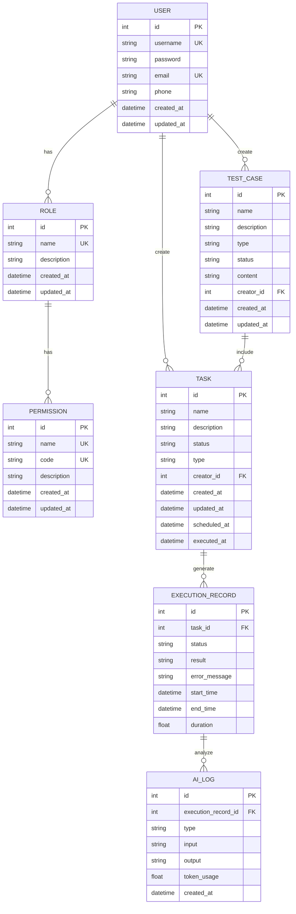

# AI TestMaster（AI自动化测试平台）上市级技术架构设计

## 1. 整体架构

### 1.1 分层架构图

### 1.2 架构设计原则

- **高可用性**：采用Nginx负载均衡、单机MySQL、Docker Compose编排等技术，确保系统稳定运行（MySQL主从同步、Kubernetes编排为规划中）
- **高扩展性**：服务化架构设计，支持水平扩展，应对业务增长
- **易维护性**：模块化设计，代码结构清晰，文档完善，便于维护和升级
- **安全合规**：符合ISO27001标准，实现数据加密、访问控制、操作审计等安全措施

## 2. 技术栈

| 分层 | 技术 | 版本 | 用途 |
|------|------|------|------|
| 前端 | Vue | 3.4 | 前端框架 |
| 前端 | Vite | 5.0 | 构建工具 |
| 前端 | Element Plus | 2.8 | UI组件库 |
| 前端 | Pinia | 2.0 | 状态管理 |
| 前端 | Axios | 1.6 | HTTP客户端 |
| 后端 | Python | 3.10 | 编程语言 |
| 后端 | FastAPI | 0.104 | Web框架 |
| 后端 | Uvicorn | 0.24 | ASGI服务器 |
| 后端 | SQLAlchemy | 2.0 | ORM框架 |
| 后端 | APScheduler | 3.10.4 | 定时任务调度 |
| 后端 | prometheus-fastapi-instrumentator | 7.0.0 | 指标采集 |
| 自动化层 | Selenium | 4.15 | Web自动化测试 |
| 自动化层 | Appium | 2.5 | 移动自动化测试 |
| 自动化层 | pytest | 7.4 | 测试框架 |
| 自动化层 | Allure | 2.24 | 测试报告 |
| AI层 | DeepSeek | deepseek-chat | AI模型 |
| 数据层 | MySQL | 8.0 | 关系型数据库 |
| 数据层 | Redis | 7.0 | 缓存 |
| 数据层 | 本地文件存储 | - | 文件存储（规划MinIO） |
| 基础设施 | Docker | 25.0 | 容器化 |
| 基础设施 | Nginx | 1.25 | 负载均衡 |
| 基础设施 | Prometheus | 2.45 | 监控 |
| 基础设施 | Grafana | 10.2 | 监控可视化 |

## 3. 后端模块结构

> 本节补充 `app/` 下核心模块的职责说明，便于新成员快速定位代码。模块边界与 `app/` 实际目录结构保持一致。

### 3.1 核心业务服务（`app/services/`）

| 模块 | 职责 | 关键文件 |
|------|------|----------|
| `test_case_generation/` | AI 驱动的测试用例生成编排，组合模式组合 ContextBuilder / AIGenerator / BatchOrchestrator / Validator 四组件 | `__init__.py`、`batch_orchestrator.py`、`_context_builder.py` |
| `case_quality/` | 用例质量评分（完整性/冗余度/覆盖度/复杂度）与反馈闭环，为 AI 生成提供历史信号 | `quality_scoring_service.py`、`quality_feedback_loop.py`、`coverage_service.py` |
| `url_driven/` | URL 驱动的一键快速测试：站点探索 → DOM 锚定 → AI 生成 → 任务装配 | `quick_launcher.py`、`auto_case_generator.py`、`site_explorer.py`、`task_assembler.py` |
| `self_test/` | 自检流水线编排：项目搭建 → pipeline 步骤执行 → 缺陷/严重度评估 | `_orchestrator.py`、`_pipeline_steps_run.py`、`_defect_bug.py` |
| `review_service/` | 用例审核 inbox 与决策落库 | `_core.py`、`__init__.py` |
| `task_service/` | 测试任务生命周期管理与执行引擎调度 | `core_mixin.py`、`execution_mixin.py` |
| `ui_spec_parser/` | UI 原型图批量解析管道（单图/批量/多图流转） | `pipeline_mixin.py`、`pipeline_upload_mixin.py` |

### 3.2 反向推理流水线（`app/pipelines/`）

| 子模块 | 职责 |
|--------|------|
| `runner.py` | 流水线执行器，串联 steps 并收集进度/指标 |
| `steps/` | 流水线步骤实现：前向扫描（`forward_scan/`）、后向扫描（`backward_scan/`）、反向推理（`reverse_infer/`）、决策分发（`decision_dispatch/`）、对账（`reconciliation/`）、质量门（`quality_gate.py`）、用例生成与持久化（`case_generation.py`、`persist.py`） |
| `scenarios/` | 5 种场景判定与分支处理（scenario_1 ~ scenario_5） |
| `schemas/` | 流水线内部数据结构（如 `backward_verdict.py`） |
| `prompts/` | 流水线专用提示词模板 |
| `context.py` / `base.py` | 流水线上下文与基类定义 |

### 3.3 共享工具（`app/utils/`）

| 文件 | 职责 |
|------|------|
| `async_sync_bridge.py` | 异步/同步桥接：`run_async_coro_in_thread` 将 async service 调用放到独立线程，避免 sync Session 阻塞 ASGI 事件循环；`iter_async_gen_in_thread` 桥接 async generator |
| `ai_concurrency.py` | AI 生成并发控制模块级信号量单例：`ai_generation_slot()` 异步上下文管理器，跨事件循环安全（`threading.Semaphore` + `asyncio.to_thread`），限制全局 AI 调用不超过 `AI_CASE_GENERATION_CONCURRENCY` |
| `ai_client_core.py` / `ai_client_stream/` | DeepSeek 客户端核心与流式调用封装 |
| `ai_client_parser.py` | AI JSON 响应 4 级容错解析（直接/修复/清洗/代码块提取） |
| `jwt_utils.py` | JWT 签发与校验 |
| `crypto.py` | 敏感字段加解密 |
| `http_utils.py` | HTTP 请求头构建工具 |

### 3.4 API 端点（`app/api/v1/endpoints/`）

端点按业务域拆分为独立模块，单文件 ≤350 行（超限文件已按 `_helpers.py` / `_routes.py` / `_mutations.py` 模式拆分）。关键域：

- `test_case_ai_generate/` — AI 用例生成（`_context.py` 上下文构建与单条生成、`_generate.py` 批量生成、`_stream.py` SSE 流式）
- `test_case_ai_stream.py` — 批量生成 SSE 入口
- `case_quality_check.py` / `case_quality_report.py` — 质量分析与审核
- `case_migration.py` — 用例跨设备迁移与 Excel 导入导出
- `quick_test.py` — URL 驱动快速测试入口
- `iteration/` — 迭代管理
- `review_inbox/` — 审核收件箱
- `pipeline_artifacts.py` — 流水线产物查询（已拆分为 helpers/routes/mutations）

### 3.5 数据访问与基础设施

| 模块 | 职责 |
|------|------|
| `app/db/database/` | 引擎与会话工厂：`_engine.py` 主从引擎懒加载、`_session.py` PrimarySessionLocal / AsyncPrimarySessionLocal、`async_get_db` / `get_db` 依赖 |
| `app/crud/` | 数据访问层，按业务域拆分（`test_point/`、`test_case.py`、`file.py` 等），提供 sync 与 async 双版本 |
| `app/core/config.py` | 全局配置（Pydantic Settings），包含 `AI_CASE_GENERATION_CONCURRENCY`、`CORS_ALLOW_HEADERS`、`ENVIRONMENT` 等 |
| `app/core/key_management.py` | JWT 密钥管理：来源审计日志（`[KEY_AUDIT]`）、生产环境强制校验 |
| `app/core/exception/` | 全局异常处理器：`_handlers.py` 注册 6 类异常处理器，500 错误统一返回固定字符串不泄露堆栈 |
| `app/core/permissions.py` | 项目级权限校验（`require_project_owner` 等） |
| `app/models/` | SQLAlchemy ORM 模型定义 |

## 4. 数据库ER图

## 5. 非功能需求

### 5.1 性能
- **响应时间**：单接口响应时间≤200ms
- **并发能力**：支持100个并发测试任务
- **查询性能**：万级用例查询响应时间≤1s
- **AI处理**：测试用例生成响应时间缓存命中≤5s，冷调用≤30s（受 deepseek-v4-flash 推理模型 reasoning_tokens 消耗影响）；失败分析响应时间≤3s

### 5.2 安全
- **合规标准**：符合ISO27001信息安全管理体系标准
- **传输安全**：支持HTTPS加密传输
- **数据安全**：敏感数据脱敏存储，数据库加密
- **权限控制**：基于RBAC（基于角色的访问控制）模型
- **操作审计**：记录所有关键操作日志，支持审计追踪
- **API安全**：实现API密钥认证、请求频率限制

### 5.3 部署
- **部署模式**：支持公有云、私有化部署
- **容器化**：使用Docker容器化部署
- **编排方案**：当前提供Docker Compose（单机）部署方案，Kubernetes（集群）为规划中未实现
- **CI/CD**：支持持续集成/持续部署
- **监控**：集成Prometheus + Grafana监控体系（通过docker-compose --profile monitoring可选启用）
- **日志**：集中式日志管理，支持日志分析和告警

### 5.4 可靠性
- **可用性**：系统可用性≥99.9%
- **容错**：实现服务降级、熔断机制
- **备份**：定期数据备份，支持灾难恢复
- **故障转移**：当前为单机MySQL 8.0，MySQL主从复制为规划中未实现

### 5.5 可维护性
- **代码规范**：遵循PEP8（Python）和ESLint（前端）代码规范
- **文档**：提供完整的API文档、部署文档、使用文档
- **日志**：详细的系统日志，便于问题定位
- **监控**：关键指标监控，及时发现和解决问题
