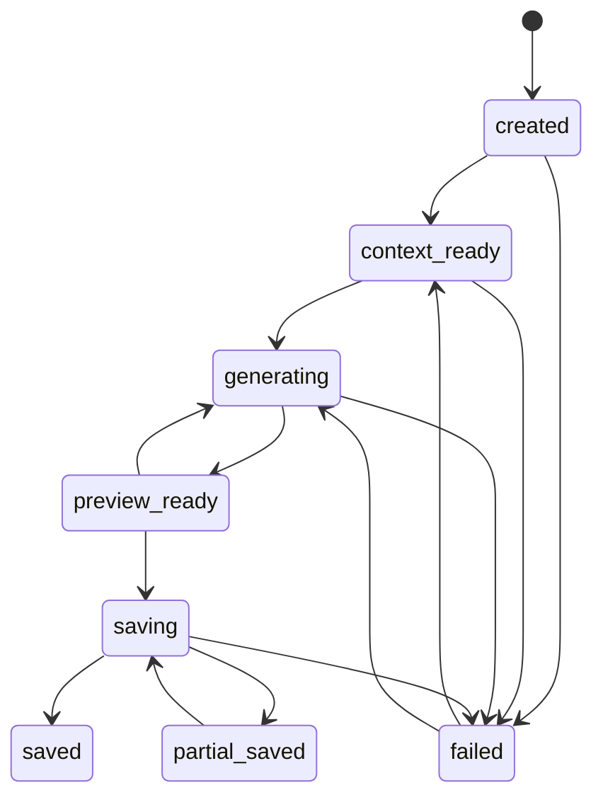

# ai-testmaster 资料融合驱动测试用例生成与更新落地方案

## 1. 文档目的

本文档用于支撑 `ai-testmaster` 从“多条技术生成路径”逐步升级为“资料融合驱动的测试用例生成与更新闭环”。

当前系统已经具备 AI 生成、测试点批量生成、XMind 导入、Excel 迁移、用例保鲜、回归变更分析、上下文精准化、历史用例可信过滤、`context_stats`、`warnings`、`evidence_refs` 等能力。问题不在于缺少单点能力，而在于用户入口、上下文组装、生成策略、质量提示、保存语义和审计链路尚未形成统一闭环。

本方案不主张一次性推倒重来，而是按阶段落地：

```text
一期：新功能生成用例闭环，优先支持“需求 / 测试点 / UI 可选”
二期：增强 UI 原型图链路，提升 A1 完整资料生成质量
三期：历史资产更新入口，整合 Excel / XMind / 保鲜 / 迁移
四期：底层治理，统一 AI 调用、Prompt、质量、版本和编号能力
```

核心原则：

- 用户体验优先，操作简单便捷。
- 不强制用户上传 UI 原型图。
- 不让用户理解底层技术路径。
- 不让 AI 直接覆盖历史用例。
- 不静默丢弃低质量结果。
- 不静默 AI 降级。
- 不把生成结果直接当作已保存结果。
- 不一次性重构全部后端接口。
- 旧入口和旧接口保留兼容，新增任务型入口逐步承接主流程。

## 1.1 用户体验一级原则

资料融合驱动不是把更多配置暴露给用户，而是让用户用更少操作完成生成和保存。默认流程必须服务普通测试人员，而不是要求用户理解上下文策略、Prompt、Pipeline、流式生成、历史保鲜、质量门禁等技术概念。

目标体验：

```text
选择任务
→ 选择资料
→ 看懂风险
→ 一键生成
→ 快速预览
→ 简单确认
→ 保存入库
```

体验要求：

- 页面只突出当前阶段最重要的主操作。
- 高级配置默认折叠，系统优先使用推荐值。
- 缺失 UI、缺失需求、上下文低完整性等风险必须用业务语言解释。
- 生成过程必须显示可理解的进度，不只显示 loading。
- 低质量结果不静默丢弃，但默认不选中保存。
- 保存前必须明确告知“当前只是预览，点击保存后才入库”。
- 失败后必须给出可恢复操作，例如重试、返回修改资料、查看部分结果、保存为草稿。

## 2. 当前项目现状与适配判断

### 2.1 已具备的基础能力

当前项目已经具备以下落地基础：

- `TestPoint.requirement_id` 可用于从测试点定位关联需求。
- `Requirement.description` 可作为精准需求正文来源。
- `UIPrototypeScreen.ui_spec`、`summary`、`navigation_flow`、`related_screens` 可作为 UI 上下文来源。
- 历史用例已有 `title`、`summary`、`expected_result`、`steps_json` 等字段，可摘要化用于避重。
- 当前上下文生成链路已返回 `context_stats`、`warnings`、`evidence_refs`。
- 历史用例已具备可信过滤思路：低可信、疑似 stale、需求不匹配用例不进入 prompt。
- 无 UI 场景已经具备降级基础：`ui_automation` 可降级为 `manual` 或草稿模式。
- `CaseRefreshSuggestion`、`TestCaseVersion` 已经为保鲜建议、审核、diff、回滚打下基础。
- `ABTestMetric` 已经可用于后续效果评估和指标埋点。

### 2.2 当前不适合直接做的事

以下内容不适合作为一期强制范围：

- 不新增完整 `MaterialParseService`。
- 不新增完整 `AIInvocationGateway`。
- 不新增完整 `PromptRegistry`。
- 不强制建设后端 preview 暂存表。
- 不一次性改造 Excel / XMind / 保鲜 / 迁移所有路径。
- 不下线旧接口。
- 不修改现有用例编号规则。
- 不把所有生成路径改造成 Pipeline。
- 不让 AI 自动覆盖历史用例。
- 不把质量校验直接改成阻断式。

原因：

- 当前项目已有多条成熟路径，直接统一会引入大范围回归风险。
- 用户最常见问题是“需求和测试点生成用例，UI 不一定有”，不是立刻需要全资料融合平台。
- 历史资产更新涉及版本、diff、审核、回滚，不能在一期和新功能生成混做。
- Prompt、AI 调用、质量门禁是底层治理能力，必须在主流程稳定后再抽象。

## 3. 产品定位

### 3.1 从技术路径改为任务入口

用户不应该直接选择：

```text
AI 增强生成
流式生成
批量测试点生成
Pipeline 生成
XMind 导入生成
Excel 迁移生成
用例保鲜
单条重新生成
前置条件解析
```

用户应该选择真实任务：

```text
1. 新功能生成用例
2. 历史资产更新用例
3. 导入测试资产
```

### 3.2 三个任务入口定义

#### 入口一：新功能生成用例

用户意图：

```text
我有新需求或测试点，要生成测试用例。
```

一期主入口。

支持资料：

- 需求文档或已有需求内容。
- AI 提取测试点或已维护测试点。
- UI 原型图，可选。
- 用户补充说明，可选。

一期支持场景：

- B1：需求文档 + 测试点，无 UI。
- A1-lite：需求文档 + 测试点 + 已解析 UI。

#### 入口二：历史资产更新用例

用户意图：

```text
我以前有 Excel 用例、XMind 测试点或系统里的旧用例，现在要基于新版本更新。
```

三期主入口。

承接能力：

- Excel 历史用例。
- XMind 历史测试点。
- 新迭代需求。
- 新 UI 原型图。
- 用例保鲜建议。
- 用例迁移。

输出类型：

- 可复用。
- 建议修改。
- 新增。
- 可能废弃。
- 待确认。

#### 入口三：导入测试资产

用户意图：

```text
我只想先把旧资产导入系统，暂不生成新用例。
```

支持资料：

- Excel 测试用例。
- XMind 测试点。

输出：

- 解析结果。
- 字段映射。
- 重复检测。
- 质量提示。
- 用户确认导入。

## 4. 一期闭环范围

### 4.1 一期目标

一期必须完成一个真实可用闭环：

```text
选择“新功能生成用例”
→ 选择项目和资料
→ 系统识别资料完整度
→ 推荐生成策略
→ 用户确认策略
→ AI 生成用例预览
→ 展示来源、风险、质量提示
→ 用户编辑 / 删除 / 单条重新生成
→ 保存确认
→ 入库
→ 展示保存结果
```

一期不是只做页面壳，也不是只生成不保存；必须让用户能完成从资料选择到保存入库的完整流程。

### 4.2 一期支持场景

#### 场景 B1：需求文档 + 测试点，无 UI

这是最高频场景。

输入：

- 需求文档或需求内容。
- AI 提取测试点或系统已有测试点。
- 无 UI 原型图。

策略：

```text
REQUIREMENT_TESTPOINT_STANDARD_GENERATION
```

生成重点：

- 功能主流程。
- 异常流程。
- 边界条件。
- 权限校验。
- 状态流转。
- 数据校验。

限制：

- 不生成确定性的 UI 自动化步骤。
- 不编造按钮、输入框、页面布局。
- 如果测试点必须涉及 UI 操作，步骤中标记 `待确认UI`。
- 默认 `case_type` 倾向 `manual` 或低置信草稿。

前端提示：

```text
当前未提供 UI 原型图，系统将主要基于需求和测试点生成用例。
页面元素、按钮名称、布局细节可能需要人工确认。
```

#### 场景 A1-lite：需求文档 + 测试点 + 已解析 UI

输入：

- 需求文档或需求内容。
- 测试点。
- 已解析 UI 页面或显式选择的 UI 页面。

策略：

```text
FULL_CONTEXT_GENERATION_LITE
```

生成重点：

- 功能主流程。
- 异常流程。
- 边界条件。
- UI 交互步骤。
- 页面元素。
- 跳转关系。

限制：

- UI 元素存在性只能来自 `ui_spec`。
- 跳转关系只能来自 `navigation_flow` 或 `related_screens`。
- UI 匹配失败不能回退全量 UI。
- UI 缺失或低置信时必须输出 warning。

### 4.3 一期不做

一期明确不做以下内容，避免范围失控：

- 不做完整资料库模型。
- 不建设后端 preview 表。
- 不统一所有 Prompt。
- 不统一所有 AI 调用入口。
- 不下线 `AI生成用例`、`测试点管理`、`用例迁移`、`保鲜建议` 等旧入口。
- 不把 Excel / XMind / 保鲜 / 迁移并入新功能生成主流程。
- 不做历史资产 diff 更新闭环。
- 不让 AI 自动归档或覆盖历史用例。
- 不做复杂审批流。
- 不强制质量门禁阻断保存。
- 不承诺真实界面执行率达到固定值。

### 4.4 一期成功标准

一期上线后，用户应能完成：

- 在一个任务型入口中选择“新功能生成用例”。
- 选择项目、需求资料、测试点、可选 UI。
- 看到资料识别结果和缺失风险。
- 看到推荐策略。
- 启动生成并看到进度。
- 在预览页查看生成结果、来源依据、质量提示。
- 编辑、删除、单条重生成。
- 保存前看到摘要。
- 保存为草稿或正式用例。
- 保存后看到成功与失败明细。

## 5. 一期前端设计

### 5.1 页面结构

新增或改造主页面：

```text
智能生成用例
```

推荐路由：

```text
/home/case/smart-generate
```

菜单处理：

- 保留现有 `AI生成用例` 菜单。
- 新增 `智能生成用例` 作为推荐入口。
- 旧入口暂不隐藏，避免影响已有用户。

### 5.2 页面步骤

#### Step 1：任务选择

展示三个任务卡片：

```text
新功能生成用例
历史资产更新用例
导入测试资产
```

一期只有“新功能生成用例”可进入完整流程。

其他两个入口展示：

- 当前阶段说明。
- 可跳转到现有页面：
  - 历史资产更新用例：跳转 `用例迁移` 或 `保鲜建议`。
  - 导入测试资产：跳转 `测试点管理` 的 XMind 导入或现有 Excel 导入能力。

不应让未完成入口成为死按钮。

体验要求：

- 三个入口使用用户能理解的任务名称，不出现“AI 增强”“Pipeline”“流式生成”等技术词。
- 每张卡片只展示适用场景、建议资料和最终产出。
- 一期主入口“新功能生成用例”视觉优先级最高。
- 未完整实现的入口给出当前可用替代路径，不让用户进入空页面。

#### Step 2：资料选择

字段：

- 项目，必选。
- 需求资料，至少一个：
  - 需求文件。
  - 需求记录。
  - 已提取测试点所关联需求。
- 测试点，至少一个。
- UI 页面，可选。
- 生成类型，默认根据 UI 是否存在自动推荐：
  - 有 UI：`ui_automation` 可选。
  - 无 UI：默认 `manual`。

资料选择规则：

- 没有测试点时，提示先去“测试点管理”提取或新建。
- 没有 UI 时允许继续。
- 选择 `ui_automation` 但没有 UI 时，前端弹出确认并建议降级为 `manual`。

体验要求：

- 默认只展示必选资料和 UI 可选入口。
- 用例类型、执行模式、历史参考数量等高级配置折叠展示。
- 无 UI 时提供清晰操作：`继续生成`、`补充上传 UI`。
- 用户选择 `继续生成` 后自动降级到更合适的生成模式，不要求用户理解 `manual` / `ui_automation` 的技术差异。
- 每一步都有明确下一步按钮，不让用户猜流程。

#### Step 3：资料识别与风险提示

调用现有 `generate-context`。

展示：

- 需求是否命中。
- 测试点数量。
- UI 页面是否命中。
- 历史用例注入数量。
- 完整性评分。
- warnings 分组。
- evidence_refs 来源。

资料完整度展示：

```text
L3 资料充足：需求 + 测试点 + UI
L2 资料较完整：需求 + 测试点
L1 资料不足：只有测试点或只有需求
L0 不建议生成：关键资料为空或解析失败
```

注意：前端分级只用于展示，后端策略以 `context_stats` 和 `warnings` 为准。

体验要求：

- `context_stats`、`warnings`、`evidence_refs` 不直接原样展示给普通用户。
- 默认展示业务化摘要，技术详情折叠在“查看详情”中。
- 用户应能在 3 秒内理解：资料是否足够、缺少什么、是否可以继续。

常见 warning 文案映射：

| warning code | 用户可理解文案 |
| --- | --- |
| `UI_NO_MATCH` | 未找到匹配的 UI 页面，页面元素需要人工确认 |
| `REQUIREMENT_NOT_FOUND` | 未找到关联需求，本次生成可信度较低 |
| `HISTORY_POTENTIALLY_STALE` | 部分历史用例可能过时，已不作为生成依据 |
| `HISTORY_LOW_TRUST_FILTERED` | 部分历史用例与当前资料不匹配，已排除 |
| `CONTEXT_COMPLETENESS_LOW` | 资料完整度较低，建议保存为草稿后人工复核 |
| `UI_REQUIRED_ELEMENT_MISSING` | 当前 UI 资料可能缺少测试点所需页面元素 |

#### Step 4：策略确认

根据资料组合自动推荐策略。

无 UI：

```text
策略：标准需求生成
依据：需求 + 测试点
重点：功能、异常、边界、权限、状态、数据校验
风险：UI 元素和页面布局需要人工确认
```

有 UI：

```text
策略：完整上下文生成
依据：需求 + 测试点 + UI
重点：功能、异常、边界、页面交互、元素校验
风险：仅使用已解析 UI 页面，不匹配全量 UI
```

用户操作：

- 开始生成。
- 返回修改资料。
- 仅查看资料分析。
- 取消。

体验要求：

- 默认只突出一个主按钮：`开始生成`。
- 策略名称面向用户展示为“标准需求生成”或“完整资料生成”，技术策略值仅在详情中展示。
- 风险提示短句化，不堆叠大段说明。
- 用户可以返回修改资料，但不需要手动选择底层生成接口。

#### Step 5：生成进度

进度阶段：

```text
1. 构建上下文
2. 评估资料完整度
3. 过滤历史参考
4. 组装生成策略
5. 调用 AI 生成
6. 解析生成结果
7. 执行质量检查
8. 生成预览
```

无 UI 时显示：

```text
跳过 UI 解析：未提供 UI 原型图
```

异常处理：

- AI 超时：允许重试或查看部分结果。
- AI JSON 解析失败：展示失败原因，允许重试。
- 上下文低完整性：继续生成但结果标记待确认。
- UI 匹配失败：继续生成，但不生成确定性 UI 自动化步骤。

体验要求：

- 进度展示使用用户能理解的动作：
  - 正在读取需求。
  - 正在分析测试点。
  - 正在检查 UI 资料。
  - 正在过滤过时历史用例。
  - 正在生成测试用例。
  - 正在检查质量。
  - 正在准备预览结果。
- 无 UI 时显示：`已跳过 UI 分析：未提供 UI 原型图，将按需求和测试点生成用例`。
- 失败后提供可恢复操作：`重试生成`、`返回修改资料`、`查看已生成结果`、`保存为草稿`。

#### Step 6：结果预览

每条用例展示：

- 标题。
- 模块。
- 前置条件。
- 步骤。
- 预期结果。
- 优先级。
- 用例类型。
- 测试点。
- 来源依据。
- 质量状态。
- 待确认项。

分组：

- 全部。
- 功能主流程。
- 异常场景。
- 边界场景。
- 权限场景。
- 数据校验。
- 待确认。
- 不建议保存。

来源依据展示：

- 需求：`requirement_id`、`req_no`、标题。
- UI：`ui_screen_id`、`screen_name`、confidence。
- 历史参考：`case_id`、`case_no`、`design_tag`、similarity、trust_level。
- warning：对应 code 和说明。

质量状态：

```text
passed           通过
warning          有轻微问题
pending_review   需要人工确认
rejected         不建议直接保存
```

一期质量状态可由前端根据已有信号粗略计算：

- 有 `CONTEXT_COMPLETENESS_LOW`：`pending_review`。
- 有 `UI_NO_MATCH` 且用例包含具体 UI 元素：`pending_review`。
- 无 UI 且 `case_type=ui_automation`：`rejected` 或自动降级。
- 缺少步骤或预期结果：`rejected`。
- 其他 warning：`warning`。

不允许静默过滤低质量结果。

体验要求：

- 顶部展示可处理摘要：可直接保存 N 条、需要确认 N 条、不建议保存 N 条。
- 默认选中可保存项。
- 待确认项明显标识，但仍允许用户查看和编辑。
- 不建议保存项不隐藏，但默认不选中。
- 支持批量选择、批量取消、批量保存为草稿。
- 来源依据默认展示摘要，技术 ID 可折叠查看。

#### Step 7：编辑与单条重新生成

支持：

- 编辑标题、前置条件、步骤、预期结果、优先级、类型。
- 删除单条。
- 单条重新生成。
- 标记确认。
- 标记保存为草稿。

单条重新生成复用现有 AI 生成接口即可，一期不要求单独新增专用接口。

体验要求：

- 编辑操作应在预览页内完成，不强制跳转。
- 单条重新生成只影响当前用例，不刷新整批结果。
- 重新生成前保留旧结果，失败时可回退。

#### Step 8：保存确认

保存前展示摘要：

```text
本次将保存：
- 可直接保存：N 条
- 需要确认：N 条
- 不建议保存：N 条
```

保存选项：

- 保存为草稿。
- 保存为正式用例。
- 仅保存已通过项。
- 取消。

保存提示：

```text
当前只是生成预览，尚未入库。点击保存后才会写入用例库。
```

体验要求：

- 保存确认要强调“预览”和“入库”的区别。
- 有待确认项时，默认推荐保存为草稿。
- 不建议保存项默认排除，用户可手动勾选。

#### Step 9：保存结果

展示：

- 成功数量。
- 失败数量。
- 失败原因。
- 已保存用例入口。
- 重试失败项。

部分失败不能只弹一个错误提示，必须展示明细。

体验要求：

- 成功后提供 `查看已保存用例`。
- 失败项提供 `重试失败项`。
- 用户可返回预览继续编辑，不丢失未保存内容。

## 6. 一期后端设计

### 6.1 复用现有能力

一期后端不重构生成主链路。

继续复用：

- `POST /api/v1/test-case/generate-context`
- `POST /api/v1/test-case/ai-enhanced-generate`
- `POST /api/v1/test-case/ai-enhanced-generate/stream`
- `POST /api/v1/test-point/batch-generate-cases/stream`

新增能力只围绕：

- 轻量批次追踪。
- 保存幂等。
- 生成结果审计关联。

### 6.2 generation_batch 模型

新增轻量模型：

```text
GenerationBatch
```

建议表名：

```text
generation_batches
```

字段：

```text
id
batch_no
project_id
user_id
entry_type
scenario_type
generation_strategy
status
requirement_file_ids_json
test_point_ids_json
ui_screen_ids_json
context_stats_json
warnings_json
evidence_refs_json
quality_summary_json
client_request_id
idempotency_key
created_at
updated_at
```

字段说明：

- `batch_no`：人类可读批次号，例如 `GB202606010001`。
- `entry_type`：当前一期固定 `NEW_FEATURE_GENERATION`。
- `scenario_type`：`B1_REQUIREMENT_TESTPOINT` 或 `A1_REQUIREMENT_TESTPOINT_UI`。
- `generation_strategy`：`REQUIREMENT_TESTPOINT_STANDARD_GENERATION` 或 `FULL_CONTEXT_GENERATION_LITE`。
- `status`：`created`、`context_ready`、`generating`、`preview_ready`、`saved`、`partial_saved`、`failed`。
- `context_stats_json`：保存上下文完整性评分等信息。
- `warnings_json`：保存结构化 warning。
- `evidence_refs_json`：保存来源依据。
- `quality_summary_json`：保存预览质量统计。
- `client_request_id`：前端生成请求 ID。
- `idempotency_key`：保存幂等 key。

### 6.3 generation_batch API

一期新增接口：

```text
POST /api/v1/generation-batches
GET  /api/v1/generation-batches/{id}
PATCH /api/v1/generation-batches/{id}
POST /api/v1/generation-batches/{id}/save
```

#### 创建批次

请求：

```json
{
  "project_id": 1,
  "entry_type": "NEW_FEATURE_GENERATION",
  "scenario_type": "B1_REQUIREMENT_TESTPOINT",
  "generation_strategy": "REQUIREMENT_TESTPOINT_STANDARD_GENERATION",
  "requirement_file_ids": [1],
  "test_point_ids": [10, 11],
  "ui_screen_ids": [],
  "client_request_id": "uuid"
}
```

行为：

- 校验项目归属。
- 创建 `generation_batch`。
- 返回 `generation_batch_id` 和 `batch_no`。

#### 查询批次

返回：

```json
{
  "id": 1,
  "batch_no": "GB202606010001",
  "project_id": 1,
  "entry_type": "NEW_FEATURE_GENERATION",
  "scenario_type": "B1_REQUIREMENT_TESTPOINT",
  "generation_strategy": "REQUIREMENT_TESTPOINT_STANDARD_GENERATION",
  "status": "preview_ready",
  "context_stats": {},
  "warnings": [],
  "evidence_refs": {},
  "quality_summary": {}
}
```

#### 更新批次

用于保存上下文分析结果和质量摘要。

请求：

```json
{
  "status": "preview_ready",
  "context_stats": {},
  "warnings": [],
  "evidence_refs": {},
  "quality_summary": {}
}
```

#### 保存预览结果

请求：

```json
{
  "idempotency_key": "uuid",
  "save_mode": "draft",
  "cases": []
}
```

`save_mode`：

```text
draft
formal
passed_only
```

行为：

- 校验批次归属。
- 校验幂等 key。
- 保存用例。
- 成功后把批次状态改为 `saved` 或 `partial_saved`。
- 返回成功和失败明细。

一期允许前端传入预览用例数组，不要求后端提前持久化 preview 表。

### 6.4 保存幂等

幂等规则：

- 同一 `generation_batch_id + idempotency_key` 重复提交，直接返回第一次保存结果。
- 不重复创建用例。

实现方式：

- 可在 `GenerationBatch` 上记录最后一次 `idempotency_key` 和保存结果。
- 或新增轻量保存记录表 `generation_batch_saves`。

一期推荐使用 `generation_batch_saves`，避免覆盖批次主记录。

字段：

```text
id
batch_id
idempotency_key
save_mode
request_hash
result_json
created_at
```

### 6.5 保存用例字段映射

前端预览用例保存到 `TestCase` 时，至少映射：

- `project_id`
- `title`
- `module`
- `precondition`
- `steps_json`
- `expected_result`
- `priority`
- `case_type`
- `case_category`
- `test_point_id`
- `generate_status`
- `lifecycle_status`

建议扩展或复用可用字段记录：

- `generation_batch_id`，若当前 `TestCase` 没有该字段，一期可先写入扩展字段或审计日志，不强制改表。
- `source_refs_json`，一期不强制写入 `TestCase`，优先保存在 `generation_batch`。

## 7. 二期详细方案：增强 UI 原型图链路

二期目标是完整支持：

```text
A1：需求文档 + 测试点 + UI 原型图生成用例
```

一期已经允许选择 UI，但二期要把 UI 变成高质量上下文，而不只是可选参数。

### 7.1 二期用户闭环

二期用户流程：

```text
选择新功能生成用例
→ 选择需求和测试点
→ 上传或选择 UI 原型图
→ 系统解析 UI
→ 系统匹配测试点与 UI 页面
→ 用户确认 UI 匹配结果
→ 生成包含 UI 依据的用例
→ 预览来源和质量
→ 保存
```

### 7.2 UI 资料接入方式

二期支持：

- 选择已有 UI 原型图。
- 选择已有已解析 UI 页面。
- 上传单张 UI 图片。
- 批量上传 UI 图片。
- 上传压缩包。
- 粘贴原型链接，若当前已有链接解析能力则接入，否则先作为备注保存。

UI 仍然不是必填。

体验要求：

- 用户可选择不上传 UI 并继续生成。
- 用户可只上传关键页面，不要求补齐全量 UI。
- 批量上传失败时允许跳过失败项继续。
- UI 解析较慢时允许后台解析，用户可先按需求和测试点生成。
- 上传入口应提供“稍后补充 UI”的明确选择。

### 7.3 UI 解析状态展示

前端展示每个 UI 资料状态：

```text
未解析
解析中
解析成功
解析失败
部分成功
```

解析失败时展示：

- 文件名。
- 失败原因。
- 可重试操作。
- 继续无 UI 生成。

### 7.4 UI 与测试点关联

二期必须增加 UI 匹配确认能力。

匹配来源：

- 显式选择。
- 测试点关键词匹配 `screen_name`。
- 测试点关键词匹配 `summary`。
- 测试点关键词匹配 `ui_spec`。
- 流程词匹配 `navigation_flow`。

前端展示：

```text
测试点：手机号验证码登录
推荐 UI 页面：
- 登录页，匹配原因：页面名命中，置信度 high
- 验证码弹窗，匹配原因：ui_spec 命中，置信度 medium
```

用户操作：

- 接受推荐。
- 手动更换页面。
- 添加相邻页面。
- 标记无对应 UI。

体验要求：

- 默认推荐一组 UI 匹配结果，用户只在必要时调整。
- 不要求用户逐项配置页面元素。
- 匹配结果用简洁文案展示，例如：

```text
测试点：手机号登录
推荐页面：登录页
匹配原因：页面名称和输入框命中
置信度：较高
```

- 置信度展示为“较高 / 中等 / 较低”，技术字段折叠展示。

### 7.5 UI 来源依据展示

预览用例中每条 UI 操作应能追溯：

```text
点击【获取验证码】
来源 UI：登录页 / ui_screen_id=12 / confidence=explicit
```

若 UI 来源不足：

```text
该步骤涉及 UI 操作，但未找到明确 UI 元素依据，请人工确认。
```

### 7.6 UI 质量校验

二期增强质量校验：

- 步骤中的按钮、输入框、页面名是否存在于 `ui_spec`。
- 测试点需要的关键元素是否在 UI 中存在。
- 页面跳转是否有 `navigation_flow` 支撑。
- UI 页面匹配置信度是否过低。

质量结果：

- UI 元素全部命中：`passed`。
- 部分命中：`warning`。
- 未命中但无 UI：`pending_review`。
- 编造明显元素：`rejected`。

### 7.7 二期后端增强

后端增强点：

- `generate-context` 返回 UI 匹配原因。
- `evidence_refs.ui_screens` 增加：
  - `confidence`
  - `match_reason`
  - `matched_terms`
  - `is_explicit`
- `context_stats` 增加：
  - `ui_match_score`
  - `ui_parse_success_count`
  - `ui_parse_failed_count`
  - `ui_required_element_missing_count`
- 新增或复用 UI 元素抽取工具，输出元素集合。

### 7.8 二期验收标准

- 用户可在向导内上传或选择 UI。
- UI 解析失败不阻断生成。
- 测试点和 UI 页面匹配结果可见、可修改。
- 生成结果展示 UI 来源依据。
- 无 UI 时仍可走一期 B1 策略。
- UI 匹配失败不回退全量 UI。
- UI 元素命中率可展示。
- 低置信 UI 用例进入待确认，而不是静默保存。
- UI 上传和匹配流程不会成为必填负担。
- 用户不需要逐个配置 UI 元素即可继续生成。

## 8. 三期详细方案：历史资产更新入口

三期目标是支持：

```text
A2：历史 Excel + 新需求 + 测试点 + UI
A3：历史 XMind + 新需求 + 测试点 + UI
B2：历史 XMind + UI
B3：历史 Excel + UI
```

### 8.1 三期入口定位

入口名称：

```text
历史资产更新用例
```

用户意图：

```text
我已有旧用例或旧测试点，现在要根据新资料更新。
```

### 8.2 三期输入资料

历史资产至少一种：

- Excel 测试用例。
- XMind 测试点。
- 系统已有历史用例。

新资料至少一种：

- 新迭代需求。
- 新测试点。
- 新 UI 原型图。

### 8.3 三期输出类型

必须按类型输出：

```text
REUSE_CASE          可复用
UPDATE_CASE         建议修改
NEW_CASE            新增
DEPRECATED_CASE     可能废弃
CONFIRM_REQUIRED    待确认
```

不允许直接只输出一批新用例。

体验要求：

- 默认先展示更新摘要，不直接铺满 diff。
- 用户优先看到系统建议：

```text
系统建议：
- 18 条可复用
- 6 条建议修改
- 4 条新增
- 2 条可能废弃
```

- 差异对比只在用户点开“建议修改”时展示。
- 避免让用户一次性审核过多内容。

### 8.4 Excel 历史用例场景

流程：

```text
上传 Excel
→ 解析字段
→ 映射为历史用例候选
→ 与新需求 / 测试点 / UI 对齐
→ 输出复用 / 修改 / 新增 / 废弃建议
→ 用户确认
→ 保存新版本或新增用例
```

关键规则：

- 不直接覆盖 Excel 原始用例。
- 不直接把 Excel 用例全量导入为正式用例。
- 字段不完整的用例进入待确认。
- 与新需求冲突的用例进入建议修改或可能废弃。

### 8.5 XMind 历史测试点场景

流程：

```text
上传 XMind
→ 解析历史测试点
→ 与新测试点合并
→ 去重
→ 补全缺失维度
→ 关联 UI
→ 生成测试用例
```

关键规则：

- 历史 XMind 只代表旧测试思路，不一定代表最新需求。
- 新需求优先级高于历史测试点。
- 没有新需求时，不得过度推断业务规则。

### 8.6 保鲜建议并入方式

现有 `CaseRefreshSuggestion` 保留。

三期将其展示归入“历史资产更新用例”入口，但底层服务可继续独立。

保鲜建议规则：

- AI 只生成建议。
- 用户审核后才应用。
- 应用前创建 `TestCaseVersion` 快照。
- 回滚必须可用。
- 废弃或归档必须走生命周期服务。

### 8.7 用例迁移并入方式

现有 `CaseMigration` 保留。

三期将其作为历史资产更新的一种策略：

```text
EXCEL_UI_ADAPTATION
```

用于：

- 旧端 Excel 用例。
- 新端 UI 原型。
- 页面元素更新。
- 步骤文案更新。
- 预期结果轻量校正。

限制：

- 缺少新需求时，不生成大量新业务用例。
- 只做 UI 适配和结构化迁移。

### 8.8 三期差异确认页面

建议修改项展示左右对比：

```text
左侧：历史用例
右侧：AI 建议更新后用例
```

差异类型：

- 标题变化。
- 前置条件变化。
- 步骤变化。
- 预期结果变化。
- UI 元素变化。
- 优先级变化。
- 新增步骤。
- 删除步骤。

用户操作：

- 接受修改。
- 部分接受。
- 手动编辑。
- 保留旧版。
- 标记待确认。

体验要求：

- 可复用默认不改。
- 新增默认选中保存为草稿。
- 建议修改默认待确认。
- 可能废弃默认不自动归档。
- 批量操作必须有二次确认。

### 8.9 三期保存规则

- 新增项保存为新用例。
- 修改项保存为候选版本或新版本。
- 可复用项不重复创建。
- 废弃项不直接归档，先进入待确认。
- 所有修改必须可回滚。

## 9. 四期详细方案：底层治理

四期目标是治理底层一致性。

### 9.1 AIInvocationGateway

统一记录：

- request_id。
- generation_batch_id。
- scenario_type。
- generation_strategy。
- model_name。
- prompt_key。
- prompt_version。
- prompt_hash。
- latency_ms。
- status。
- error_code。

错误码：

```text
AI_TIMEOUT
AI_RATE_LIMIT
AI_INVALID_JSON
AI_EMPTY_RESULT
AI_PROVIDER_UNAVAILABLE
AI_UNKNOWN_ERROR
```

### 9.2 PromptRegistry

按策略维护 prompt：

```text
FULL_CONTEXT_GENERATION_PROMPT
REQUIREMENT_TESTPOINT_STANDARD_PROMPT
EXCEL_CASE_INCREMENTAL_UPDATE_PROMPT
XMIND_TESTPOINT_MERGE_PROMPT
XMIND_UI_COMPLETION_PROMPT
EXCEL_UI_ADAPTATION_PROMPT
```

记录：

- prompt_key。
- prompt_version。
- prompt_hash。
- enabled。
- created_at。

支持：

- 灰度。
- 回滚。
- 回归集测试。

### 9.3 QualityGate 统一

拆分校验器：

- `CaseValidator`
- `UpdateSuggestionValidator`
- `ImportResultValidator`
- `MaterialConflictValidator`
- `UIReferenceValidator`
- `DuplicationValidator`

质量状态统一：

```text
passed
warning
pending_review
rejected
```

### 9.4 CaseVersionService

统一管理：

- 用例修改版本。
- AI 建议版本。
- 保鲜版本。
- 迁移版本。
- 回滚。

### 9.5 CaseNumberService

编号原则：

- 项目内唯一。
- 按创建顺序递增。
- 允许跳号。
- 不复用。
- 兼容历史编号。
- 导入编号保留到 `legacy_case_no` 或 `source_case_no`。

## 10. 关键数据流

### 10.1 一期 B1 数据流

```text
前端选择项目、需求、测试点
→ 创建 generation_batch
→ 调用 generate-context
→ 保存 context_stats / warnings / evidence_refs 到 batch
→ 前端展示资料识别与策略
→ 用户点击开始生成
→ 调用 ai-enhanced-generate
→ 前端得到 preview_cases
→ 前端执行轻量质量分组
→ 用户编辑确认
→ 调用 batch save
→ 后端幂等保存 TestCase
→ 更新 generation_batch 状态
→ 返回保存结果
```

### 10.2 一期 A1-lite 数据流

```text
前端选择项目、需求、测试点、UI 页面
→ 创建 generation_batch
→ 调用 generate-context
→ 后端按显式 ui_screen_ids 加载 UI
→ 返回 evidence_refs.ui_screens
→ 前端展示 UI 来源
→ AI 生成含 UI 依据用例
→ 预览和保存
```

## 11. 验收标准

### 11.1 一期前端验收

- 能进入 `智能生成用例` 页面。
- 能看到三个任务入口。
- “新功能生成用例”可完整走通。
- 无 UI 可继续生成。
- 无 UI 风险提示明显。
- 资料识别页展示需求、测试点、UI、历史参考、完整性评分。
- 策略确认页展示推荐策略。
- 生成进度不是单纯 loading。
- 预览页展示来源依据和质量状态。
- 可编辑、删除、单条重生成。
- 保存前有摘要。
- 保存成功和失败都有反馈。
- 新用户不理解 AI 技术路径也能完成新功能生成。
- 用户能在 3 秒内理解当前缺少哪些资料。
- 高级配置不会干扰默认主流程。
- 失败后用户知道下一步怎么处理。
- 保存前用户明确知道结果尚未入库。

### 11.2 一期后端验收

- 每次新向导生成有 `generation_batch`。
- batch 记录项目、用户、策略、资料 ID。
- batch 记录 `context_stats`、`warnings`、`evidence_refs`。
- 保存接口支持 `idempotency_key`。
- 重复保存不产生重复用例。
- 旧接口行为不变。
- 无 UI 时不会强制生成确定性 UI 自动化用例。

### 11.3 二期验收

- UI 上传和选择可在向导内完成。
- UI 解析状态可见。
- UI 解析失败可重试或跳过。
- UI 与测试点匹配结果可见。
- 用户可手动调整 UI 匹配。
- 生成用例展示 UI 来源依据。
- UI 元素命中检查结果可见。
- UI 低置信用例进入待确认。

### 11.4 三期验收

- 历史资产更新入口可接收 Excel、XMind、系统历史用例。
- 输出能区分复用、修改、新增、废弃、待确认。
- 建议修改项支持 diff。
- 不直接覆盖历史用例。
- 保存前创建版本或候选版本。
- 可回滚。
- 保鲜建议可从统一入口进入审核。

## 12. 风险与控制

| 风险 | 控制方式 |
| --- | --- |
| 一期范围膨胀 | 只完整打通新功能生成用例，历史资产更新后移 |
| 用户不上传 UI | UI 可选，无 UI 降级并提示 |
| AI 编造 UI 元素 | 无 UI 禁止确定性 UI 自动化，UI 来源必须可追踪 |
| 历史用例误导 | 只注入高可信摘要，低可信 warning |
| 低质量结果被隐藏 | 不静默过滤，进入待确认或不建议保存 |
| 用户误以为生成即保存 | 预览和保存明确分离 |
| 重复点击保存 | `idempotency_key` 幂等 |
| 旧入口用户受影响 | 旧入口保留，新增推荐入口 |
| Prompt 改动导致回归 | 一期不统一 Prompt，四期再治理 |
| 历史资产被污染 | 三期前不自动覆盖，更新必须人工确认 |
| 操作流程复杂导致用户放弃 | 默认少配置、主操作突出、高级配置折叠 |
| 技术字段吓退普通用户 | 默认展示业务文案，技术详情折叠 |

## 13. 推荐任务拆分

### 一期任务

1. 新增 `智能生成用例` 路由和菜单。
2. 新增任务选择页。
3. 实现新功能生成资料选择页。
4. 接入 `generate-context` 并展示资料识别结果。
5. 实现策略确认页。
6. 接入 AI 生成并展示进度。
7. 实现预览页、质量状态和来源依据展示。
8. 实现编辑、删除、单条重生成。
9. 新增 `generation_batch` 模型、迁移、API。
10. 实现保存确认和保存结果页。
11. 实现保存幂等。
12. 补充前后端测试。
13. 增加 warning code 到用户可理解文案的前端映射。
14. 将高级配置折叠，默认使用系统推荐值。
15. 增加失败后的恢复操作入口。

### 二期任务

1. 向导内 UI 上传 / 选择。
2. UI 解析状态展示。
3. UI 与测试点匹配确认。
4. UI 来源依据增强。
5. UI 元素命中质量检查。
6. UI 低置信降级展示。
7. 补充 A1 场景测试。
8. UI 匹配结果默认推荐，用户可选调整。
9. UI 解析慢或失败时支持跳过继续。

### 三期任务

1. 历史资产更新入口。
2. Excel 历史用例解析接入。
3. XMind 历史测试点解析接入。
4. 新旧资料对齐。
5. 复用 / 修改 / 新增 / 废弃 / 待确认分类。
6. diff 对比页面。
7. 候选版本保存。
8. 回滚链路。
9. 保鲜建议入口整合。
10. 用例迁移入口整合。
11. 历史资产更新摘要优先展示，diff 按需展开。
12. 默认推荐动作：复用不改、新增草稿、修改待确认、废弃不自动归档。

### 四期任务

1. AIInvocationGateway。
2. PromptRegistry。
3. QualityGate 统一。
4. CaseVersionService。
5. CaseNumberService。
6. Feature Flags。
7. 旧接口调用统计。
8. 旧入口 deprecated 策略。

## 14. 最终结论

当前项目最适合的落地路径不是一次性重构所有生成能力，而是：

```text
先做一个用户能闭环使用的新功能生成入口，
再把 UI 原型增强做深，
再承接历史资产更新，
最后治理底层 AI / Prompt / 质量 / 版本能力。
```

一期必须闭环，但必须克制：

- 闭环的是“新功能生成用例”。
- 不闭环的是“历史资产更新全场景”。
- 不建设完整资料平台。
- 不动所有旧路径。
- 用户体验必须闭环：少配置、强提示、可恢复、预览后保存。

这样既能解决用户当前最痛的“基于需求和测试点快速生成可用用例”问题，又不会因为过早统一所有能力导致系统大范围回归。

## 15. 三类角色审查补充与实施约束

本章节从普通用户、专业测试工程师、开发者三个视角审查本方案，并将审查结论转化为后续开发必须遵守的实施约束。该章节用于防止方案在开发过程中变成“技术闭环完整，但用户不好用、测试质量不可控、工程边界不清晰”的实现。

### 15.1 普通用户视角

普通用户关注的是能否低成本完成任务，而不是理解系统内部能力。对普通用户来说，成功体验应是：

```text
我选一个任务
→ 系统告诉我需要什么资料
→ 我缺 UI 也能继续
→ 系统告诉我风险
→ 我点生成
→ 我看结果
→ 我确认保存
```

#### 15.1.1 当前方案对普通用户友好的部分

- 入口从技术路径改为任务入口。
- UI 原型图不强制上传。
- 生成和保存分离，避免误入库。
- warning 转换为用户可理解文案。
- 失败后提供恢复动作。

#### 15.1.2 普通用户体验风险

- 如果资料完整度、策略、质量状态全部直接展示，页面仍可能显得复杂。
- 如果高级配置默认展开，用户会误以为必须理解配置才能生成。
- 如果缺 UI 时提示过重，用户可能以为不能继续。
- 如果保存前摘要不清楚，用户可能不理解哪些会入库。
- 如果失败后只有错误弹窗，用户不知道下一步如何处理。

#### 15.1.3 普通用户实施约束

一期必须实现“最短路径”：

```text
选择项目
→ 选择测试点
→ 点击开始生成
→ 预览
→ 保存为草稿
```

默认动作：

- 无 UI 时默认允许继续生成。
- 无 UI 时默认使用需求和测试点生成，不阻塞。
- 有待确认项时默认推荐保存为草稿。
- 不建议保存项默认不选中。
- 高级配置默认折叠。
- 技术详情默认折叠。

页面文案要求：

- 缺 UI 文案应表达“可以继续，但页面细节需确认”，不能表达成阻断错误。
- 低完整度文案应给出建议动作，例如“建议保存为草稿后复核”。
- 保存确认必须明确“当前是预览，保存后才入库”。
- 生成失败必须给出下一步动作，不只展示错误原因。

一期验收时必须验证：

- 新用户不理解 AI 增强、Pipeline、Prompt，也能完成新功能生成。
- 用户在资料识别页 3 秒内能理解缺什么资料。
- 用户能一眼区分可保存、待确认、不建议保存。
- 用户知道保存前结果尚未入库。
- 用户失败后知道可以重试、返回修改资料或保留草稿。

### 15.2 专业测试工程师视角

专业测试工程师关注生成结果是否可信、是否可评审、是否覆盖当前测试点、是否避免历史旧逻辑污染。

#### 15.2.1 当前方案对测试质量友好的部分

- 历史用例仅作为覆盖摘要和避重参考，不作为业务事实来源。
- 低可信、疑似 stale、需求不匹配历史用例不进入 prompt。
- 无 UI 场景不生成确定性 UI 自动化步骤。
- 低质量结果不静默丢弃，进入待确认或不建议保存。
- `evidence_refs` 支持来源审计。
- 三期历史资产更新不直接覆盖旧用例，要求 diff、版本、回滚。

#### 15.2.2 测试质量风险

- 质量状态如果没有明确判定矩阵，测试人员无法稳定验收。
- 如果只展示用例列表，不展示覆盖摘要，难以判断测试点覆盖是否充分。
- 如果为了凑数量强行生成正向、异常、边界，可能产生低质量用例。
- 单条重新生成如果改变测试点或上下文依据，会破坏追踪链路。
- 无 UI 场景下如果仍出现具体按钮、输入框、页面区域，会造成伪可执行用例。

#### 15.2.3 质量判定矩阵

一期质量状态可以先采用 record-only，但必须按统一规则展示。

| 问题 | 推荐状态 | 保存默认行为 |
| --- | --- | --- |
| 字段完整、步骤清晰、预期可断言、来源充分 | `passed` | 默认选中 |
| 存在普通 warning，但不影响理解 | `warning` | 默认选中，可提示 |
| 无 UI 但步骤出现页面操作 | `pending_review` | 默认不作为正式保存，建议草稿 |
| UI 匹配失败但用例依赖具体 UI 元素 | `pending_review` | 默认不作为正式保存 |
| 需求缺失或关联需求低置信 | `pending_review` | 默认草稿 |
| 历史用例疑似 stale 被过滤 | `warning` | 默认选中，但展示说明 |
| 缺少步骤、缺少预期结果、标题为空 | `rejected` | 默认不选中 |
| 明显编造 UI 元素或业务规则 | `rejected` | 默认不选中 |
| 与已有用例高度重复 | `pending_review` | 默认不选中或建议合并 |

#### 15.2.4 覆盖摘要要求

预览页必须展示覆盖摘要：

```text
本次测试点：N 个
已覆盖测试点：N 个
未覆盖测试点：N 个
正向用例：N 条
异常用例：N 条
边界用例：N 条
待确认用例：N 条
不建议保存：N 条
```

覆盖统计应基于测试点和用例之间的关联关系，不应只统计用例数量。

#### 15.2.5 不凑数原则

生成策略必须遵守：

- 不为了满足数量强制生成低质量异常或边界用例。
- 当前测试点只适合正向验证时，可以只生成正向用例。
- 异常、边界、权限、状态流转必须有需求或测试点依据。
- 资料不足时应输出待确认，而不是臆造。

#### 15.2.6 单条重新生成约束

单条重新生成必须保持：

- 所属 `generation_batch_id` 不变。
- 所属 `test_point_id` 不变，除非用户显式调整。
- 原始 `evidence_refs` 可追溯。
- 重新生成失败时保留旧结果。
- 新旧结果应能在前端区分，避免误保存。

#### 15.2.7 专业测试视角下的入口与流程调整

从专业测试工程师角度看，三类任务入口是合理的：

```text
新功能生成用例
历史资产更新用例
导入测试资产
```

但“资料不足”“生成失败”“预览页处理”“保存”等不应被设计成独立用户入口，它们只是生成流程中的状态或分支。前端应在当前步骤内展示提示和可恢复操作，避免让用户感觉系统存在大量路径需要选择。

入口调整要求：

- 一级入口只保留任务型入口，不暴露技术路径。
- 分支路径作为页面内状态展示，不进入菜单。
- 一期只完整展开“新功能生成用例”。
- “历史资产更新用例”和“导入测试资产”在一期可跳转到现有能力，不做复杂新流程。

#### 15.2.8 一期最短路径要求

一期必须保证普通测试人员可以走最短路径完成生成：

```text
选择项目
→ 选择测试点
→ 开始生成
→ 查看预览
→ 保存为草稿
```

实现要求：

- 需求资料优先由测试点关联关系自动带出。
- UI 资料自动匹配或允许为空，不作为阻塞。
- 历史参考自动可信过滤，不要求用户手动选择。
- 默认主按钮应始终明确，例如 `开始生成`、`查看预览`、`保存为草稿`。
- 高级配置仅作为折叠项，不影响最短路径。

#### 15.2.9 正式保存谨慎原则

AI 生成结果不应默认进入正式用例状态。专业测试视角下，默认保存策略应为：

```text
保存为草稿
```

正式保存约束：

- 默认推荐保存为草稿。
- `pending_review` 和 `rejected` 默认不得保存为正式用例。
- 存在上下文低完整性、无 UI 却出现 UI 操作、需求缺失等风险时，正式保存必须二次确认。
- 只有全部选中用例质量状态为 `passed` 或用户明确确认风险时，才允许保存为正式用例。
- 保存确认页必须展示正式保存风险提示。

推荐文案：

```text
当前结果由 AI 生成，建议先保存为草稿并人工复核。
如保存为正式用例，请确认步骤、预期结果和来源依据均已核对。
```

#### 15.2.10 历史资产更新审核负担控制

三期“历史资产更新用例”入口必须避免一次性抛出大量 diff 让测试工程师逐条审查。

默认展示顺序：

```text
更新摘要
→ 分组列表
→ 用户按需展开 diff
→ 批量确认或逐条处理
```

默认处理策略：

- `可复用`：默认折叠，不修改旧用例。
- `新增`：默认选中保存为草稿。
- `建议修改`：默认待确认，用户点开后查看 diff。
- `可能废弃`：默认不处理，不自动归档。
- `待确认`：默认不保存为正式用例。

验收要求：

- 用户能先看到摘要，再决定是否展开明细。
- diff 不应在页面初始状态全部展开。
- 批量接受修改和批量废弃必须二次确认。
- 废弃或归档必须走生命周期服务，不允许直接改状态字段。

#### 15.2.11 专业测试验收补强项

一期及后续阶段必须补充以下测试验收规则：

- 每条生成用例必须关联测试点；无法关联时必须标记“无明确测试点”。
- 每条生成用例必须展示来源依据，至少包括需求、测试点、UI、历史摘要中的一种。
- 无 UI 场景下，不允许生成确定性的按钮名、输入框名、页面布局断言。
- 有 UI 场景下，UI 操作步骤必须能追溯到 `ui_spec`。
- 生成结果必须展示覆盖摘要，不只展示用例数量。
- 不允许为了凑数量强行生成异常或边界用例。
- 保存正式用例前必须提示风险。
- 历史用例只能作为避重和覆盖参考，不得作为当前业务规则来源。

### 15.3 开发者视角

开发者关注的是改动边界、接口职责、兼容性、权限、幂等、测试和迁移风险。

#### 15.3.1 当前方案工程上合理的部分

- 一期复用现有 `generate-context` 和 AI 生成接口。
- 旧接口和旧入口保留，降低回归风险。
- `generation_batch` 先作为轻量追踪，不承担完整资料平台职责。
- 不在一期统一 Prompt 和 AI 调用网关。
- 不在一期强制建设后端 preview 表。

#### 15.3.2 工程风险

- 一期功能仍然较大，包含新页面、新模型、新接口、保存幂等、预览编辑、单条重生成。
- `generation_batch` 可能与现有迁移批次、保鲜建议、AB 指标产生概念重叠。
- 保存幂等如果定义不清，可能重复创建用例。
- 质量状态如果前后端各算各的，会产生口径不一致。
- 项目权限和归属校验容易遗漏。
- 新迁移可能导致 Alembic 多 head。

#### 15.3.3 工程实施边界

一期必须控制为：

- 新增推荐入口，不替换所有旧入口。
- 新增轻量 `generation_batch`，不替代 `migration_batch_id`、`CaseRefreshSuggestion`、`ABTestMetric`。
- 新增 batch save 接口支持幂等，不改旧 `caseApi.create` 的既有语义。
- 质量状态一期以前端展示为主，后端保留原始 `warnings`、`context_stats`、`evidence_refs`。
- 单条重新生成复用现有生成能力，不新增复杂 Agent。
- 所有新增接口必须做项目归属校验和登录鉴权。

#### 15.3.4 generation_batch 与现有模型关系

`generation_batch` 定位：

```text
资料融合生成闭环的追踪批次
```

不替代：

- `migration_batch_id`：继续表示用例迁移批次。
- `CaseRefreshSuggestion`：继续表示保鲜建议。
- `TestCaseVersion`：继续表示用例版本快照。
- `ABTestMetric`：继续表示指标采集。

关系：

- 一期生成闭环写入 `generation_batch`。
- 三期历史资产更新可在保鲜建议、迁移批次中补充关联 `generation_batch_id`，但不强制一期完成。
- A/B 指标可以记录 `generation_batch_id`，但不依赖它工作。

#### 15.3.5 接口和权限要求

所有新增接口必须满足：

- 必须依赖当前登录用户。
- 必须校验 `project_id` 是否属于当前用户可访问项目。
- 查询 batch 时不得跨项目访问。
- 保存 batch 时不得保存到其他项目。
- `idempotency_key` 必须和 batch 绑定。
- 重复提交返回首次保存结果，不再次创建用例。

#### 15.3.6 幂等要求

幂等键定义：

```text
generation_batch_id + idempotency_key
```

行为：

- 第一次提交：保存用例并记录保存结果。
- 重复提交同一 key：返回第一次结果。
- 同一 batch 使用不同 key：视为新的保存请求，但应提示可能重复保存，前端默认禁止。

一期推荐前端策略：

- 保存按钮点击后立即 loading。
- 保存完成前禁用二次点击。
- 如果刷新页面后重试，使用同一个 `idempotency_key`。

#### 15.3.7 测试和迁移要求

后端测试：

- 创建 batch 成功。
- 无权限项目创建 batch 失败。
- 查询其他项目 batch 失败。
- 保存 batch 成功。
- 重复 `idempotency_key` 不重复创建。
- 部分保存失败返回明细。
- `generate-context` 仍返回 `context_stats/warnings/evidence_refs`。

前端测试：

- 新入口路由可访问。
- 无 UI 可继续生成。
- warning 文案正确映射。
- 预览页按质量状态分组。
- 不建议保存项默认不选中。
- 保存前确认出现。
- 保存失败明细可见。

工程检查：

- `python -m compileall app -q`
- 后端关键 pytest。
- `npx vue-tsc --noEmit`
- `npm run build`
- `alembic heads` 保持单一 head。

### 15.4 角色审查后的最终实施口径

综合三类角色视角，一期最终实施口径为：

```text
做一个普通测试人员能低成本完成的新功能生成闭环；
测试工程师能看到覆盖、来源、质量和待确认项；
开发者不重构全部旧链路，只新增轻量 batch、推荐入口和幂等保存。
```

必须同时满足：

- 用户路径足够简单。
- 质量风险可见。
- 保存语义清晰。
- 工程边界可控。
- 旧链路不被破坏。

## 16. 开发前置细化清单

本章节用于把开发前必须明确的 P0/P1 问题转化为可执行约束。进入一期开发前，必须先确认本章节内容，避免在模型、接口、生命周期、SSE 进度、前端状态管理和单条重新生成上自由发挥。

### 16.1 `GenerationBatch` 模型定义

一期新增轻量批次模型：

```text
GenerationBatch
```

建议表名：

```text
generation_batches
```

字段定义：

| 字段 | 类型 | 约束 | 说明 |
| --- | --- | --- | --- |
| `id` | Integer | PK, autoincrement | 主键 |
| `batch_no` | String(40) | unique, index, not null | 人类可读批次号，例如 `GB202606010001` |
| `project_id` | Integer | FK `projects.id`, index, not null | 项目 ID |
| `user_id` | Integer | FK `users.id`, index, not null | 创建人 ID |
| `entry_type` | String(40) | index, not null, default `NEW_FEATURE_GENERATION` | 任务入口 |
| `scenario_type` | String(60) | index, not null | 资料组合场景 |
| `generation_strategy` | String(80) | index, not null | 生成策略 |
| `status` | String(30) | index, not null, default `created` | 批次状态 |
| `requirement_file_ids_json` | JSON | default `[]` | 本次选择的需求文件 ID |
| `test_point_ids_json` | JSON | default `[]` | 本次选择的测试点 ID |
| `ui_screen_ids_json` | JSON | default `[]` | 本次选择的 UI 页面 ID |
| `context_stats_json` | JSON | default `{}` | 上下文统计 |
| `warnings_json` | JSON | default `[]` | 结构化 warning |
| `evidence_refs_json` | JSON | default `{}` | 来源依据 |
| `quality_summary_json` | JSON | default `{}` | 质量摘要 |
| `client_request_id` | String(80) | nullable | 前端请求 ID |
| `created_at` | DateTime | not null | 创建时间 |
| `updated_at` | DateTime | nullable | 更新时间 |

建议索引：

- `project_id + created_at`
- `project_id + status`
- `batch_no`
- `user_id + created_at`

批次状态：

```text
created
context_ready
generating
preview_ready
saving
saved
partial_saved
failed
```

定位边界：

- `generation_batch` 只表示资料融合生成闭环的追踪批次。
- 不替代 `TestCase.migration_batch_id`。
- 不替代 `CaseRefreshSuggestion`。
- 不替代 `TestCaseVersion`。
- 不替代 `ABTestMetric`。

JSON 字段结构建议：

```json
{
  "context_stats_json": {
    "completeness_score": 80,
    "missing_core_context": [],
    "low_confidence_reasons": [],
    "requirements_used": 1,
    "ui_screens_used": 0,
    "history_cases_used": 2
  },
  "warnings_json": [
    {
      "code": "UI_NO_MATCH",
      "message": "未匹配到与测试点相关的UI页面",
      "detail": {}
    }
  ],
  "evidence_refs_json": {
    "requirements": [],
    "requirement_files": [],
    "ui_screens": [],
    "history_cases": [],
    "warnings": []
  },
  "quality_summary_json": {
    "passed": 10,
    "warning": 2,
    "pending_review": 1,
    "rejected": 0
  }
}
```

### 16.2 `GenerationBatchSave` 幂等模型

一期新增保存幂等记录：

```text
GenerationBatchSave
```

建议表名：

```text
generation_batch_saves
```

字段定义：

| 字段 | 类型 | 约束 | 说明 |
| --- | --- | --- | --- |
| `id` | Integer | PK, autoincrement | 主键 |
| `batch_id` | Integer | FK `generation_batches.id`, index, not null | 批次 ID |
| `idempotency_key` | String(100) | not null | 保存幂等键 |
| `save_mode` | String(30) | not null | 保存模式 |
| `request_hash` | String(64) | nullable | 请求体 hash，用于排查重复提交 |
| `result_json` | JSON | not null | 首次保存结果 |
| `created_at` | DateTime | not null | 创建时间 |

约束：

- 唯一索引：`batch_id + idempotency_key`。
- 重复提交同一 key 时，直接返回首次 `result_json`。
- 同一 batch 使用不同 key 默认允许，但前端必须禁止重复点击保存。

幂等定义：

```text
generation_batch_id + idempotency_key
```

幂等行为：

- 第一次提交：执行保存并记录结果。
- 重复提交：不再创建用例，返回首次保存结果。
- 保存中异常：记录失败明细，允许用户使用同一 key 重试并返回一致结果；若无法确定是否落库，应返回明确错误并提示刷新查询。

### 16.3 batch save 与生命周期规则

当前 `TestCase.lifecycle_status` 存在 ORM `before_flush` 守卫。新增用例可设置初始状态，但修改已存在用例状态必须通过 `LifecycleService.transition()`。

一期 batch save 只新增用例，不更新已有正式用例。

保存模式与状态：

| save_mode | 保存范围 | 新建 `lifecycle_status` | 说明 |
| --- | --- | --- | --- |
| `draft` | 用户选中的用例 | `draft` | 推荐默认模式，适合有待确认项 |
| `formal` | 用户选中的用例 | `active` | 用户确认后直接作为正式用例 |
| `passed_only` | `passed` 和允许保存的 `warning` | `active` | 跳过 `pending_review` 和 `rejected` |

质量状态到保存默认行为：

| quality_status | 默认保存行为 |
| --- | --- |
| `passed` | 默认选中 |
| `warning` | 默认选中，可保存 |
| `pending_review` | 默认不保存为正式；建议草稿 |
| `rejected` | 默认不保存 |

生命周期要求：

- 新建 `TestCase` 时可直接设置初始 `lifecycle_status`。
- 修改已存在用例状态必须走 `LifecycleService.transition()`。
- 一期不创建 `TestCaseVersion`。
- 三期历史资产更新才引入版本快照和回滚。
- 废弃、归档、恢复等状态变更不得在 batch save 中直接改字段。

生成状态：

```text
generate_status=1
```

表示 AI 生成成功后入库。

保存失败处理：

- 单条失败不应导致所有已成功保存项丢失，除非发生事务级不可恢复错误。
- 返回成功和失败明细。
- 失败项包含 `client_id`、`title`、`reason`。

### 16.4 Pydantic Schema 定义

一期新增 API 必须有明确 Pydantic Schema，不允许只使用裸 `dict`。

#### 16.4.1 `GenerationBatchCreate`

```python
class GenerationBatchCreate(BaseModel):
    project_id: int = Field(..., gt=0)
    entry_type: Literal["NEW_FEATURE_GENERATION"] = "NEW_FEATURE_GENERATION"
    scenario_type: Literal[
        "B1_REQUIREMENT_TESTPOINT",
        "A1_REQUIREMENT_TESTPOINT_UI",
    ]
    generation_strategy: Literal[
        "REQUIREMENT_TESTPOINT_STANDARD_GENERATION",
        "FULL_CONTEXT_GENERATION_LITE",
    ]
    requirement_file_ids: list[int] = Field(default_factory=list, max_length=200)
    test_point_ids: list[int] = Field(default_factory=list, max_length=200)
    ui_screen_ids: list[int] = Field(default_factory=list, max_length=200)
    client_request_id: str | None = Field(None, max_length=80)
```

#### 16.4.2 `GenerationBatchUpdate`

```python
class GenerationBatchUpdate(BaseModel):
    status: Literal[
        "created",
        "context_ready",
        "generating",
        "preview_ready",
        "saving",
        "saved",
        "partial_saved",
        "failed",
    ] | None = None
    context_stats: dict[str, Any] | None = None
    warnings: list[dict[str, Any]] | None = None
    evidence_refs: dict[str, Any] | None = None
    quality_summary: dict[str, Any] | None = None
```

#### 16.4.3 `GenerationBatchResponse`

```python
class GenerationBatchResponse(BaseModel):
    id: int
    batch_no: str
    project_id: int
    user_id: int
    entry_type: str
    scenario_type: str
    generation_strategy: str
    status: str
    requirement_file_ids: list[int]
    test_point_ids: list[int]
    ui_screen_ids: list[int]
    context_stats: dict[str, Any]
    warnings: list[dict[str, Any]]
    evidence_refs: dict[str, Any]
    quality_summary: dict[str, Any]
    created_at: datetime
    updated_at: datetime | None
```

#### 16.4.4 `PreviewCasePayload`

```python
class PreviewCasePayload(BaseModel):
    client_id: str = Field(..., min_length=1, max_length=80)
    source_test_point_id: int | None = None
    requirement_file_id: int | None = None
    title: str = Field(..., min_length=1, max_length=255)
    module: str = Field("", max_length=100)
    precondition: str = ""
    steps: list[TestCaseStep] = Field(..., min_length=1)
    expected_result: str = Field(..., min_length=1)
    priority: int = Field(2, ge=1, le=3)
    case_type: str = Field("manual", max_length=20)
    case_category: str | None = None
    quality_status: Literal["passed", "warning", "pending_review", "rejected"] = "pending_review"
    quality_issues: list[dict[str, Any]] = Field(default_factory=list)
    selected_for_save: bool = True
    source_refs: dict[str, Any] = Field(default_factory=dict)
```

#### 16.4.5 `GenerationBatchSaveRequest`

```python
class GenerationBatchSaveRequest(BaseModel):
    idempotency_key: str = Field(..., min_length=1, max_length=100)
    save_mode: Literal["draft", "formal", "passed_only"]
    cases: list[PreviewCasePayload] = Field(..., min_length=1, max_length=500)
```

#### 16.4.6 `BatchSaveFailureItem`

```python
class BatchSaveFailureItem(BaseModel):
    client_id: str | None = None
    title: str | None = None
    reason: str
```

#### 16.4.7 `GenerationBatchSaveResponse`

```python
class GenerationBatchSaveResponse(BaseModel):
    batch_id: int
    idempotency_key: str
    save_mode: str
    saved_count: int
    failed_count: int
    saved_case_ids: list[int]
    failures: list[BatchSaveFailureItem]
    status: Literal["saved", "partial_saved", "failed"]
```

错误响应：

- 业务成功/失败响应沿用项目现有 `create_response`。
- 权限、参数、不可恢复错误使用 `HTTPException`。
- 部分保存失败不得只返回 HTTP 500，应返回 `partial_saved` 和失败明细。

### 16.5 API 端点约束

一期新增端点：

```text
POST  /api/v1/generation-batches
GET   /api/v1/generation-batches/{id}
PATCH /api/v1/generation-batches/{id}
POST  /api/v1/generation-batches/{id}/save
```

权限要求：

- 所有端点必须依赖当前登录用户。
- 创建 batch 时校验项目归属。
- 查询、更新、保存 batch 时校验 batch 所属项目归属当前用户。
- 不允许跨项目访问 batch。

接口行为：

- `POST /generation-batches`：只创建批次，不触发 AI。
- `GET /generation-batches/{id}`：返回批次元数据和上下文审计信息，不返回前端内存中的 preview cases。
- `PATCH /generation-batches/{id}`：用于前端在上下文构建、预览完成后回写状态、上下文和质量摘要。
- `POST /generation-batches/{id}/save`：保存前端提交的预览用例，支持幂等。

### 16.6 生成进度机制

一期采用：

```text
优先 SSE，非流式作为兜底。
```

不要求后端立即重构现有 SSE 协议。前端可把现有后端状态映射成用户可理解进度。

进度映射：

| 用户进度 | 后端来源 |
| --- | --- |
| 正在读取需求 | 调用 `generate-context` 前端本地阶段 |
| 正在分析测试点 | `generate-context` 返回后前端本地阶段 |
| 正在检查 UI 资料 | 解析 `context_stats/evidence_refs` 的前端本地阶段 |
| 正在过滤过时历史用例 | 解析 `warnings/history_cases` 的前端本地阶段 |
| 正在生成测试用例 | `/ai-enhanced-generate/stream` 的 `status=generating` |
| 正在检查质量 | 前端接收结果后本地质量判定 |
| 正在准备预览结果 | 前端构建 preview store |

现有 SSE 状态映射：

| 后端 status | 用户文案 |
| --- | --- |
| `started` | 正在准备生成 |
| `building_prompt` | 正在组织生成资料 |
| `generating` | 正在生成测试用例 |
| 完成响应 | 正在准备预览结果 |

失败处理：

- SSE 失败时展示错误原因。
- 若已有部分结果，允许查看部分结果。
- 允许重试生成。
- 非流式接口只作为兜底，不作为进度页主机制。

### 16.7 前端 Preview Store 结构

一期不建设后端 preview 表，预览数据由前端持有。

建议新增独立 store：

```text
useSmartGenerationStore
```

状态字段：

| 字段 | 说明 |
| --- | --- |
| `batchId` | 当前生成批次 ID |
| `batchNo` | 当前生成批次编号 |
| `currentStep` | 当前向导步骤 |
| `selectedTask` | 当前任务入口 |
| `selectedProjectId` | 当前项目 ID |
| `materialSelection` | 需求、测试点、UI 选择 |
| `contextStats` | 上下文统计 |
| `warnings` | 后端 warning |
| `evidenceRefs` | 来源依据 |
| `strategy` | 推荐策略 |
| `previewCases` | 预览用例 |
| `qualitySummary` | 质量摘要 |
| `saveSummary` | 保存前摘要 |
| `saveResult` | 保存结果 |

每条 `previewCase`：

| 字段 | 说明 |
| --- | --- |
| `client_id` | 前端本地唯一 ID |
| `source_test_point_id` | 来源测试点 ID |
| `title` | 标题 |
| `module` | 模块 |
| `precondition` | 前置条件 |
| `steps` | 步骤 |
| `expected_result` | 预期结果 |
| `priority` | 优先级 |
| `case_type` | 用例类型 |
| `case_category` | 场景分类 |
| `quality_status` | 质量状态 |
| `quality_issues` | 质量问题 |
| `selected_for_save` | 是否选中保存 |
| `dirty` | 是否被用户编辑 |
| `regenerating` | 是否正在单条重新生成 |
| `source_refs` | 来源依据 |

刷新策略：

- 一期不保证刷新后恢复预览。
- 页面刷新或离开前，如存在未保存预览结果，必须提示用户。
- 二期再考虑后端 preview 表、预览恢复、分页、失败重试。

### 16.8 单条重新生成端点选择

一期单条重新生成不能调用：

```text
POST /api/v1/test-case/generate-single
```

原因：

- 该接口会直接保存入库，不符合“预览后保存”语义。

一期推荐使用：

```text
POST /api/v1/test-case/ai-enhanced-generate
```

请求构造：

- `project_id` 使用当前项目。
- `context` 使用当前 batch 的上下文。
- `description` 由当前测试点、当前用例标题、质量问题、用户补充说明拼接。
- `case_type` 使用当前预览用例类型或资料策略推荐类型。

行为：

- 返回结果只替换前端 `previewCases[index]`。
- 失败时保留旧用例。
- 新结果继承原 `source_test_point_id` 和 batch 关联。
- 不写库。

### 16.9 `generate-context` 当前能力差异

当前 `generate-context` 已返回：

- `requirement_content`
- `requirement_length`
- `ui_descriptions`
- `ui_specs`
- `ui_count`
- `test_points`
- `test_point_count`
- `files_used`
- `warnings`
- `pagination`
- `project_config`
- `history_cases`
- `context_stats`
- `evidence_refs`
- `message`

一期前端仍需补充：

- warning code 到业务文案映射。
- 资料完整度展示。
- 策略推荐展示。
- 质量状态粗判。
- 覆盖摘要统计。
- 技术详情折叠展示。

一期后端不要求改造 `generate-context` 主响应结构，但如果发现前端所需字段缺失，应优先通过 `context_stats`、`warnings`、`evidence_refs` 增量补充，避免破坏旧调用方。

### 16.10 warning code 支持清单

一期前端必须识别常见 warning code，并转成用户可理解文案。

已支持或应支持：

| warning code | 用户文案 |
| --- | --- |
| `UI_NO_MATCH` | 未找到匹配的 UI 页面，页面元素需要人工确认 |
| `REQUIREMENT_NOT_FOUND` | 未找到关联需求，本次生成可信度较低 |
| `REQUIREMENT_KEYWORD_MATCH` | 未找到直接关联需求，已按关键词匹配相关需求 |
| `REQUIREMENT_TRIMMED_BY_KEYWORDS` | 需求内容较长，已按测试点关键词裁剪 |
| `UI_SPEC_MISSING` | 部分 UI 页面缺少可交互元素解析，相关步骤需确认 |
| `UI_PARTIAL_MATCH` | 部分 UI 页面未纳入上下文，可能缺少页面信息 |
| `UI_REQUIRED_ELEMENT_MISSING` | 当前 UI 资料可能缺少测试点所需页面元素 |
| `HISTORY_NO_SIMILAR_CASE` | 未找到相似历史用例，本次不使用历史参考 |
| `HISTORY_NO_QUERY_TEXT` | 测试点信息不足，未使用历史用例参考 |
| `HISTORY_LOW_TRUST_FILTERED` | 部分历史用例与当前资料不匹配，已排除 |
| `HISTORY_POTENTIALLY_STALE` | 部分历史用例可能过时，已不作为生成依据 |
| `CONTEXT_COMPLETENESS_LOW` | 资料完整度较低，建议保存为草稿后人工复核 |

未知 warning：

- 归类到“其他提示”。
- 默认展示后端 `message`。
- 技术详情折叠展示 `detail`。

### 16.11 开发前检查标准

一期正式开发前必须满足：

- 模型字段类型、约束、索引明确。
- batch save 初始状态和 `LifecycleService` 边界明确。
- API 请求/响应 schema 明确。
- SSE 进度与用户文案映射明确。
- 前端 preview store 结构明确。
- 单条重新生成不调用会落库的 `/generate-single`。
- `generate-context` 当前返回结构和前端需补能力明确。
- warning code 支持清单明确。
- 旧接口兼容策略明确。
- Alembic 迁移后必须保持单一 head。

### 16.12 本章节默认假设

- 一期 batch save 只新增用例，不更新旧用例。
- 一期不创建 `TestCaseVersion`。
- 一期不做后端 preview 表。
- 一期前端持有预览状态，刷新后允许丢失但必须提示。
- 一期质量校验为 record-only，不阻断保存，但改变默认选中状态。
- 一期不重构现有 SSE 协议，只做前端映射。

### 16.13 开发者深度评审后的代码对齐修订

本节用于修正开发者评审中指出的文档与当前代码不一致问题。以下内容优先级高于第 16 章前文中较宽泛的描述，同时高于第 6 章中较早、较宽泛的字段与保存描述；一期开发时必须以本节为准。

#### 16.13.1 评审结论

开发者评审报告中提到的 13 个问题，大部分成立。其中必须在开发前修正文档口径的问题包括：

- `context_stats_json` 字段定义不完整。
- `evidence_refs.ui_screens` 结构和 `confidence` 枚举未定义。
- warning code 清单缺少 `TEST_POINT_NOT_FOUND`、`UI_SCREEN_NOT_FOUND`、`UI_FILE_NO_PARSED_SCREENS` 和 `UNKNOWN`。
- SSE 事件格式与文档中“started/building_prompt/generating”的简化描述不一致。
- `PreviewCasePayload.steps` 到 `TestCase.steps_json`、`TestStep` 的保存转换未定义。
- 主向导不能调用会直接落库的批量生成链路。
- `GenerationBatch.status` 合法转换、`case_no` 生成、保存事务策略、字段映射和单条重新生成上下文来源需要明确。

#### 16.13.2 `context_stats_json` 完整结构

一期 `GenerationBatch.context_stats_json` 必须允许保存现有 `generate-context` 实际返回的完整字段，前端不得只按简化字段解析。

当前应兼容字段：

| 字段 | 类型 | 一期展示要求 | 说明 |
| --- | --- | --- | --- |
| `strategy` | string | 可选展示 | 上下文构建策略，当前常见值为 `precision` |
| `token_budget` | number | 技术详情展示 | 上下文 token 预算 |
| `requirements_used` | number | 必须展示 | 纳入上下文的需求数量 |
| `ui_screens_used` | number | 必须展示 | 纳入上下文的 UI 页面数量 |
| `test_points_loaded` | number | 必须展示 | 加载的测试点数量 |
| `history_cases_used` | number | 必须展示 | 纳入 Prompt 的高可信历史用例数量 |
| `history_low_trust_filtered` | number | 必须展示为风险 | 被过滤的低可信历史用例数量 |
| `fallbacks` | list[string] | 必须转成业务提示 | 降级原因，例如 `ui_not_found`、`requirement_not_found` |
| `requirement_strategy` | string | 技术详情展示 | 需求匹配策略，例如 `test_point_requirement`、`keyword_top_n` |
| `ui_strategy` | string | 技术详情展示 | UI 匹配策略，例如 `keyword_top_n` |
| `estimated_tokens` | object | 技术详情展示 | 各类上下文 token 估算 |
| `completeness_score` | number | 必须展示 | 资料完整度评分 |
| `missing_core_context` | list[string] | 必须展示为缺失项 | 缺少的核心上下文 |
| `low_confidence_reasons` | list[string] | 必须展示为风险 | 低置信原因 |

推荐 JSON 示例：

```json
{
  "strategy": "precision",
  "token_budget": 6000,
  "requirements_used": 1,
  "ui_screens_used": 0,
  "test_points_loaded": 12,
  "history_cases_used": 2,
  "history_low_trust_filtered": 1,
  "fallbacks": ["ui_not_found"],
  "requirement_strategy": "test_point_requirement",
  "ui_strategy": "keyword_top_n",
  "estimated_tokens": {
    "requirement_content": 1200,
    "ui_specs": 0,
    "ui_descriptions": 0
  },
  "completeness_score": 72,
  "missing_core_context": ["ui"],
  "low_confidence_reasons": ["UI_NO_MATCH"]
}
```

前端展示原则：

- 普通用户只看到“资料完整度、已识别资料、缺失资料、风险提示”。
- `strategy`、`token_budget`、`estimated_tokens`、`requirement_strategy`、`ui_strategy` 放到“查看技术详情”折叠区。
- `fallbacks` 必须映射为业务文案，不直接展示原始值。

#### 16.13.3 `evidence_refs_json` 结构与 UI 来源映射

一期 `evidence_refs_json` 必须兼容当前结构：

```json
{
  "requirements": [
    {
      "id": 1,
      "req_no": "REQ-001",
      "title": "手机号验证码登录",
      "status": "active",
      "source_file_id": 10
    }
  ],
  "requirement_files": [
    {
      "id": 10,
      "file_name": "登录需求.docx"
    }
  ],
  "ui_screens": [
    {
      "id": 3,
      "screen_name": "登录页",
      "prototype_name": "登录原型.png",
      "confidence": "matched",
      "parse_status": "completed"
    }
  ],
  "history_cases": [
    {
      "id": 20,
      "case_no": "CASE1-20260601120000000001",
      "design_tag": "login",
      "similarity": 0.86,
      "trust_level": "high",
      "staleness_reason": ""
    }
  ],
  "warnings": []
}
```

`ui_screens[].confidence` 枚举映射：

| confidence | 用户文案 | 说明 |
| --- | --- | --- |
| `explicit` | 用户指定页面 | 用户在资料选择页明确选择的 UI 页面 |
| `ui_file` | 来自上传 UI 文件 | 由 UI 文件解析出的页面 |
| `matched` | 系统匹配页面 | 系统按测试点关键词匹配出的页面 |
| `adjacent` | 关联流程页面 | 系统根据页面跳转或相关页面补充的上下文 |

二期 UI 增强中提到的 `match_reason`、`matched_terms`、`is_explicit` 当前代码尚未返回，一期前端不得依赖这些字段。若二期需要展示“匹配原因”，应由后端在 `evidence_refs.ui_screens` 中增量补充，不通过前端臆造。

#### 16.13.4 warning 标准化与补全清单

当前后端 warning 存在两种格式：

```json
{"code": "UI_NO_MATCH", "message": "未匹配到 UI 页面", "detail": {}}
```

以及非结构化字符串：

```text
以下节点缺少 screen_name: [...]
```

一期前端必须先统一标准化：

```ts
type NormalizedWarning = {
  code: string
  message: string
  detail: Record<string, unknown>
}
```

标准化规则：

- dict warning：保留 `code/message/detail`，缺失字段用默认值补齐。
- string warning：转换为 `{ code: "UNKNOWN", message: 原字符串, detail: {} }`。
- 未识别 code：归类到“其他提示”，技术详情折叠展示。

第 16.10 节清单之外，一期必须补充识别：

| warning code | 用户文案 |
| --- | --- |
| `TEST_POINT_NOT_FOUND` | 部分测试点不存在，已跳过 |
| `UI_SCREEN_NOT_FOUND` | 部分指定 UI 页面不存在，已跳过 |
| `UI_FILE_NO_PARSED_SCREENS` | 上传的 UI 文件尚未完成解析，页面元素需要人工确认 |
| `UNKNOWN` | 存在其他资料提示，建议查看详情 |

#### 16.13.5 一期接口调用策略

一期主向导采用方案 A：

```text
Step 2 资料选择
→ Step 3 调用 generate-context 做资料识别
→ Step 4 前端基于上下文推荐策略
→ Step 5 调用 preview-only 的 ai-enhanced-generate/stream
→ Step 6 前端构建预览结果
→ Step 8 调用 generation-batches/{id}/save 入库
```

选择方案 A 的原因：

- Step 3 需要在用户点击“开始生成”前展示资料识别、风险和策略确认。
- `/api/v1/test-case/ai-enhanced-generate/stream` 不会直接入库，符合“生成预览后保存”语义。
- `/api/v1/test-case/batch-generate/stream` 和 `/api/v1/test-point/batch-generate-cases/stream` 当前会边生成边保存，不适合作为一期主向导生成预览接口。

明确禁止：

- 一期主向导不得调用会直接保存入库的 `/generate-single`。
- 一期主向导不得调用会边生成边落库的批量流式端点，除非后端新增明确的 preview-only 参数并完成兼容测试。

Step 2 到 Step 5 参数映射：

| 前端选择 | `generate-context` 字段 | `ai-enhanced-generate/stream` 字段 |
| --- | --- | --- |
| 项目 | `project_id` | `project_id` |
| 需求文件 | `requirement_file_ids` | 放入 `context` |
| 测试点 | `test_point_ids` | 放入 `context.test_points` |
| UI 文件 | `ui_file_ids` | 放入 `context` |
| UI 页面 | `ui_screen_ids` | `ui_screen_ids`，同时放入 `context` |
| 补充说明 | 不传或作为前端备注 | `extra_requirements` / `description` |

`ai-enhanced-generate/stream` 请求约束：

```json
{
  "project_id": 1,
  "description": "基于本批次需求文档、测试点和可选 UI 资料生成测试用例",
  "case_type": "manual",
  "exec_mode": "manual",
  "priority": 2,
  "enhanced_mode": true,
  "mode": "linear",
  "context": {
    "requirement_content": "...",
    "test_points": [],
    "ui_descriptions": [],
    "ui_specs": [],
    "history_cases": [],
    "context_stats": {},
    "warnings": [],
    "evidence_refs": {}
  }
}
```

无 UI 时默认：

- `case_type=manual`
- `exec_mode=manual`
- 生成结果默认 `quality_status=pending_review` 或 `warning`
- 不生成确定性的 `ui_automation` 用例

#### 16.13.6 SSE 事件格式

`/api/v1/test-case/ai-enhanced-generate/stream` 当前事件格式为：

```text
data: {"code":0,"message":"...","data":{...}}

```

约束：

- 不包含 `event:` 字段。
- 不发送 `[DONE]` 结束标记，前端以流关闭作为结束。
- `code=0` 表示正常阶段或生成完成。
- `code=1` 表示生成结果全部未通过当前质量校验，前端展示可恢复失败。
- `code=500` 表示后端异常，前端展示失败并允许重试。

典型事件序列：

```text
data: {"code":0,"message":"开始生成","data":{"status":"started","context_stats":{},"warnings":[],"evidence_refs":{}}}

data: {"code":0,"message":"构建增强Prompt...","data":{"status":"building_prompt"}}

data: {"code":0,"message":"AI生成中...","data":{"status":"generating"}}

data: {"code":0,"message":"生成完成","data":[{...case}]}
```

错误事件：

```text
data: {"code":1,"message":"生成的用例均未通过质量校验，请调整描述后重试","data":null}

data: {"code":500,"message":"生成失败: ...","data":null}
```

基础模式可能返回单条对象，增强/图模式通常返回数组。一期主向导固定使用：

```text
enhanced_mode=true
mode=linear
```

前端仍需兼容最终 `data` 是对象或数组：

- 对象：包装为单元素数组。
- 数组：逐条转换为 `previewCases`。
- `null`：进入失败或空结果处理。

#### 16.13.7 `steps` 保存转换规则

`PreviewCasePayload.steps` 使用 `list[TestCaseStep]`；数据库 `TestCase.steps_json` 当前实际保存为 JSON list，并同步创建独立 `TestStep` 记录。

batch save 必须复用现有转换口径：

1. 前端提交 `steps: list[TestCaseStep]`。
2. 后端将每个 step 转成 dict，完整保存到 `TestCase.steps_json`。
3. 后端创建 `TestStep` 时复用 `_create_test_steps()` 或抽取同等逻辑。
4. `TestStep` 字段映射：

| `TestCaseStep` 字段 | `TestStep` 字段 |
| --- | --- |
| 顺序索引 | `step_number` |
| `action` | `action` |
| `expected_result` | `expected_result` |
| `action_type` | `action_type` |
| `input_value` | `input_value` |
| `target_element` | `target_element` |

兼容要求：

- `steps_json` 不得转换成 dict keyed by step number，避免破坏现有执行、展示和导出逻辑。
- 如果 step 不是 dict，应在保存前判为失败项，不影响其他用例。
- `param`、`test_data`、`description`、`ui_elements` 等扩展字段保留在 `steps_json` 中。

#### 16.13.8 `case_no` 生成规则

一期 batch save 复用当前项目主流编号格式：

```text
CASE{project_id}-{yyyyMMddHHmmssffffff}{index4}
```

要求：

- 后端生成 `case_no`，前端不再为智能向导生成最终编号。
- 同一批次保存多条用例时，使用同一时间戳前缀加四位序号，降低冲突风险。
- 写入前按 `TestCase.case_no` 唯一约束兜底校验。
- 如果发生极端冲突，重新生成编号后再保存该条。

示例：

```text
CASE1-202606011200001234560001
CASE1-202606011200001234560002
```

#### 16.13.9 batch save 事务策略

一期 batch save 采用“逐条保存 + 汇总结果”的策略，不使用现有 `batch_create_test_cases()` 的整批统一提交策略。

原因：

- 产品语义要求部分失败时可返回成功和失败明细。
- `batch_create_test_cases()` 当前任一条异常会导致整批回滚，不适合 `partial_saved`。

实现约束：

- 每条用例独立事务或独立 savepoint。
- 单条失败只回滚该条。
- 所有用例处理完成后写入 `GenerationBatchSave.result_json`。
- `GenerationBatch.status` 根据结果更新：
  - 全部成功：`saved`
  - 部分成功：`partial_saved`
  - 全部失败：`failed`

#### 16.13.10 字段映射：`case_category` 与 `test_category`

当前项目中：

- AI 输出的 `case_category` 表示场景分类，例如 `positive`、`boundary`、`exception`。
- `TestCase.test_category` 是数据库字段，现有保存链路通常写入用例类型或分类标签。
- `TestCase` 模型没有独立 `case_category` 字段。

一期保存映射：

| Preview 字段 | 入库字段 |
| --- | --- |
| `case_type` | `TestCase.case_type` |
| `case_category` | 优先写入 `TestCase.test_category` |
| `source_refs.case_category` | 可选保留原始分类 |

如果后续需要同时保留“用例类型”和“场景分类”，二期应新增明确字段或扩展 JSON，不在一期临时新增模型字段。

#### 16.13.11 单条重新生成上下文来源

单条重新生成必须复用首次 `generate-context` 的完整上下文，而不是只从 `context_stats_json` 重建。

前端 Preview Store 必须新增：

```text
generationContext
```

保存内容为 `generate-context` 返回的完整上下文：

```text
requirement_content
ui_descriptions
ui_specs
test_points
history_cases
context_stats
warnings
evidence_refs
project_config
```

单条重新生成时：

- 从 `generationContext.test_points` 中筛选当前 `source_test_point_id` 对应测试点。
- 保留完整 `requirement_content`、`ui_specs`、`history_cases`。
- `description` 拼接当前测试点、原用例标题、质量问题和用户补充说明。
- 调用 `/api/v1/test-case/ai-enhanced-generate` 或 `/api/v1/test-case/ai-enhanced-generate/stream`。
- 返回结果只替换当前 preview item，不写库。
- 失败时保留旧 preview item，并展示失败原因。

#### 16.13.12 `GenerationBatch.status` 合法转换

一期状态机必须限制合法转换：



约束：

- `saved` 为终态，不允许回退到 `preview_ready`。用户若返回编辑并再次保存，应新建 batch 或使用新的 `idempotency_key` 但不得修改已保存结果。
- `partial_saved` 允许再次进入 `saving`，仅重试失败项或用户重新选择的未保存项。
- `PATCH /generation-batches/{id}` 必须校验状态转换合法性。
- 非法转换返回业务错误，不静默覆盖状态。

#### 16.13.13 前端质量状态一致性

一期质量状态可由前端粗判，但必须基于标准化后的 warning 和 preview case 内容计算。

前端计算顺序：

1. 标准化 `warnings`。
2. 根据 `context_stats.completeness_score`、`missing_core_context`、`low_confidence_reasons` 生成资料级质量提示。
3. 根据用例字段完整性生成用例级质量提示。
4. 合并为 `quality_status`。

默认规则：

| 条件 | 默认 `quality_status` |
| --- | --- |
| 标题、步骤、预期结果完整且无高风险 warning | `passed` |
| 无 UI、UI 未匹配、需求被裁剪、历史用例被过滤 | `warning` |
| 缺需求、资料完整度低、步骤或预期结果不清晰 | `pending_review` |
| 标题空、步骤空、预期结果空、AI 返回结构不可解析 | `rejected` |

低质量结果不得静默丢弃：

- `rejected` 仍展示在预览页。
- 默认不选中保存。
- 用户可删除、编辑、重新生成。

#### 16.13.14 开发前必须完成的修订检查

进入一期开发前，除第 16.11 节外，还必须确认：

- `context_stats_json` 按 16.13.2 兼容完整字段。
- `evidence_refs.ui_screens` 按 16.13.3 处理 `confidence`。
- warning 标准化已覆盖 `UNKNOWN` 和新增 3 个 code。
- 主向导采用 `generate-context` + `/ai-enhanced-generate/stream`，不调用直接落库链路。
- SSE 解析按 `data: {...}`、`code=0/1/500`、无 `[DONE]` 处理。
- `steps` 保存为 JSON list，并同步创建 `TestStep`。
- batch save 使用逐条事务或 savepoint，支持 `partial_saved`。
- `case_no` 由后端生成。
- `case_category` 明确映射到 `test_category`。
- 单条重新生成复用完整 `generationContext`。
- `GenerationBatch.status` 按合法状态机转换。

### 16.14 终审边界条件补充

本节补充第三轮开发者终审中发现的边界条件。以下内容用于防止开发阶段在请求校验、需求文件关联、执行模式和幂等结果结构上出现实现分歧。

#### 16.14.1 `description` 构造规则

当前 `AIGenerateEnhancedRequest.description` 存在后端校验：

```text
strip 后长度 >= 5
长度 <= 10000
```

一期前端构造 `description` 时必须保证满足该约束，不得把 Pydantic 422 直接暴露给用户。

构造规则：

1. 优先拼接测试点标题、测试点模块、当前用例标题、质量问题和用户补充说明。
2. 拼接后执行 `trim`。
3. 若长度小于 5，追加默认后缀：

```text
生成测试用例
```

4. 若长度超过 10000，前端截断到 10000 字符以内，并在技术详情中记录已截断。

推荐函数口径：

```ts
function normalizeGenerationDescription(raw: string): string {
  const trimmed = raw.trim()
  const withFallback = trimmed.length >= 5 ? trimmed : `${trimmed} 生成测试用例`.trim()
  return withFallback.slice(0, 10000)
}
```

用户可见错误文案：

```text
生成描述信息不足，请补充测试点或需求说明后重试。
```

#### 16.14.2 `requirement_file_id` 保存映射

当前 `TestCase.requirement_file_id` 是单数 FK，只能关联一个需求文件；`GenerationBatch.requirement_file_ids_json` 是复数数组。

一期 batch save 映射规则：

1. 优先使用 `PreviewCasePayload.requirement_file_id`。
2. 如果为空，尝试从 `PreviewCasePayload.source_refs.requirement_file_id` 或 `source_refs.requirement_file_ids[0]` 获取。
3. 如果仍为空，使用 `GenerationBatch.requirement_file_ids_json[0]`。
4. 如果 batch 也没有需求文件，则写入 `None`。
5. 写入前必须校验该文件属于当前项目，且 `resource_type=requirement`。

`PreviewCasePayload` schema 已补充：

```python
requirement_file_id: int | None = None
```

多需求文件来源展示：

- 预览页 `source_refs` 可以展示多个需求来源。
- 入库字段 `requirement_file_id` 只保存主需求文件。
- 后续若需要多需求关联，应新增关联表，不在一期用逗号字符串或 JSON 塞进单数字段。

#### 16.14.3 有 UI 场景的 `exec_mode` 规则

`AIGenerateEnhancedRequest.exec_mode` 合法值为：

```text
all
ui_auto
manual
```

A1-lite 有 UI 场景下，一期执行模式按以下规则确定：

| 场景 | `case_type` | `exec_mode` | 说明 |
| --- | --- | --- | --- |
| 无 UI | `manual` | `manual` | 只生成手工/草稿型用例 |
| 有 UI，用户选择 UI 自动化 | `ui_automation` | `ui_auto` | 优先生成带页面元素和交互步骤的 UI 自动化候选用例 |
| 有 UI，用户选择手工用例 | `manual` | `manual` | 生成手工功能用例，可带 UI 来源依据 |
| 有 UI，用户未指定 | 不强制指定 | `all` | 让系统综合生成，预览页按质量状态筛选 |

用户体验默认：

- 一期普通用户默认不展示 `exec_mode`。
- 系统根据 UI 是否存在和用例类型自动选择。
- 高级配置折叠展示“生成类型”，允许专业测试工程师调整。

#### 16.14.4 `generate-context` 隐含参数策略

`GenerateContextRequest` 当前还支持：

| 字段 | 一期策略 |
| --- | --- |
| `history_case_ids` | 默认不传，让后端自动搜索相似历史用例 |
| `force_refresh` | 默认不传或传 `false`，仅“重新分析资料”操作传 `true` |
| `test_point_page` | 默认 `1` |
| `test_point_page_size` | 按选择数量动态设置，最大 `500` |

补充约束：

- 如果用户明确选择了测试点 ID，必须传 `test_point_ids`，分页字段只作为兜底。
- 如果用户未选择测试点而选择“使用项目未覆盖测试点”，前端传 `test_point_page=1`，`test_point_page_size` 最大不超过 `500`。
- 当前后端 `test_point_page_size` 校验范围为 `1-500`，前端不得传超过 `500` 的值。
- 历史用例只作为高可信摘要注入；低可信历史用例进入 warning，不进入 Prompt。

#### 16.14.5 SSE `context` 完整性要求

方案 A 下，Step 3 已调用 `generate-context`。Step 5 调用 `/api/v1/test-case/ai-enhanced-generate/stream` 时，`context` 必须传完整上下文，而不能只传审计字段。

必须包含：

```text
requirement_content
ui_descriptions
ui_specs
test_points
history_cases
context_stats
warnings
evidence_refs
project_config
pagination
files_used
```

原因：

- `started` 事件只从 `request.context` 提取 `context_stats/warnings/evidence_refs`。
- Prompt 构建仍依赖 `requirement_content/test_points/ui_specs/history_cases` 等完整数据。
- 如果前端只传审计字段，生成质量会明显下降，且可能造成不必要的上下文重建或降级。

#### 16.14.6 `GenerationBatchSave.result_json` 结构

`GenerationBatchSave.result_json` 必须保存首次保存响应的完整结果，结构与 `GenerationBatchSaveResponse` 对齐。

推荐结构：

```json
{
  "batch_id": 1001,
  "idempotency_key": "uuid",
  "save_mode": "draft",
  "saved_count": 24,
  "failed_count": 2,
  "saved_case_ids": [101, 102],
  "failures": [
    {
      "client_id": "case-1",
      "title": "手机号验证码登录",
      "reason": "缺少预期结果"
    }
  ],
  "status": "partial_saved"
}
```

幂等返回要求：

- 重复提交同一 `batch_id + idempotency_key` 时，直接返回 `result_json`。
- 不重新计算、不重新创建、不重新生成 `case_no`。
- 如果发现同一 key 的 `request_hash` 与首次不同，返回业务错误，提示用户刷新后重试。

#### 16.14.7 `case_type` legacy 值说明

当前 `AIGenerateEnhancedRequest.case_type` 兼容部分 legacy 值，例如：

```text
UI
API
functional
api_auto
```

并会通过 `TestCaseType.from_legacy()` 转换为系统内部值。

一期智能向导不得依赖 legacy 输入：

- 手工用例统一传 `manual`。
- UI 自动化候选用例统一传 `ui_automation`。
- 接口、性能、安全类型保留给后续扩展入口。

#### 16.14.8 旧章节冲突处理

第 6 章及第 16 章早期小节中存在部分较早设计描述，开发时按以下优先级处理：

```text
16.14 > 16.13 > 16.1-16.12 > 第 6 章 > 其他早期方案描述
```

已知冲突处理：

| 冲突点 | 以哪个章节为准 |
| --- | --- |
| `idempotency_key` 存放位置 | 以 16.2 和 16.14.6 为准，放在 `GenerationBatchSave` |
| `case_category` 入库字段 | 以 16.13.10 为准，映射到 `TestCase.test_category` |
| batch 状态是否包含 `saving` | 以 16.1 和 16.13.12 为准，包含 `saving` |
| batch save 事务策略 | 以 16.13.9 为准，逐条事务或 savepoint |
| `requirement_file_id` 取值 | 以 16.14.2 为准 |

#### 16.14.9 终审后开发前检查增补

在第 16.11 和 16.13.14 基础上，开发前还必须确认：

- `description` 构造满足 5 到 10000 字符约束。
- `PreviewCasePayload` 已包含 `requirement_file_id`。
- batch save 按统一规则写入 `TestCase.requirement_file_id`。
- A1-lite 有 UI 场景按 `case_type` 推导 `exec_mode`。
- `generate-context` 的 `test_point_page_size` 不超过 `500`。
- Step 5 传给 SSE 的 `context` 是完整上下文。
- `GenerationBatchSave.result_json` 与保存响应结构一致。
