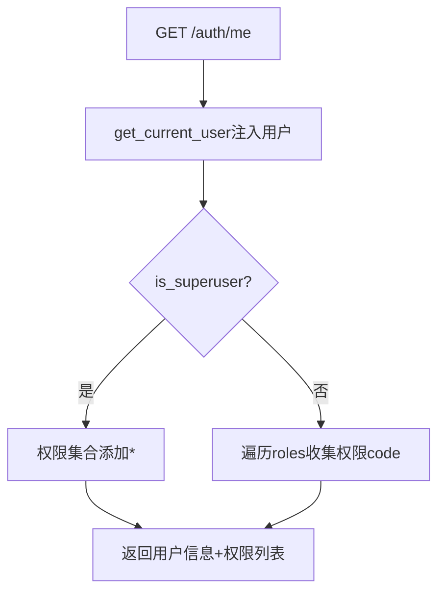
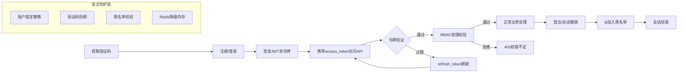
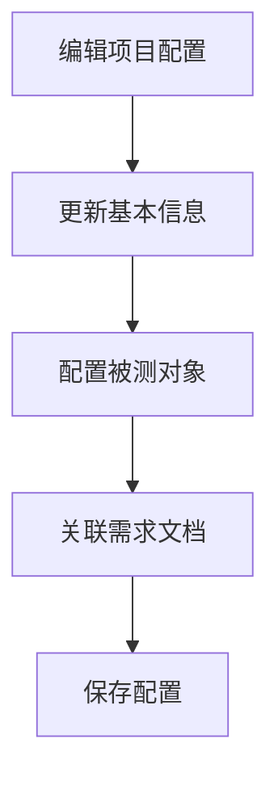
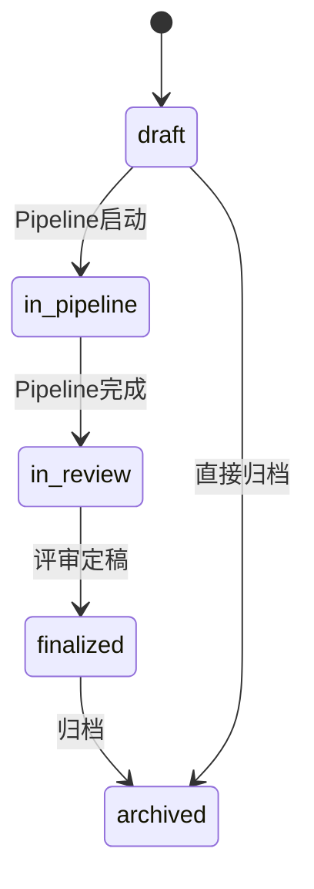
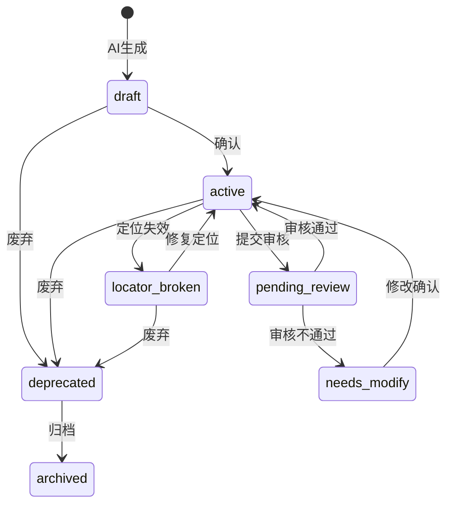

# AI-TestMaster 业务流程全景文档

## 文档概述

本文档是对 **AI-TestMaster（AI全自动测试平台）** 全部业务流程的系统梳理，涵盖主流程与分支流程。文档从认证与用户管理出发，贯穿项目与文件管理、测试用例核心、Pipeline执行引擎、测试执行、用例质量与评审、AI调用与成本、Agent系统、自愈管理、数据模型全景及流程间关联关系，形成完整的业务流程闭环。

**文档约定：**
- 每个流程包含：Mermaid流程图、触发条件、前置/后置条件、关键步骤、决策点、涉及组件、异常分支
- 流程图中异常节点以红色标注（`fill:#ff6b6b,color:#fff`）
- 状态机使用 Mermaid `stateDiagram-v2` 语法
- ER图使用 Mermaid `erDiagram` 语法

---

## 目录

- [第一章 认证与用户管理](#第一章-认证与用户管理)
- [第二章 项目与文件管理](#第二章-项目与文件管理)
- [第三章 测试用例核心](#第三章-测试用例核心)
- [第四章 Pipeline执行引擎](#第四章-pipeline执行引擎)
- [第五章 测试执行](#第五章-测试执行)
- [第六章 用例质量与评审](#第六章-用例质量与评审)
- [第七章 AI调用与成本](#第七章-ai调用与成本)
- [第八章 Agent系统](#第八章-agent系统)
- [第九章 自愈管理](#第九章-自愈管理)
- [第十章 数据模型全景](#第十章-数据模型全景)
- [第十一章 流程间关联关系](#第十一章-流程间关联关系)

---

## 第一章 认证与用户管理

### 1.1 验证码获取流程

**触发条件：** 用户访问登录页面，前端请求验证码

**前置条件：** 无（公开接口）

**后置条件：** 服务端存储验证码记录，客户端持有captcha_id

**关键步骤：**
1. 客户端发起 GET /auth/captcha 请求
2. CaptchaService 检查IP频率限制（每分钟≤10次）
3. 生成随机数字验证码（默认4位）
4. 生成唯一captcha_id（32位随机串）
5. 存储验证码至内存（captcha_id → (code, expire_time)），5分钟过期
6. 触发过期清理（存储>100条时）
7. 返回 captcha_id + code 给客户端

**决策点：**
- IP请求频率是否超限？→ 是：返回429

**涉及组件：** CaptchaService（单例）、内存存储（_store + _used + _ip_limits）

**异常分支：**
- IP频率超限 → 抛出429 Too Many Requests
- 验证码生成异常 → 返回500

```mermaid
flowchart TD
    A[客户端请求验证码] --> B{IP频率检查}
    B -->|超限| C[返回429请求过于频繁]
    C_style C fill:#ff6b6b,color:#fff
    B -->|未超限| D[生成随机数字验证码]
    D --> E[生成唯一captcha_id]
    E --> F[存储验证码 captcha_id→code,expire_time]
    F --> G{存储数量>100?}
    G -->|是| H[清理过期验证码]
    G -->|否| I[返回captcha_id+code]
    H --> I
```

---

### 1.2 用户注册流程

**触发条件：** 用户提交注册表单

**前置条件：** 无（公开接口）

**后置条件：** 新用户记录写入users表，密码以bcrypt哈希存储

**关键步骤：**
1. 接收 RegisterRequest（username, password, email）
2. 校验用户名唯一性
3. 校验邮箱唯一性（若提供）
4. 用户名长度校验（3-50字符）
5. 密码长度校验（≥8位）
6. 密码bcrypt哈希处理
7. 创建User记录并持久化
8. 返回用户基本信息

**决策点：**
- 用户名是否已存在？→ 是：返回400
- 邮箱是否已注册？→ 是：返回400

**涉及组件：** auth_endpoints、User模型、pwd_context（bcrypt）

**异常分支：**
- 用户名/邮箱重复 → 400
- 参数校验失败 → 400
- 数据库异常 → 500 + rollback

```mermaid
flowchart TD
    A[提交注册请求] --> B{用户名唯一?}
    B -->|否| C[返回400用户名已存在]
    C_style C fill:#ff6b6b,color:#fff
    B -->|是| D{邮箱唯一?}
    D -->|否| E[返回400邮箱已被注册]
    E_style E fill:#ff6b6b,color:#fff
    D -->|是| F{参数校验通过?}
    F -->|否| G[返回400参数验证失败]
    G_style G fill:#ff6b6b,color:#fff
    F -->|是| H[密码bcrypt哈希]
    H --> I[创建User记录]
    I --> J[持久化到数据库]
    J --> K[返回用户信息+注册成功]
```

---

### 1.3 用户登录流程

**触发条件：** 用户提交登录表单（username + password + captcha_id + captcha_code）

**前置条件：** 用户已注册且账户激活

**后置条件：** 签发JWT双令牌，创建UserSession记录

**关键步骤：**
1. 解析登录参数（支持Form和JSON两种格式）
2. 校验必填字段（username, password, captcha_id, captcha_code）
3. 验证码校验（CaptchaService.verify）
4. 查询用户记录
5. 检查账户是否激活
6. 检查账户是否锁定（locked_until > now）
7. 密码验证（bcrypt verify）
8. 登录失败计数处理
9. 登录成功：重置失败计数、签发access_token + refresh_token
10. 创建UserSession记录（绑定refresh_jti）
11. 返回双令牌 + 用户信息

**决策点：**
- 验证码是否有效？→ 否：返回401
- 用户是否存在？→ 否：返回401
- 账户是否激活？→ 否：返回403
- 账户是否锁定？→ 是：返回423
- 密码是否正确？→ 否：累加失败计数，达阈值锁定账户

**涉及组件：** auth_endpoints、CaptchaService、User模型、jwt_utils、SessionService

**异常分支：**
- 验证码错误/过期 → 401
- 用户不存在 → 401
- 账户禁用 → 403
- 账户锁定 → 423
- 密码错误 → 401 + _record_login_failure
- 连续失败达阈值 → 账户锁定（LOGIN_MAX_FAILURES次，锁定LOGIN_LOCK_MINUTES分钟）
- 内部异常 → 500

```mermaid
flowchart TD
    A[提交登录请求] --> B{参数完整?}
    B -->|否| C[返回400参数验证失败]
    C_style C fill:#ff6b6b,color:#fff
    B -->|是| D{验证码校验}
    D -->|失败| E[返回401验证码错误或已过期]
    E_style E fill:#ff6b6b,color:#fff
    D -->|通过| F{用户存在?}
    F -->|否| G[返回401用户名或密码错误]
    G_style G fill:#ff6b6b,color:#fff
    F -->|是| H{账户激活?}
    H -->|否| I[返回403账号已被禁用]
    I_style I fill:#ff6b6b,color:#fff
    H -->|是| J{账户锁定?}
    J -->|是| K[返回423账户已锁定]
    K_style K fill:#ff6b6b,color:#fff
    J -->|否| L{密码正确?}
    L -->|否| M[记录失败计数]
    M --> N{达到锁定阈值?}
    N -->|是| O[锁定账户]
    O_style O fill:#ff6b6b,color:#fff
    N -->|否| P[返回401用户名或密码错误]
    P_style P fill:#ff6b6b,color:#fff
    L -->|是| Q[重置失败计数]
    Q --> R[签发access_token+refresh_token]
    R --> S[创建UserSession记录]
    S --> T[返回双令牌+用户信息]
```

---

### 1.4 JWT令牌签发与密钥管理流程

**触发条件：** 登录成功或刷新令牌时

**前置条件：** 密钥配置完成（至少HS256可用）

**后置条件：** JWT令牌签发成功，payload包含sub/type/jti/iat/exp

**关键步骤：**
1. 确定签名算法：优先RS256，回退HS256
2. RS256密钥三级回退加载：
   - Level 1：环境变量JWT_PRIVATE_KEY / JWT_PUBLIC_KEY（KMS注入PEM字符串）
   - Level 2：JWT_PRIVATE_KEY_PATH / JWT_PUBLIC_KEY_PATH（PEM文件路径）
   - Level 3：.secret_keys缓存文件
   - Level 4：开发/测试环境自动生成RSA-2048密钥对
   - Level 5：生产环境未配置 → 回退HS256 + WARNING日志
3. 构造payload（sub/type/jti/iat/exp）
4. 使用确定的算法和密钥签名
5. 返回JWT字符串

**决策点：**
- RS256私钥是否可用？→ 否：回退HS256
- 是否为生产环境？→ 是：不自动生成，记录WARNING

**涉及组件：** jwt_utils、jwt_keys、key_management、settings

**异常分支：**
- 密钥文件读取失败 → 降级到下一级
- 生产环境无RSA密钥 → 回退HS256 + WARNING审计日志
- PEM格式损坏 → 重新生成密钥对（非生产环境）

```mermaid
flowchart TD
    A[开始签发JWT] --> B{settings.JWT_PREFERRED_ALGORITHM?}
    B -->|RS256| C[尝试获取RSA私钥]
    C --> D{Level1:环境变量PEM?}
    D -->|有| E[使用RS256签名]
    D -->|无| F{Level2:文件路径?}
    F -->|有| G[加载PEM文件]
    F -->|无| H{Level3:缓存文件?}
    H -->|有| I[从.secret_keys加载]
    H -->|无| J{非生产环境?}
    J -->|是| K[自动生成RSA-2048密钥对]
    K --> E
    J -->|否| L[记录WARNING回退HS256]
    L_style L fill:#ff6b6b,color:#fff
    L --> M[使用HS256签名]
    B -->|HS256| M
    E --> N[构造payload: sub/type/jti/iat/exp]
    M --> N
    N --> O[返回JWT字符串]
```

---

### 1.5 JWT令牌验证流程

**触发条件：** 请求携带Bearer令牌访问受保护资源

**前置条件：** 令牌格式合法

**后置条件：** 返回验证通过的payload或抛出AuthenticationError

**关键步骤：**
1. 从Authorization头提取Bearer令牌
2. 双算法验签解码（同时尝试RS256 + HS256）
3. 检查type字段（access/refresh类型匹配）
4. 检查jti是否在黑名单中（Redis优先 → 内存降级）
5. 返回验证通过的payload

**决策点：**
- 签名是否通过？→ 否：抛出AuthenticationError
- type是否匹配？→ 否：抛出"Token类型错误"
- jti是否在黑名单？→ 是：抛出"Token已撤销"

**涉及组件：** jwt_utils（verify_access_token / verify_refresh_token）、Redis黑名单、内存降级黑名单

**异常分支：**
- 令牌无效/过期 → AuthenticationError
- type不匹配 → AuthenticationError
- 令牌已撤销（黑名单） → AuthenticationError
- Redis不可用 → 降级内存黑名单查询

```mermaid
flowchart TD
    A[提取Bearer令牌] --> B[双算法验签解码]
    B --> C{签名通过?}
    C -->|否| D[抛出AuthenticationError: Token无效]
    D_style D fill:#ff6b6b,color:#fff
    C -->|是| E{type字段匹配?}
    E -->|否| F[抛出AuthenticationError: Token类型错误]
    F_style F fill:#ff6b6b,color:#fff
    E -->|是| G{jti在黑名单?}
    G -->|是| H[抛出AuthenticationError: Token已撤销]
    H_style H fill:#ff6b6b,color:#fff
    G -->|否| I[返回验证通过的payload]
```

---

### 1.6 刷新令牌流程

**触发条件：** access_token过期，前端使用refresh_token请求新令牌

**前置条件：** 持有有效的refresh_token

**后置条件：** 签发新的access_token，更新last_active_at

**关键步骤：**
1. 从请求中提取refresh_token（JSON body优先，Authorization头回退）
2. 验证refresh_token签名与jti（含黑名单校验）
3. 查询UserSession确认会话未撤销（revoked_at为空）
4. 签发新access_token
5. 更新会话last_active_at
6. 返回新access_token

**决策点：**
- refresh_token是否有效？→ 否：返回401
- 会话是否已撤销？→ 是：返回401

**涉及组件：** auth_endpoints、jwt_utils、SessionService

**异常分支：**
- refresh_token无效 → 401
- 会话已撤销 → 401
- AuthenticationError → 401
- 内部异常 → 500

```mermaid
flowchart TD
    A[提交refresh请求] --> B[提取refresh_token]
    B --> C[验证refresh_token签名+jti]
    C --> D{验证通过?}
    D -->|否| E[返回401 refresh_token无效]
    E_style E fill:#ff6b6b,color:#fff
    D -->|是| F[查询UserSession]
    F --> G{会话未撤销?}
    G -->|已撤销| H[返回401 会话已撤销请重新登录]
    H_style H fill:#ff6b6b,color:#fff
    G -->|未撤销| I[签发新access_token]
    I --> J[更新last_active_at]
    J --> K[返回新access_token]
```

---

### 1.7 登出流程（单会话/全部会话）

**触发条件：** 用户主动登出或安全事件触发登出所有设备

**前置条件：** 用户已登录（持有有效令牌）

**后置条件：** 会话撤销（revoked_at写入），jti加入黑名单

**关键步骤：**

**单会话登出（/auth/logout）：**
1. 提取refresh_token
2. 验证refresh_token获取jti
3. 通过jti撤销UserSession（写入revoked_at）
4. refresh_jti加入Redis黑名单（TTL=剩余有效期）
5. 幂等返回成功

**全部会话登出（/auth/logout-all）：**
1. 查询用户所有有效会话
2. 批量更新revoked_at
3. 所有refresh_jti加入黑名单
4. 返回撤销会话数量

**决策点：**
- refresh_token是否有效？→ 否：幂等返回成功
- 会话是否已撤销？→ 是：幂等返回成功

**涉及组件：** auth_endpoints、SessionService、jwt_utils（blacklist_token）、Redis

**异常分支：**
- refresh_token已失效 → 幂等返回成功（不报错）
- 黑名单写入Redis失败 → 降级内存黑名单，不阻断主流程
- 内部异常 → 500

```mermaid
flowchart TD
    subgraph 单会话登出
        A1[/auth/logout] --> B1[提取refresh_token]
        B1 --> C1[验证获取jti]
        C1 --> D1{验证成功?}
        D1 -->|否| E1[幂等返回登出成功]
        D1 -->|是| F1[revoke_session_by_jti]
        F1 --> G1[jti加入黑名单]
        G1 --> H1[返回登出成功]
    end

    subgraph 全部会话登出
        A2[/auth/logout-all] --> B2[查询所有有效会话]
        B2 --> C2[批量更新revoked_at]
        C2 --> D2[所有jti加入黑名单]
        D2 --> E2[返回撤销会话数]
    end
```

---

### 1.8 会话查询与撤销流程

**触发条件：** 用户查看在线设备列表或远程撤销某台设备

**前置条件：** 用户已认证

**后置条件：** 返回会话列表或撤销指定会话

**关键步骤：**

**查询会话（GET /auth/sessions）：**
1. 查询当前用户所有未撤销会话
2. 返回会话列表（含IP、User-Agent、最后活跃时间）

**撤销指定会话（DELETE /auth/sessions/{id}）：**
1. 查询指定会话记录
2. 权限校验：仅允许撤销自己的会话（超管可撤销任何）
3. 写入revoked_at
4. jti加入黑名单
5. 返回撤销结果

**决策点：**
- 会话是否存在？→ 否：返回404
- 是否有权撤销？→ 否：返回403

**涉及组件：** auth_endpoints、SessionService

**异常分支：**
- 会话不存在 → 404
- 权限不足 → 403
- 内部异常 → 500

```mermaid
flowchart TD
    subgraph 查询会话
        A1[GET /auth/sessions] --> B1[查询未撤销会话]
        B1 --> C1[返回会话列表]
    end

    subgraph 撤销指定会话
        A2[DELETE /auth/sessions/id] --> B2{会话存在?}
        B2 -->|否| C2[返回404会话不存在]
        C2_style C2 fill:#ff6b6b,color:#fff
        B2 -->|是| D2{权限校验}
        D2 -->|无权| E2[返回403无权撤销他人会话]
        E2_style E2 fill:#ff6b6b,color:#fff
        D2 -->|有权| F2[写入revoked_at]
        F2 --> G2[jti加入黑名单]
        G2 --> H2[返回撤销成功]
    end
```

---

### 1.9 RBAC权限校验流程

**触发条件：** 用户访问受角色保护的API端点

**前置条件：** 用户已认证（持有有效令牌）

**后置条件：** 权限校验通过则继续处理请求，否则返回403

**关键步骤：**
1. 通过Depends(get_current_user)获取用户对象
2. 检查is_superuser → 超管直接放行
3. 从user.roles关联提取角色名称列表
4. 用户角色与允许角色取交集（OR语义）
5. 有匹配 → 通过；无匹配 → PermissionDenied(403)

**决策点：**
- 是否超管？→ 是：直接放行
- 角色是否匹配？→ 否：返回403

**涉及组件：** permissions模块、require_roles()、ViewPermissions

**权限层级：**
- BUSINESS_VIEW：所有角色可见
- TECHNICAL_VIEW：test_engineer, admin, developer
- EDIT：test_engineer, admin
- ADMIN：仅admin

**异常分支：**
- 角色关联查询异常 → 视为无角色，返回403
- 用户未登录 → 401

```mermaid
flowchart TD
    A[请求受保护端点] --> B{已认证?}
    B -->|否| C[返回401未认证]
    C_style C fill:#ff6b6b,color:#fff
    B -->|是| D{is_superuser?}
    D -->|是| E[直接放行]
    D -->|否| F[提取用户角色列表]
    F --> G{角色匹配?}
    G -->|是| H[继续处理请求]
    G -->|否| I[返回403权限不足]
    I_style I fill:#ff6b6b,color:#fff
```

---

### 1.10 项目权限校验流程

**触发条件：** 用户操作特定项目资源

**前置条件：** 用户已认证

**后置条件：** 验证用户为项目所有者或超管

**关键步骤：**
1. 获取当前用户和目标project_id
2. 查询Project表匹配user_id
3. 存在记录 → 通过；不存在 → 403
4. 超管绕过检查

**决策点：**
- 是否为项目所有者？→ 否：返回403

**涉及组件：** ProjectAccessChecker、require_project_owner

**异常分支：**
- 非项目所有者 → 403

```mermaid
flowchart TD
    A[操作项目资源] --> B{is_superuser?}
    B -->|是| C[放行]
    B -->|否| D[查询Project.user_id==current_user.id]
    D --> E{匹配?}
    E -->|是| C
    E -->|否| F[返回403无权限操作此项目]
    F_style F fill:#ff6b6b,color:#fff
```

---

### 1.11 获取当前用户信息流程

**触发条件：** 前端请求当前登录用户信息

**前置条件：** 用户已认证

**后置条件：** 返回用户详情 + 权限列表

**关键步骤：**
1. 通过Depends(get_current_user)注入用户对象
2. 超管 → 权限集合添加"*"
3. 遍历user.roles，收集所有权限code
4. 返回用户ID、用户名、邮箱、激活状态、超管标志、权限列表

**涉及组件：** auth_endpoints（/auth/me）、get_current_user依赖



---

### 1.12 全局异常处理流程

**触发条件：** 请求处理过程中抛出异常

**前置条件：** 应用启动时已注册异常处理器

**后置条件：** 返回统一格式的错误响应

**关键步骤：**
1. BaseAPIException → WARNING日志 + 统一错误响应
2. HTTPException → WARNING日志 + 转换为统一格式
3. SQLAlchemyError → ERROR日志 + 脱敏错误消息（IntegrityError/OperationalError细分）
4. ValidationError → WARNING日志 + 结构化字段错误列表
5. RequestValidationError → WARNING日志 + 请求参数错误列表
6. Exception（兜底）→ ERROR日志 + 通用500错误，不暴露内部细节

**决策点：**
- 异常类型匹配哪个处理器？→ 最具体优先

**涉及组件：** _handlers模块（register_exception_handlers）、BaseAPIException

**异常分支：**
- 数据库IntegrityError → "数据已存在或违反完整性约束"
- 数据库OperationalError → "数据库连接失败"
- 未捕获异常 → "服务器内部错误"（不暴露堆栈）

```mermaid
flowchart TD
    A[异常抛出] --> B{BaseAPIException?}
    B -->|是| C[WARNING日志+统一错误响应]
    B -->|否| D{HTTPException?}
    D -->|是| E[WARNING日志+转换格式]
    D -->|否| F{SQLAlchemyError?}
    F -->|是| G[ERROR日志+脱敏消息]
    G --> G1{IntegrityError?}
    G1 -->|是| G2[数据已存在或违反约束]
    G1 -->|否| G3{OperationalError?}
    G3 -->|是| G4[数据库连接失败]
    G3 -->|否| G5[数据库操作失败]
    F -->|否| H{ValidationError?}
    H -->|是| I[WARNING+字段错误列表]
    H -->|否| J{RequestValidationError?}
    J -->|是| K[WARNING+参数错误列表]
    J -->|否| L[ERROR日志+通用500错误]
    L_style L fill:#ff6b6b,color:#fff
```

---

### 1.13 完整认证生命周期总览



---

## 第二章 项目与文件管理

### 2.1 项目全生命周期管理

**触发条件：** 用户创建/查询/删除项目，配置自测定时任务

**前置条件：** 用户已认证

**后置条件：** 项目记录创建/更新/删除

**关键步骤：**
1. **创建项目：** 校验项目名称唯一性 → 创建Project记录 → 关联user_id
2. **查询项目列表：** 按user_id筛选 → 支持分页和搜索
3. **删除项目：** 级联删除关联的迭代、文件、用例等
4. **自测定时配置：** 设置cron表达式 + 自测参数 → scheduler_service调度

**决策点：**
- 项目名称是否重复？→ 是：返回400
- 删除时是否有关联数据？→ 级联删除确认

**涉及组件：** project_core端点、project CRUD、scheduler_service

**异常分支：**
- 项目名称重复 → 400
- 项目不存在 → 404
- 级联删除失败 → 500

```mermaid
flowchart TD
    A[项目管理入口] --> B{操作类型}
    B -->|创建| C{名称唯一?}
    C -->|否| D[返回400项目名已存在]
    D_style D fill:#ff6b6b,color:#fff
    C -->|是| E[创建Project记录]
    E --> F[返回项目信息]
    B -->|查询| G[按user_id筛选+分页]
    G --> H[返回项目列表]
    B -->|删除| I[级联删除关联数据]
    I --> J[返回删除成功]
    B -->|自测定时| K[配置cron+参数]
    K --> L[scheduler_service注册]
```

---

### 2.2 项目配置与被测对象管理

**触发条件：** 用户编辑项目配置或管理被测对象

**前置条件：** 项目已创建

**后置条件：** 项目配置更新，被测对象关联正确

**关键步骤：**
1. 更新项目基本信息（名称、描述、source等）
2. 配置被测对象URL/包名
3. 关联需求文档
4. 保存配置

**涉及组件：** project端点、project CRUD



---

### 2.3 迭代管理

**触发条件：** 用户创建/定稿/添加输入/删除/迁移迭代状态

**前置条件：** 项目已存在

**后置条件：** 迭代记录创建/状态变更

**关键步骤：**
1. **创建迭代：** 指定项目ID + 迭代名称 → 创建Iteration记录（status=draft）
2. **添加输入：** 上传PRD/原型/XMind等 → 创建IterationInput记录
3. **启动Pipeline：** draft → in_pipeline
4. **Pipeline完成：** in_pipeline → in_review
5. **评审定稿：** in_review → finalized
6. **归档：** finalized → archived

**决策点：**
- 迭代状态是否允许当前操作？→ 否：返回400

**涉及组件：** iteration端点、iteration CRUD、pipeline_service

**迭代状态机：**



---

### 2.4 文件上传

**触发条件：** 用户上传需求文档、原型文件等

**前置条件：** 项目已存在

**后置条件：** 文件记录创建，内容存储

**关键步骤：**
1. **单文件上传：** 校验文件类型和大小 → 存储到磁盘 → 创建FileRecord
2. **批量上传：** 遍历文件列表 → 逐个上传 → 返回批量结果
3. **ZIP解压上传：** 上传ZIP → 解压到项目目录 → 为每个文件创建FileRecord

**决策点：**
- 文件类型是否允许？→ 否：拒绝
- 文件大小是否超限？→ 是：拒绝

**涉及组件：** file_upload端点、file CRUD、file_utils

**异常分支：**
- 文件类型不允许 → 400
- 文件过大 → 400
- ZIP解压失败 → 500

```mermaid
flowchart TD
    A[文件上传请求] --> B{上传类型}
    B -->|单文件| C[校验类型+大小]
    B -->|批量| D[遍历文件列表]
    B -->|ZIP| E[解压ZIP]
    C --> F{校验通过?}
    F -->|否| G[返回400文件不合法]
    G_style G fill:#ff6b6b,color:#fff
    F -->|是| H[存储到磁盘]
    H --> I[创建FileRecord]
    I --> J[返回文件信息]
    D --> C
    E --> K{解压成功?}
    K -->|否| L[返回500解压失败]
    L_style L fill:#ff6b6b,color:#fff
    K -->|是| M[为每个文件创建记录]
    M --> J
```

---

### 2.5 文件管理与内容提取

**触发条件：** 用户查看/下载/删除文件，或Pipeline提取文件内容

**前置条件：** 文件已上传

**后置条件：** 文件内容返回或文件删除

**关键步骤：**
1. 查询文件列表（按项目筛选）
2. 提取文件内容（file_parser解析PRD/Excel/Word等）
3. 下载文件（流式返回）
4. 删除文件（磁盘+数据库记录）

**涉及组件：** file端点、file_parser、file_utils

---

### 2.6 需求链接管理

**触发条件：** 用户关联外部需求链接到项目

**前置条件：** 项目已存在

**后置条件：** 需求链接CRUD完成

**关键步骤：**
1. 创建需求链接（URL + 描述）
2. 查询项目关联的需求链接
3. 更新链接信息
4. 删除链接
5. 获取链接内容（link_fetcher_service抓取网页内容）
6. 验证链接有效性

**涉及组件：** requirement_link CRUD、link_fetcher_service

---

### 2.7 历史资产管理

**触发条件：** 用户上传历史测试资产或对齐分类

**前置条件：** 项目已存在

**后置条件：** 历史资产记录创建

**关键步骤：**
1. 上传历史测试用例/报告
2. AI对齐分类（匹配测试点/能力）
3. 导入到当前项目资产库

**涉及组件：** history_asset端点、history_asset模型

---

### 2.8 UI原型管理

**触发条件：** 用户管理项目的UI原型数据

**前置条件：** 项目已存在

**后置条件：** 原型数据（项目/屏幕/流程）创建/更新

**关键步骤：**
1. 创建UI原型项目
2. 添加屏幕数据（截图 + 元信息）
3. 配置流程数据（页面间跳转关系）
4. 批量截图上传

**涉及组件：** ui_prototype端点、ui_prototype_project/screen/flow_data CRUD

---

### 2.9 XMind导入服务

**触发条件：** 用户上传XMind文件导入测试点/用例

**前置条件：** 迭代已创建

**后置条件：** XMind内容解析为测试点/用例结构

**关键步骤：**
1. 上传.xmind文件
2. 解压获取content.json
3. 递归解析主题树（xmind_parser）
4. 提取测试点与用例结构
5. 创建IterationInput（kind=xmind）

**涉及组件：** xmind_import_service、xmind_parser（_parse + _util）

---

### 2.10 Bug缺陷管理

**触发条件：** 测试执行发现Bug或手动创建Bug记录

**前置条件：** 项目已存在

**后置条件：** Bug记录创建/更新

**关键步骤：**
1. 创建Bug记录（标题、描述、严重级别、UX类别）
2. 关联测试用例/测试结果
3. 更新Bug状态
4. 添加缺陷证据

**涉及组件：** bug端点、Bug模型

---

## 第三章 测试用例核心

### 3.1 测试用例CRUD流程

**触发条件：** 用户手动创建/查询/更新/删除测试用例

**前置条件：** 项目已存在，用户有编辑权限

**后置条件：** 用例记录创建/更新/删除

**关键步骤：**
1. **创建：** 校验必填字段 → 分配case_number → 设置lifecycle_status=draft → 持久化
2. **查询：** 支持按项目/迭代/状态/关键词筛选 → 分页返回
3. **更新：** lifecycle_guard拦截直接修改 → 通过LifecycleService.transition()
4. **删除：** 标记deprecated（软删除）或硬删除（仅draft状态）

**决策点：**
- lifecycle_status修改是否经LifecycleService？→ 否：RuntimeError
- 删除时用例状态是否允许？→ 非draft需特殊处理

**涉及组件：** test_case端点、test_case CRUD、LifecycleService、case_number_service

**异常分支：**
- 直接修改lifecycle_status → RuntimeError
- 用例不存在 → 404
- 权限不足 → 403

```mermaid
flowchart TD
    A[用例CRUD] --> B{操作类型}
    B -->|创建| C[分配case_number]
    C --> D[设置lifecycle_status=draft]
    D --> E[持久化]
    B -->|查询| F[筛选+分页]
    B -->|更新| G{通过LifecycleService?}
    G -->|否| H[RuntimeError禁止直接修改]
    H_style H fill:#ff6b6b,color:#fff
    G -->|是| I[执行状态迁移]
    B -->|删除| J{draft状态?}
    J -->|是| K[硬删除]
    J -->|否| L[标记deprecated]
```

---

### 3.2 AI生成测试用例流程

**触发条件：** 用户通过Pipeline触发AI生成

**前置条件：** 迭代已创建并添加输入

**后置条件：** AI生成用例写入数据库，lifecycle_status=draft

**关键步骤：**
1. Pipeline Step执行AI生成逻辑
2. 构建Prompt（包含PRD内容、测试点、上下文）
3. 调用AI Client获取生成结果
4. 解析AI响应为结构化用例数据
5. 批量创建TestCase记录（draft状态）
6. 关联生成批次（generation_batch）

**涉及组件：** CaseGeneration Step、AI Client、test_case CRUD、generation_batch

```mermaid
flowchart TD
    A[Pipeline触发AI生成] --> B[构建Prompt]
    B --> C[调用AI Client]
    C --> D{AI调用成功?}
    D -->|否| E[重试/降级]
    E_style E fill:#ff6b6b,color:#fff
    D -->|是| F[解析AI响应]
    F --> G[批量创建TestCase draft]
    G --> H[关联generation_batch]
```

---

### 3.3 用例生命周期状态变更流程

**触发条件：** 确认用例/提交审核/审核通过/定位失效/废弃/归档

**前置条件：** 操作经过LifecycleService

**后置条件：** lifecycle_status变更，版本快照自动创建

**关键步骤：**
1. 调用LifecycleService.transition(case, target_status)
2. enable_lifecycle_transition() 设置上下文标记
3. 校验状态迁移合法性（状态机规则）
4. 更新lifecycle_status
5. 自动创建版本快照（before_flush事件）
6. disable_lifecycle_transition() 清除标记

**状态机规则：**
- draft → active（确认）
- draft → deprecated（废弃）
- active → pending_review（提交审核）
- pending_review → needs_modify（审核不通过）
- pending_review → active（审核通过）
- active → locator_broken（定位失效）
- needs_modify → active（修改后再确认）
- any → deprecated（废弃）
- deprecated → archived（归档）

**涉及组件：** LifecycleService、_test_case_lifecycle guard、CaseVersionService

**异常分支：**
- 非法状态迁移 → RuntimeError
- 直接修改lifecycle_status → RuntimeError



---

### 3.4 用例版本管理流程

**触发条件：** 用例追踪字段变更（自动触发）或手动创建快照

**前置条件：** 用例已持久化（有主键ID）

**后置条件：** TestCaseVersion记录创建

**关键步骤：**
1. before_flush事件检测追踪字段变更
2. 构建变更字段字典（CaseVersionService.build_changed_fields）
3. 创建快照记录（snapshot_type=update/create/migration等）
4. 跳过标记检查（_version_snapshot_skip）

**追踪字段（TRACKED_FIELDS）：** title、precondition、steps、expected_result等核心内容字段

**涉及组件：** CaseVersionService、_test_case_lifecycle事件监听、TestCaseVersion模型

---

### 3.5 用例保鲜（刷新）流程

**触发条件：** 用户触发用例刷新或批量刷新

**前置条件：** 用例处于active/locator_broken状态

**后置条件：** 用例内容更新，版本快照创建

**关键步骤：**
1. 评估用例是否需要刷新（case_refresh_service）
2. 生成刷新建议（AI分析变更影响）
3. 用户确认刷新方案
4. 执行刷新（_case_refresh_apply）
5. 创建版本快照
6. 更新lifecycle_status

**涉及组件：** case_refresh_service、_case_refresh_apply、AI Client

---

### 3.6 用例迁移流程

**触发条件：** 用户将用例从一个迭代/项目迁移到另一个

**前置条件：** 源和目标迭代/项目存在

**后置条件：** 用例关联到新迭代/项目

**关键步骤：**
1. 选择源用例
2. 验证目标迭代/项目
3. 复制用例到目标（保留历史版本）
4. 标记源用例迁移状态

**涉及组件：** CaseMigration视图、test_case CRUD

---

### 3.7 用例视图查询流程

**触发条件：** 前端请求不同维度的用例视图

**前置条件：** 用户有查看权限

**后置条件：** 返回结构化视图数据

**关键步骤：**
1. 按业务视图/技术视图筛选字段
2. 根据权限过滤敏感字段
3. 支持列表/卡片/树形展示

**涉及组件：** test_case_view服务、permissions模块

---

## 第四章 Pipeline执行引擎

### 4.1 Pipeline触发与运行主流程

**触发条件：** 用户在迭代中启动Pipeline

**前置条件：** 迭代处于draft状态，已添加输入

**后置条件：** PipelineRun记录创建，Step按序执行

**关键步骤：**
1. 创建PipelineRun记录（input_hash幂等校验）
2. 迭代状态 draft → in_pipeline
3. 构造PipelineContext（注入DB、AI Client、Config、Run等）
4. PipelineRunner.run(ctx) 启动执行循环
5. 所有Step完成后 PipelineRun status → completed
6. 迭代状态 in_pipeline → in_review

**决策点：**
- 相同input_hash是否已存在Run？→ 是：幂等返回
- Pipeline是否被取消？→ 是：终止执行

**涉及组件：** pipeline端点、pipeline_service、PipelineRunner、PipelineContext

**异常分支：**
- 输入不完整 → 400
- Pipeline已运行 → 幂等返回
- 用户取消 → cancelled

```mermaid
flowchart TD
    A[启动Pipeline] --> B{input_hash幂等?}
    B -->|已存在| C[返回已有Run]
    B -->|新建| D[创建PipelineRun]
    D --> E[迭代draft→in_pipeline]
    E --> F[构造PipelineContext]
    F --> G[PipelineRunner.run]
    G --> H[按序执行Step]
    H --> I{所有Step完成?}
    I -->|是| J[Run→completed]
    J --> K[迭代in_pipeline→in_review]
    I -->|失败| L[Run→failed]
    L_style L fill:#ff6b6b,color:#fff
    I -->|取消| M[Run→cancelled]
```

---

### 4.2 PipelineRunner核心执行循环

**触发条件：** PipelineRunner.run(ctx)被调用

**前置条件：** PipelineRun已创建

**后置条件：** 所有Step执行完毕或Pipeline终止

**关键步骤：**
1. 检查是否为恢复模式（pause_payload存在 → 从指定Step恢复）
2. 更新Run状态为running
3. 遍历Step列表：
   a. 恢复模式下跳过已完成的Step
   b. 协作式取消检查（每次Step前commit并重新查询Run状态）
   c. should_run判断是否跳过
   d. 预算检查（ctx.check_budget()）
   e. 执行Step（_execute_step_with_retry）
   f. 处理暂停请求（pause_for_confirmation）
   g. 处理失败
   h. 持久化产物
4. 所有Step完成 → Run → completed

**决策点：**
- Run是否被取消？→ 是：终止
- 是否暂停等待确认？→ 是：Run → waiting_for_user
- 预算是否超限？→ 是：暂停Pipeline
- Step是否失败？→ 是：Run → failed

**涉及组件：** PipelineRunner、_StepExecutionMixin、_runner_progress、_runner_metrics

```mermaid
flowchart TD
    A[PipelineRunner.run] --> B{恢复模式?}
    B -->|是| C[跳过已完成Step]
    B -->|否| D[从第一个Step开始]
    C --> E[遍历Step列表]
    D --> E
    E --> F{Run被取消?}
    F -->|是| G[终止执行]
    F -->|否| H{should_run?}
    H -->|否| I[跳过此Step]
    H -->|是| J{预算充足?}
    J -->|否| K[Run→waiting_for_user暂停]
    K_style K fill:#ff6b6b,color:#fff
    J -->|是| L[执行Step含重试]
    L --> M{Step结果}
    M -->|暂停| N[Run→waiting_for_user]
    M -->|失败| O[Run→failed]
    O_style O fill:#ff6b6b,color:#fff
    M -->|成功| P[持久化产物]
    P --> Q{还有下一个Step?}
    Q -->|是| E
    Q -->|否| R[Run→completed]
```

---

### 4.3 单Step执行流程（缓存+重试+降级）

**触发条件：** PipelineRunner执行单个Step

**前置条件：** Step的依赖产物已就绪

**后置条件：** StepResult返回（成功/降级/失败/暂停）

**关键步骤：**
1. 创建PipelineStep记录（status=pending）
2. 计算cache_key → 查询已有done状态Step → 缓存命中则跳过
3. 执行step.execute(ctx)
4. 执行失败 → 重试（最多MAX_RETRIES次）
5. 重试耗尽 → 调用step.fallback()降级
6. 降级成功 → StepResult(degraded=True)
7. 验证产物格式（validate_output）

**决策点：**
- 缓存是否命中？→ 是：跳过执行
- 重试是否成功？→ 是：继续
- 降级是否可用？→ 否：Step失败

**涉及组件：** _StepExecutionMixin、PipelineStep记录、Step Protocol

**异常分支：**
- 缓存命中 → 跳过执行
- 重试耗尽 → 降级执行
- 降级也失败 → StepResult(success=False)
- 产物校验失败 → 标记错误

```mermaid
flowchart TD
    A[开始执行Step] --> B[创建PipelineStep记录]
    B --> C{缓存命中?}
    C -->|是| D[跳过执行复用产物]
    C -->|否| E[执行step.execute]
    E --> F{执行成功?}
    F -->|是| G[验证产物格式]
    F -->|否| H{重试次数<MAX_RETRIES?}
    H -->|是| I[重试执行]
    I --> F
    H -->|否| J[调用fallback降级]
    J --> K{降级成功?}
    K -->|是| L[StepResult degraded=True]
    K -->|否| M[StepResult success=False]
    M_style M fill:#ff6b6b,color:#fff
    G --> N{产物合法?}
    N -->|是| O[StepResult success=True]
    N -->|否| P[StepResult error=产物校验失败]
    P_style P fill:#ff6b6b,color:#fff
```

---

### 4.4 Pipeline Step依赖链（产物流转图）

每个Step声明requires（依赖的产物类型）和produces（产出的产物类型），通过PipelineContext的get_artifact/set_artifact在Step间传递产物。

```mermaid
flowchart LR
    SG[SignalGatherer] -->|signals| HF[HistoryFingerprint]
    HF -->|history_fingerprint| RI[ReverseInfer]
    RI -->|inferred_test_points| SC[ScenarioCandidate]
    SG -->|signals| SC
    SC -->|scenarios| FS[ForwardScan]
    SC -->|scenarios| BS[BackwardScan]
    FS -->|forward_results| RC[Reconciliation]
    BS -->|backward_results| RC
    RC -->|reconciled_points| TPA[TestPointAlignment]
    TPA -->|aligned_test_points| DD[DecisionDispatch]
    DD -->|dispatch_plan| CG[CaseGeneration]
    CG -->|generated_cases| QG[QualityGate]
    QG -->|quality_report| PS[Persist]
    PS -->|persist_result| EV[ExecutionValidation]
```

---

### 4.5 各Step详细流程

#### SignalGatherer
- **功能：** 从迭代输入中提取信号（PRD关键词、原型元素、XMind结构等）
- **产物：** signals

#### HistoryFingerprint
- **功能：** 基于历史用例生成指纹，识别已知测试点
- **产物：** history_fingerprint

#### ReverseInfer
- **功能：** 反向推理，从已有缺陷和历史数据推断潜在风险点
- **产物：** inferred_test_points

#### ScenarioCandidate
- **功能：** 基于信号和历史推断，生成候选测试场景
- **产物：** scenarios

#### ForwardScan
- **功能：** 正向扫描，从PRD需求出发枚举正常路径测试场景
- **产物：** forward_results

#### BackwardScan
- **功能：** 反向扫描，从风险点出发枚举异常路径测试场景
- **产物：** backward_results

#### Reconciliation
- **功能：** 合并正向和反向扫描结果，消除重复和冲突
- **产物：** reconciled_points

#### TestPointAlignment
- **功能：** 将合并后的测试点与已有测试点对齐（新增/更新/废弃）
- **产物：** aligned_test_points

#### DecisionDispatch
- **功能：** 根据置信度分发决策（高置信自动通过、低置信暂停等）
- **产物：** dispatch_plan

#### CaseGeneration
- **功能：** AI生成测试用例（调用AI Client，构建Prompt）
- **产物：** generated_cases

#### QualityGate
- **功能：** 对生成的用例进行质量检查（覆盖率、去重、评分）
- **产物：** quality_report

#### Persist
- **功能：** 将生成的用例持久化到数据库
- **产物：** persist_result

#### ExecutionValidation
- **功能：** 验证生成的用例是否可执行（定位器检查、步骤校验）
- **产物：** execution_validation_result

---

### 4.6 Pipeline恢复流程

**触发条件：** 用户确认暂停的Pipeline继续执行

**前置条件：** PipelineRun处于waiting_for_user状态

**后置条件：** Pipeline从暂停Step继续执行

**关键步骤：**
1. 用户提供确认数据
2. 加载pause_payload获取暂停Step名称
3. 跳过已完成的Step
4. 从暂停Step重新开始执行
5. 更新Run状态为running

**涉及组件：** pipeline端点、PipelineRunner

```mermaid
flowchart TD
    A[用户确认继续] --> B[加载pause_payload]
    B --> C[获取暂停Step名称]
    C --> D[跳过已完成Step]
    D --> E[从暂停Step继续执行]
    E --> F[Run→running]
```

---

### 4.7 Pipeline暂停超时自动取消

**触发条件：** Pipeline暂停时间超过阈值

**前置条件：** PipelineRun处于waiting_for_user状态

**后置条件：** PipelineRun自动取消

**关键步骤：**
1. 定时检查暂停中的PipelineRun
2. 计算暂停时长
3. 超时 → 更新status为cancelled
4. 清理资源

**涉及组件：** scheduler_service、pipeline_service

---

### 4.8 场景4预检流程

**触发条件：** 用户选择场景4（回归测试）启动Pipeline

**前置条件：** 迭代已存在变更说明

**后置条件：** 预检通过或拒绝

**关键步骤：**
1. 校验变更说明输入是否存在
2. 校验历史用例是否可追溯
3. 预检通过 → 启动Pipeline
4. 预检失败 → 返回错误原因

**涉及组件：** scenario_4、validation

---

### 4.9 PipelineRun状态机

```mermaid
stateDiagram-v2
    [*] --> pending: 创建Run
    pending --> running: 开始执行
    running --> waiting_for_user: 暂停/预算超限/低置信
    running --> completed: 所有Step完成
    running --> failed: Step执行失败
    running --> cancelled: 用户取消
    waiting_for_user --> running: 用户确认继续
    waiting_for_user --> cancelled: 超时自动取消
```

---

### 4.10 PipelineStep状态机

```mermaid
stateDiagram-v2
    [*] --> pending: 创建Step记录
    pending --> running: 开始执行
    running --> done: 执行成功
    running --> failed: 执行失败含重试耗尽
    running --> degraded: 降级完成
    pending --> skipped: 缓存命中或should_run=False
    failed --> running: 重试
```

---

## 第五章 测试执行

### 5.1 测试任务创建

**触发条件：** 用户选择用例集创建测试任务

**前置条件：** 项目存在，至少一个active状态用例

**后置条件：** TestTask记录创建（status=pending）

**关键步骤：**
1. 选择用例（按迭代/测试点/手动选择）
2. 配置执行参数（浏览器/设备、超时时间等）
3. 创建TestTask记录
4. 关联选中的用例

**涉及组件：** test_task端点、TaskService

---

### 5.2 测试任务启动

**触发条件：** 用户启动测试任务

**前置条件：** 任务处于pending状态

**后置条件：** 任务开始执行（status=running）

**关键步骤：**
1. 校验任务状态
2. 更新status为running
3. 初始化执行环境（ADB设备/浏览器）
4. 启动执行循环

**涉及组件：** test_task端点、TaskService、ADB/Browser控制器

---

### 5.3 测试执行引擎核心流程

**触发条件：** 任务启动后自动执行

**前置条件：** 任务处于running状态

**后置条件：** 所有用例执行完毕，任务完成

**关键步骤：**
1. TaskService内部执行循环遍历用例列表
2. 逐个执行用例（单用例执行流程）
3. 记录执行结果（TestResult）
4. 更新任务进度
5. 推送WebSocket实时进度

**涉及组件：** TaskExecutionMixin、ADB控制器、Browser控制器

```mermaid
flowchart TD
    A[任务启动] --> B[遍历用例列表]
    B --> C[单用例执行]
    C --> D[记录TestResult]
    D --> E[推送WebSocket进度]
    E --> F{还有用例?}
    F -->|是| B
    F -->|否| G[任务完成]
```

---

### 5.4 测试任务执行控制（暂停/恢复/停止）

**触发条件：** 用户手动控制任务执行

**前置条件：** 任务处于running状态

**后置条件：** 任务状态变更

**关键步骤：**
1. **暂停：** 设置暂停标志 → 当前用例执行完成后暂停
2. **恢复：** 清除暂停标志 → 从下一个用例继续
3. **停止：** 设置停止标志 → 终止执行 → 记录已完成结果

**涉及组件：** test_task端点、TaskService

---

### 5.5 TaskService内部执行循环

**触发条件：** 任务启动后

**关键步骤：**
1. 初始化执行环境
2. 遍历用例列表
3. 对每个用例：
   - 检查暂停/停止标志
   - 初始化浏览器/设备
   - 执行测试步骤
   - 收集执行结果
   - 截图/录像
4. 汇总结果
5. 清理执行环境

**涉及组件：** TaskCoreMixin、TaskExecutionMixin、TaskPushMixin

---

### 5.6 单用例执行流程

**触发条件：** 执行循环遍历到该用例

**前置条件：** 执行环境就绪

**后置条件：** 用例执行结果记录（pass/fail/blocked）

**关键步骤：**
1. 加载用例步骤
2. 初始化前置条件
3. 逐步执行测试步骤：
   - 查找元素（定位器）
   - 执行操作（点击/输入/滑动等）
   - 验证预期结果
4. 收集执行证据（截图/日志）
5. 判定执行结果
6. 创建TestResult记录

**决策点：**
- 元素是否找到？→ 否：定位失败
- 步骤是否通过？→ 否：标记失败原因

**异常分支：**
- 定位器失效 → 触发自愈流程
- 超时 → 标记blocked
- 元素未找到 → 标记failed

```mermaid
flowchart TD
    A[开始单用例执行] --> B[加载用例步骤]
    B --> C[初始化前置条件]
    C --> D[逐步执行测试步骤]
    D --> E{元素定位}
    E -->|成功| F[执行操作]
    E -->|失败| G{触发自愈?}
    G -->|是| H[自愈流程]
    G -->|否| I[标记failed+定位失效]
    I_style I fill:#ff6b6b,color:#fff
    H --> J{自愈成功?}
    J -->|是| F
    J -->|否| I
    F --> K{验证预期结果}
    K -->|通过| L[记录pass]
    K -->|失败| M[记录fail+截图]
    K -->|超时| N[记录blocked]
```

---

### 5.7 快速测试流程（QuickTest）

**触发条件：** 用户对单个用例快速执行测试

**前置条件：** 用例存在且可执行

**后置条件：** 快速执行结果返回

**关键步骤：**
1. 选择单个用例
2. 快速启动执行（无需创建完整TaskTask）
3. 执行单用例流程
4. 实时返回执行结果

**涉及组件：** quick_test端点、QuickTest服务

---

### 5.8 ADB设备管理

**触发条件：** 移动端测试需要连接ADB设备

**前置条件：** ADB环境已配置

**后置条件：** 设备连接就绪

**关键步骤：**
1. 枚举已连接设备（adb_controller._device）
2. 选择目标设备
3. 安装被测应用
4. 配置输入法
5. 执行测试步骤

**涉及组件：** adb_controller（_core + _device + _input）、uiautomator_helper

---

### 5.9 TestTask状态机

```mermaid
stateDiagram-v2
    [*] --> pending: 创建任务
    pending --> running: 启动任务
    running --> paused: 暂停
    paused --> running: 恢复
    running --> completed: 全部用例执行完毕
    running --> failed: 执行异常
    running --> stopped: 用户停止
    pending --> cancelled: 取消
```

---

## 第六章 用例质量与评审

### 6.1 单用例质量分析

**触发条件：** 用户查看用例质量评分或AI生成后自动分析

**前置条件：** 用例已创建

**后置条件：** 质量评分计算完成

**关键步骤：**
1. 提取用例特征（步骤数、覆盖率、定位器状态等）
2. 调用case_quality服务计算评分
3. 生成质量分析报告

**涉及组件：** case_quality端点、case_quality服务、models

---

### 6.2 后验质量评分流程

**触发条件：** 用例执行后统计后验质量

**前置条件：** 用例至少执行一次

**后置条件：** 后验质量分数更新

**关键步骤：**
1. 收集执行历史数据
2. 计算通过率、缺陷发现率、稳定性等指标
3. 综合评分（compute_posterior_score）
4. 更新用例quality_grade字段

**涉及组件：** compute_posterior_score脚本、quality/grade服务

---

### 6.3 质量评分统一服务

**触发条件：** 多处需要质量评分（生成后、执行后、刷新后）

**前置条件：** 用例数据可用

**后置条件：** 统一评分结果

**关键步骤：**
1. 调用先验评分模型（生成时）
2. 调用后验评分模型（执行后）
3. 合并为综合评分
4. 记录评分历史

**涉及组件：** quality服务、grade模块

---

### 6.4 评审Inbox - 单条人工判定

**触发条件：** 评审人员对单条AI决策进行人工判定

**前置条件：** 评审处于in_progress状态

**后置条件：** ReviewDecision.human_verdict写入

**关键步骤：**
1. 从Inbox获取待判定决策
2. 查看AI判定详情（verdict + confidence + reason）
3. 提交人工判定（keep/deprecate/modify）
4. 计算最终裁决（compute_final_verdict）
5. 标记冲突（AI与人工不一致）

**决策点：**
- AI与人工判定是否冲突？→ 是：标记conflict_marker

**涉及组件：** ReviewInbox视图、review_service._core（set_human_verdict）

---

### 6.5 评审Inbox - 批量人工判定

**触发条件：** 评审人员批量处理多条决策

**前置条件：** 评审处于in_progress状态

**后置条件：** 批量human_verdict写入

**关键步骤：**
1. 选择多条待判定决策
2. 设置批量判定结果
3. 逐条执行set_human_verdict
4. 返回批量处理结果

**涉及组件：** ReviewInbox视图、review_service

---

### 6.6 评审最终化与决策应用

**触发条件：** 所有决策已人工确认，用户执行finalize

**前置条件：** 评审处于in_progress状态

**后置条件：** 评审finalized，决策应用到用例

**关键步骤：**
1. finalize_review → status = finalized
2. 清理所有lock记录
3. apply_decisions → 逐条应用决策：
   - keep → 保持用例active
   - deprecate → 用例标记deprecated
   - modify → 更新用例内容
4. 应用失败 → 回滚评审状态

**决策点：**
- 所有决策是否已处理？→ 否：无法finalize
- apply_decisions是否成功？→ 否：回滚评审

**涉及组件：** review_service._core（finalize_review）、decision_application_service（apply_decisions）

**异常分支：**
- apply_decisions失败 → 回滚评审到in_progress
- 评审已finalized → ReviewFinalizedError

```mermaid
flowchart TD
    A[执行finalize] --> B[status→finalized]
    B --> C[清理lock记录]
    C --> D[apply_decisions]
    D --> E{应用成功?}
    E -->|是| F[评审完成]
    E -->|否| G[回滚status→in_progress]
    G_style G fill:#ff6b6b,color:#fff
```

---

### 6.7 决策回滚/撤销

**触发条件：** 用户撤销已做的人工判定

**前置条件：** 评审未finalized

**后置条件：** human_verdict清除，恢复AI原始判定

**关键步骤：**
1. rollback_decision → 清除human_verdict/human_user_id/human_reason
2. final_verdict恢复为ai_verdict
3. 记录审计日志（AuditLog: review_rollback）

**涉及组件：** review_service._core（rollback_decision）、AuditLog

---

### 6.8 质量规则配置

**触发条件：** 管理员配置质量门禁规则

**前置条件：** 管理员权限

**后置条件：** QualityRuleConfig记录创建/更新

**关键步骤：**
1. 定义规则（阈值、条件、动作）
2. 创建/更新QualityRuleConfig
3. 规则应用到QualityGate Step

**涉及组件：** quality_rule端点、QualityRuleConfig模型

---

### 6.9 批量定位器流程

**触发条件：** 用户批量修复失效的定位器

**前置条件：** 用例处于locator_broken状态

**后置条件：** 定位器更新，用例恢复active

**关键步骤：**
1. 批量查询失效定位器
2. AI重新识别元素
3. 更新定位器配置
4. 验证定位器有效性
5. 更新用例状态

**涉及组件：** batch_locator端点、batch_locator服务

---

### 6.10 测试点管理

**触发条件：** 管理测试点的CRUD和状态变更

**前置条件：** 项目存在

**后置条件：** TestPoint记录创建/更新

**关键步骤：**
1. 创建测试点（status=draft）
2. 确认测试点 → active
3. 废弃测试点 → deprecated
4. 归档测试点 → archived
5. 关联测试用例

**TestPoint状态机：**

```mermaid
stateDiagram-v2
    [*] --> draft: AI提取
    draft --> active: 确认
    draft --> deprecated: 废弃
    active --> deprecated: 废弃
    deprecated --> archived: 归档
```

**涉及组件：** test_point端点、test_point_management CRUD

---

### 6.11 测试数据管理

**触发条件：** 管理测试数据集的CRUD

**前置条件：** 项目存在

**后置条件：** TestData记录创建/更新

**关键步骤：**
1. 创建测试数据集（参数化数据）
2. AI生成测试数据（test_data_generator）
3. 关联测试用例
4. 导入/导出数据

**涉及组件：** test_data端点、test_data_service、test_data_generator

---

### 6.12 测试能力管理

**触发条件：** 管理业务能力的CRUD和状态变更

**前置条件：** 项目存在

**后置条件：** TestCapability记录创建/更新

**关键步骤：**
1. 创建能力（status=active）
2. 废弃能力 → deprecated
3. 归档能力 → archived
4. 关联测试点

**Capability状态机：**

```mermaid
stateDiagram-v2
    [*] --> active: 创建
    active --> deprecated: 废弃
    deprecated --> archived: 归档
```

**涉及组件：** test_capability端点

---

### 6.13 生成批次管理

**触发条件：** 查看AI生成批次历史

**前置条件：** Pipeline已执行

**后置条件：** 批次信息返回

**关键步骤：**
1. 查询GenerationBatch记录
2. 统计批次用例数量和质量
3. 追溯批次来源

**涉及组件：** generation_batch端点、GenerationBatch模型

---

### 6.14 可见性配置

**触发条件：** 管理不同角色的数据可见性

**前置条件：** 管理员权限

**后置条件：** 可见性规则更新

**关键步骤：**
1. 配置角色可见字段
2. 应用到视图查询

**涉及组件：** visibility端点

---

### 6.15 质量门禁服务

**触发条件：** Pipeline中QualityGate Step执行

**前置条件：** 用例已生成

**后置条件：** 质量报告生成

**关键步骤：**
1. 计算覆盖率指标
2. 执行去重检查
3. 评分计算
4. 生成质量报告
5. 低置信用例标记暂停

**涉及组件：** quality_gate Step、_coverage、_dedup、_scoring

---

## 第七章 AI调用与成本

### 7.1 AI调用主流程

**触发条件：** Pipeline Step或Agent需要调用AI模型

**前置条件：** AI Client已初始化

**后置条件：** AI响应返回，调用日志记录

**关键步骤：**
1. 构建请求参数（prompt, system, schema, temperature, max_tokens）
2. 并发控制（ai_concurrency信号量）
3. 检查缓存（相同prompt+参数 → 直接返回缓存结果）
4. 预算检查（token_budget）
5. 调用主模型（OpenAIClient）
6. 主模型失败 → FallbackAIClient主备切换
7. 错误码映射（AI错误码 → 业务异常）
8. 记录AICallLog
9. 返回AIResponse

**决策点：**
- 缓存是否命中？→ 是：直接返回
- 主模型是否成功？→ 否：尝试fallback
- 预算是否超限？→ 是：拒绝调用

**涉及组件：** AIClient Protocol、OpenAIClient、FallbackAIClient、ai_concurrency、call_log

**异常分支：**
- 主模型连续失败3次 → 切换到备用模型
- 备用模型也失败 → 抛出AIServiceError
- 预算超限 → 拒绝调用
- 并发超限 → 排队等待

```mermaid
flowchart TD
    A[AI调用请求] --> B{并发控制}
    B -->|超限| C[排队等待]
    B -->|通过| D{缓存命中?}
    D -->|是| E[返回缓存结果]
    D -->|否| F{预算检查}
    F -->|超限| G[拒绝调用]
    G_style G fill:#ff6b6b,color:#fff
    F -->|通过| H[调用主模型]
    H --> I{主模型成功?}
    I -->|是| J[记录AICallLog]
    I -->|否| K{连续失败<3次?}
    K -->|是| L[抛出异常重试]
    K -->|否| M[切换备用模型]
    M --> N{备用模型成功?}
    N -->|是| O[标记degraded=True]
    O --> J
    N -->|否| P[抛出AIServiceError]
    P_style P fill:#ff6b6b,color:#fff
    J --> Q[返回AIResponse]
```

---

### 7.2 成本统计 - AI API调用成本记录与查询

**触发条件：** AI调用完成或用户查询成本统计

**前置条件：** AICallLog记录存在

**后置条件：** 成本统计数据返回

**关键步骤：**
1. 每次AI调用记录AICallLog（model, prompt_tokens, completion_tokens, cost_usd, latency_ms等）
2. 按项目/模型/时间段聚合查询
3. 生成成本报表

**涉及组件：** AICallLog模型、ai_invocation端点、api_cost_log模型

---

### 7.3 成本统计 - AI视觉成本统计与报表

**触发条件：** 视觉AI调用（OCR/截图分析）完成

**前置条件：** 视觉调用记录存在

**后置条件：** 视觉成本统计

**关键步骤：**
1. 区分文本模型和视觉模型调用
2. 统计视觉模型调用量和成本
3. 生成视觉成本报表

**涉及组件：** AICostDashboard视图、metrics_service

---

### 7.4 Prompt模板管理 - 版本注册

**触发条件：** 管理员注册新Prompt模板版本

**前置条件：** 管理员权限

**后置条件：** PromptTemplate记录创建

**关键步骤：**
1. 定义模板内容 + 版本号
2. 创建PromptTemplate记录
3. 标记版本状态

**涉及组件：** prompt_template端点、PromptTemplate模型、prompt_registry

---

### 7.5 Prompt模板管理 - 默认版本切换与回滚

**触发条件：** 管理员切换默认模板版本

**前置条件：** 多个版本存在

**后置条件：** 默认版本变更

**关键步骤：**
1. 取消当前默认版本标记
2. 设置新默认版本
3. 记录变更审计

**涉及组件：** prompt_template端点、prompt_registry

---

### 7.6 Prompt模板管理 - 运行时内容获取

**触发条件：** Step执行时获取Prompt模板

**前置条件：** 模板已注册

**后置条件：** 返回模板内容

**关键步骤：**
1. 查询默认版本模板
2. 填充变量（project_name, context等）
3. 返回完整Prompt文本

**涉及组件：** prompt_registry、PromptTemplate模型

---

### 7.7 特性开关 - CRUD与灰度评估

**触发条件：** 管理员管理特性开关

**前置条件：** 管理员权限

**后置条件：** FeatureFlag记录创建/更新

**关键步骤：**
1. 创建特性开关（名称、描述、启用比例、规则）
2. 更新开关状态
3. 运行时检查开关（灰度评估：按比例/用户ID/项目ID）
4. 记录评估指标

**涉及组件：** feature_flag端点、FeatureFlag模型、feature_flag_service

---

### 7.8 A/B测试 - 指标记录与汇总

**触发条件：** A/B测试场景下的指标记录

**前置条件：** 特性开关配置了A/B分组

**后置条件：** 指标记录并汇总

**关键步骤：**
1. 记录ABTestMetric（group, metric_name, value, timestamp）
2. 按分组聚合统计
3. 计算显著性差异
4. 生成实验报告

**涉及组件：** ab_test端点、ABTestMetric模型、ab_test_service

---

## 第八章 Agent系统

### 8.1 Agent会话执行主流程

**触发条件：** 业务触发Agent执行（如失败分析、自愈等）

**前置条件：** Agent类型已注册，熔断器未开启

**后置条件：** AgentSession完成（completed/failed/loop_detected/token_exhausted）

**关键步骤：**
1. 熔断器检查（circuit_breaker.allow）
2. Token预算检查（token_guard.is_daily_budget_exhausted）
3. 创建AgentSession
4. 多轮迭代循环：
   a. 检查max_iterations
   b. 循环检测（loop_detector.check）
   c. 构建messages（system_prompt + artifacts + history）
   d. 调用LLM（llm_provider.complete）
   e. 解析tool_calls
   f. 执行工具调用
   g. 记录消息和审计
   h. 消耗token
   i. 检查终止条件（final_answer工具 / 无tool_calls）
5. 完成会话

**决策点：**
- 熔断器是否开启？→ 是：抛出CircuitBreakerOpen
- 预算是否耗尽？→ 是：抛出TokenBudgetExceeded
- 是否检测到循环？→ 是：抛出AgentLoopDetected
- 是否触达max_iterations？→ 是：抛出MaxIterationsExceeded
- 是否收到final_answer？→ 是：正常终止

**涉及组件：** AgentRuntime、AgentSession、AgentDefinition、LoopDetector、CircuitBreaker、TokenBudgetGuard

**异常分支：**
- CircuitBreakerOpen → 会话failed
- TokenBudgetExceeded → 会话token_exhausted
- AgentLoopDetected → 会话loop_detected
- MaxIterationsExceeded → 会话failed
- ToolExecutionError → 传播异常

```mermaid
flowchart TD
    A[触发Agent执行] --> B{熔断器检查}
    B -->|开启| C[CircuitBreakerOpen异常]
    C_style C fill:#ff6b6b,color:#fff
    B -->|通过| D{Token预算检查}
    D -->|耗尽| E[TokenBudgetExceeded异常]
    E_style E fill:#ff6b6b,color:#fff
    D -->|通过| F[创建AgentSession]
    F --> G[多轮迭代循环]
    G --> H{max_iterations?}
    H -->|触达| I[MaxIterationsExceeded]
    I_style I fill:#ff6b6b,color:#fff
    H -->|未触达| J{循环检测}
    J -->|检测到| K[AgentLoopDetected]
    K_style K fill:#ff6b6b,color:#fff
    J -->|正常| L[构建messages]
    L --> M[调用LLM]
    M --> N[解析tool_calls]
    N --> O[执行工具调用]
    O --> P[记录消息+审计+消耗token]
    P --> Q{终止条件?}
    Q -->|final_answer| R[会话completed]
    Q -->|继续| G
```

---

### 8.2 工具调用执行流程

**触发条件：** LLM返回tool_calls

**前置条件：** 工具已注册

**后置条件：** 工具执行结果返回

**关键步骤：**
1. 解析tool_call（function name + arguments JSON）
2. 从tool_registry获取工具实例
3. 构造ToolContext（db, session_id, agent_type, project_id）
4. 执行tool.execute(args, context)
5. 记录工具消息到会话历史
6. 记录审计（audit_service.record_action）
7. 更新熔断器状态（成功/失败）

**决策点：**
- 工具是否已注册？→ 否：ToolExecutionError
- 参数解析是否成功？→ 否：ToolExecutionError

**涉及组件：** ToolRegistry、BaseTool、ToolContext、ToolResult、AuditService

**异常分支：**
- 工具未注册 → ToolExecutionError
- 参数解析失败 → ToolExecutionError
- 工具执行异常 → ToolExecutionError

---

### 8.3 熔断器状态机

**触发条件：** Agent工具调用成功/失败

**前置条件：** CircuitBreaker已初始化

**后置条件：** 熔断器状态变更

**状态转换：**
- closed → open：连续失败≥threshold
- open → half_open：经过recovery_seconds + acquire_probe
- half_open → closed：record_success
- half_open → open：record_failure

**存储：** Redis优先（4 key/agent_type: state/failures/opened_at/probe），异常降级内存dict

```mermaid
stateDiagram-v2
    [*] --> closed: 初始化
    closed --> open: 连续失败≥threshold
    open --> half_open: elapsed≥recovery_seconds + acquire_probe
    half_open --> closed: record_success
    half_open --> open: record_failure
```

---

### 8.4 循环检测流程

**触发条件：** Agent迭代中工具调用前

**前置条件：** LoopDetector已初始化

**后置条件：** 检测到循环或正常继续

**关键步骤：**
1. 构造工具调用签名（tool_name:sorted_args_json）
2. 写入滑动窗口（Redis LPUSH+LTRIM / deque.append）
3. 统计签名在窗口内出现次数
4. ≥threshold → 返回True（检测到循环）

**存储：** Redis list `agent:loop:{agent_type}:{session_id}`，异常降级deque

**涉及组件：** LoopDetector

---

### 8.5 Token预算控制流程

**触发条件：** Agent每次LLM调用前后

**前置条件：** TokenBudgetGuard已初始化

**后置条件：** Token消耗记录

**关键步骤：**
1. **调用前：** check_single_call(estimate) → 超限则熔断本轮
2. **调用后：** consume(actual_cost) → 累加到Redis计数器
3. **会话前：** is_daily_budget_exhausted() → 超限则拒绝新会话

**隔离维度：** agent_type + project_id + 日期

**存储：** Redis key `agent:token:{agent_type}:{project_id}:{YYYYMMDD}`

**涉及组件：** AgentTokenBudgetGuard、BaseTokenBudgetGuard

---

### 8.6 Agent审计与HITL审批流程

**触发条件：** Agent执行关键操作时

**前置条件：** AuditService已注入

**后置条件：** 审计记录持久化

**关键步骤：**
1. 记录action_type（tool_call/decision/状态变更等）
2. 记录action_detail（工具名、参数、结果）
3. 记录decision_confidence
4. 人工审批（HITL）：低置信操作暂停等待人工确认

**涉及组件：** AuditService、agent_audit模型

---

### 8.7 Agent注册与发现

**触发条件：** 系统启动时注册Agent类型

**前置条件：** AgentDefinition已定义

**后置条件：** Agent类型可被发现和调用

**关键步骤：**
1. 定义AgentDefinition（agent_type, system_prompt, tools, max_iterations）
2. 注册到AgentRegistry
3. 运行时通过agent_type查找

**涉及组件：** AgentRegistry（get_global_registry）、AgentDefinition、BaseAgent

---

### 8.8 Artifact上下文构建流程

**触发条件：** Agent构建system_prompt时

**前置条件：** ArtifactRegistry已注入

**后置条件：** 上下文prompt包含artifact信息

**关键步骤：**
1. 构建artifact索引prompt
2. 遍历initial_artifacts → 逐个to_prompt_section()
3. 拼接到system_prompt

**涉及组件：** ArtifactRegistry、Artifact基类

---

### 8.9 工具注册与路由

**触发条件：** Agent初始化时注册工具集

**前置条件：** Tool子类已实现

**后置条件：** 工具可被LLM调用

**关键步骤：**
1. 实现BaseTool子类（name, description, parameters_schema, execute）
2. 注册到ToolRegistry
3. 运行时根据agent_type过滤可用工具
4. 构建tools_schema传给LLM
5. 路由tool_call到具体工具实例

**涉及组件：** ToolRegistry、BaseTool、ToolContext、ToolResult

---

## 第九章 自愈管理

### 9.1 自愈失败分析流程

**触发条件：** 测试执行中元素定位失败

**前置条件：** 定位器失效

**后置条件：** 失败类型判定完成

**关键步骤：**
1. 收集失败信息（错误消息 + DOM快照）
2. FailureAnalyzer分析失败类型：
   - ELEMENT_MOVED：元素位置变化
   - ATTRIBUTE_CHANGED：元素属性变化
   - ELEMENT_REMOVED：元素被删除
   - STRUCTURE_CHANGED：DOM结构变化
   - UNKNOWN：未知原因
3. 生成FailureAnalysis结果

**决策点：**
- 失败类型是否可自愈？→ 否：标记为需人工介入

**涉及组件：** FailureAnalyzer、FailureType枚举、FailureAnalysis数据类

**异常分支：**
- 不可自愈的失败类型 → 需人工修复

```mermaid
flowchart TD
    A[元素定位失败] --> B[收集失败信息]
    B --> C[FailureAnalyzer分析]
    C --> D{失败类型}
    D -->|ELEMENT_MOVED| E[尝试重新定位]
    D -->|ATTRIBUTE_CHANGED| F[尝试属性匹配]
    D -->|ELEMENT_REMOVED| G[标记需人工介入]
    G_style G fill:#ff6b6b,color:#fff
    D -->|STRUCTURE_CHANGED| H[尝试AI视觉识别]
    D -->|UNKNOWN| I[标记需人工介入]
    I_style I fill:#ff6b6b,color:#fff
```

---

### 9.2 自愈审计记录与回滚

**触发条件：** 自愈操作执行前后

**前置条件：** 自愈操作已执行

**后置条件：** SelfHealingAudit记录创建

**关键步骤：**
1. 记录自愈操作（original_locator → healed_locator）
2. 记录置信度和成功/失败状态
3. 支持回滚（恢复原始定位器）
4. 审计记录不可变

**涉及组件：** SelfHealingAudit模型、self_healing端点

---

### 9.3 自愈配置管理

**触发条件：** 管理员配置自愈参数

**前置条件：** 管理员权限

**后置条件：** 自愈配置更新

**关键步骤：**
1. 设置自愈开关（全局/项目级）
2. 配置置信度阈值
3. 配置自动/手动模式
4. 配置回滚策略

**涉及组件：** self_healing服务、models

---

### 9.4 自愈API端点请求处理

**触发条件：** 执行引擎检测到定位失败，请求自愈

**前置条件：** 自愈功能已启用

**后置条件：** 自愈结果返回

**关键步骤：**
1. 接收自愈请求（locator_info + page_snapshot）
2. 调用FailureAnalyzer
3. 执行自愈策略
4. 返回HealResult（成功/失败 + 新定位器）
5. 记录审计

**涉及组件：** self_healing端点、FailureAnalyzer

---

### 9.5 自愈Prometheus指标埋点

**触发条件：** 自愈操作完成

**前置条件：** Prometheus已配置

**后置条件：** 指标记录

**关键步骤：**
1. 记录自愈成功率
2. 记录自愈耗时
3. 记录失败类型分布
4. 暴露/metrics端点

**涉及组件：** self_healing.metrics模块、prometheus.yml

---

### 9.6 端到端自愈完整流程（Agent+自愈联动）

**触发条件：** 测试执行定位失败 + Agent系统介入

**前置条件：** Agent已注册failure_analysis类型，自愈功能启用

**后置条件：** 定位器修复或人工介入

**关键步骤：**
1. 测试执行检测定位失败
2. 触发自愈API → FailureAnalyzer分析
3. 若自动自愈置信度不足 → 触发Agent介入
4. Agent调用视觉识别工具重新分析
5. Agent返回修复方案
6. HITL审批（低置信时暂停等待人工）
7. 应用修复方案
8. 记录审计
9. 更新用例状态

```mermaid
flowchart TD
    A[测试执行定位失败] --> B[自愈API: FailureAnalyzer]
    B --> C{自动自愈置信度}
    C -->|高| D[直接应用修复]
    C -->|低| E[触发Agent介入]
    E --> F[Agent视觉识别分析]
    F --> G{Agent置信度}
    G -->|高| H[应用修复方案]
    G -->|低| I[HITL暂停等待人工]
    I_style I fill:#ff6b6b,color:#fff
    I --> J[人工确认/修改]
    J --> K[应用修复]
    D --> L[记录审计]
    H --> L
    K --> L
    L --> M[更新用例状态]
```

---

## 第十章 数据模型全景

### 10.1 核心模型关联关系ER图

#### 用户与权限域

```mermaid
erDiagram
    User ||--o{ Project : "创建"
    User ||--o{ UserSession : "拥有"
    User ||--o{ AgentSession : "触发"
    User ||--o{ AuditLog : "操作"
    User }o--o{ Group : "隶属"
    Group ||--o{ Role : "包含"
    Role ||--o{ ResourcePermission : "持有"
    User ||--o{ OperationLog : "产生"
```

#### 项目与测试域

```mermaid
erDiagram
    Project ||--o{ Iteration : "包含"
    Project ||--o{ TestCapability : "拥有"
    Project ||--o{ TestPoint : "拥有"
    Project ||--o{ TestCase : "拥有"
    Project ||--o{ TestTask : "拥有"
    Project ||--o{ FileRecord : "关联"
    Project ||--o{ RequirementLink : "关联"
    Project ||--o{ HistoryAsset : "拥有"
    Project ||--o{ UIPrototypeProject : "关联"
    Project ||--o{ Bug : "包含"
    Iteration ||--o{ IterationInput : "接收"
    Iteration ||--o{ PipelineRun : "触发"
    Iteration ||--o{ IterationReview : "进入"
    TestPoint }o--o{ TestCase : "覆盖"
    TestCapability ||--o{ TestPoint : "分解"
    TestCase ||--o{ TestCaseVersion : "版本"
    TestCase ||--o{ TestResult : "产生"
    TestCase ||--o{ NLTestStep : "包含"
    TestCase ||--o{ ElementLocator : "引用"
    TestTask ||--o{ TestResult : "产出"
    TestTask ||--o{ VideoRecord : "录制"
```

#### Pipeline与AI域

```mermaid
erDiagram
    PipelineRun ||--o{ PipelineStepModel : "包含"
    PipelineRun ||--o{ Artifact : "产出"
    PipelineRun ||--o{ AICallLog : "记录"
    IterationReview ||--o{ ReviewDecision : "包含"
    IterationReview ||--o{ ReviewLock : "持有"
    PromptTemplate ||--o{ PromptVersion : "版本"
    FeatureFlag ||--o{ ABTestMetric : "实验"
```

---

### 10.2 核心模型字段与外键速查表

| 模型 | 核心字段 | 关键外键 | 状态字段 |
|------|---------|---------|---------|
| User | id, username, email, password_hash, is_superuser, is_active | - | is_active |
| UserSession | id, user_id, refresh_jti, user_agent, ip_address, expires_at, revoked_at | user_id → User | revoked_at |
| Project | id, name, description, user_id, source | user_id → User | - |
| Iteration | id, project_id, name, status | project_id → Project | status(draft/in_pipeline/in_review/finalized/archived) |
| IterationInput | id, iteration_id, kind, file_id | iteration_id → Iteration | kind(prd/prototype/xmind/testpoint/supplement_form/change_notes) |
| PipelineRun | id, iteration_id, input_hash, status, error, pause_payload | iteration_id → Iteration, triggered_by → User | status(pending/running/waiting_for_user/completed/failed/cancelled) |
| PipelineStep | id, run_id, step_name, step_version, status, cache_key, retried_count, degraded | run_id → PipelineRun | status(pending/running/done/failed/skipped/degraded) |
| Artifact | id, run_id, kind, payload, confidence, content_hash | run_id → PipelineRun | - |
| TestCase | id, project_id, iteration_id, title, lifecycle_status, quality_grade, case_number | project_id → Project | lifecycle_status(draft/active/pending_review/needs_modify/locator_broken/deprecated/archived) |
| TestCaseVersion | id, test_case_id, version_number, snapshot, change_type | test_case_id → TestCase | - |
| TestPoint | id, project_id, capability_id, name, status | project_id → Project, capability_id → TestCapability | status(draft/active/deprecated/archived) |
| TestCapability | id, project_id, name, status | project_id → Project | status(active/deprecated/archived) |
| TestTask | id, project_id, status | project_id → Project | status(pending/running/paused/completed/failed/stopped/cancelled) |
| TestResult | id, task_id, case_id, exec_status | task_id → TestTask, case_id → TestCase | exec_status(not_executed/passed/failed/blocked) |
| IterationReview | id, iteration_id, kind, status, finalized_by | iteration_id → Iteration | status(draft/in_progress/finalized/cancelled) |
| ReviewDecision | id, review_id, target_kind, target_id, ai_verdict, human_verdict, final_verdict, conflict_marker | review_id → IterationReview | - |
| AICallLog | id, run_id, model, prompt_tokens, completion_tokens, cost_usd | run_id → PipelineRun | - |
| AgentSession | id, project_id, agent_type, status, token_cost, iteration_count, loop_detected | project_id → Project | status(running/completed/failed/loop_detected/token_exhausted) |
| AgentAudit | id, session_id, iteration, action_type, action_detail | session_id → AgentSession | - |
| SelfHealingAudit | id, case_id, step_id, original_locator, healed_locator, confidence, success | case_id → TestCase | - |
| Bug | id, project_id, title, severity, ux_category | project_id → Project | - |
| ElementLocator | id, case_id, step_id, locator_type, locator_value, locator_status | case_id → TestCase | locator_status(pending/recorded/failed) |
| PromptTemplate | id, name, description | - | - |
| FeatureFlag | id, name, enabled, rollout_percentage | - | enabled |
| ABTestMetric | id, flag_id, group_name, metric_name, value | flag_id → FeatureFlag | - |
| QualityRuleConfig | id, project_id, rule_type, threshold, is_active | project_id → Project | is_active |
| GenerationBatch | id, project_id, iteration_id, run_id | project_id → Project, iteration_id → Iteration | - |

---

### 10.3 核心状态机汇总

#### 用例生命周期状态机

```mermaid
stateDiagram-v2
    [*] --> draft: AI生成
    draft --> active: 确认
    draft --> deprecated: 废弃
    active --> pending_review: 提交审核
    active --> locator_broken: 定位失效
    active --> deprecated: 废弃
    pending_review --> needs_modify: 审核不通过
    pending_review --> active: 审核通过
    needs_modify --> active: 修改确认
    locator_broken --> active: 修复定位
    locator_broken --> deprecated: 废弃
    deprecated --> archived: 归档
```

#### 迭代状态机

```mermaid
stateDiagram-v2
    [*] --> draft: 创建迭代
    draft --> in_pipeline: Pipeline启动
    in_pipeline --> in_review: Pipeline完成
    in_review --> finalized: 评审定稿
    finalized --> archived: 归档
    draft --> archived: 直接归档
```

#### PipelineRun状态机

```mermaid
stateDiagram-v2
    [*] --> pending: 创建Run
    pending --> running: 开始执行
    running --> waiting_for_user: 暂停
    running --> completed: 完成
    running --> failed: 失败
    running --> cancelled: 取消
    waiting_for_user --> running: 恢复
    waiting_for_user --> cancelled: 超时取消
```

#### PipelineStep状态机

```mermaid
stateDiagram-v2
    [*] --> pending
    pending --> running: 开始
    pending --> skipped: 跳过
    running --> done: 成功
    running --> failed: 失败
    running --> degraded: 降级
    failed --> running: 重试
```

#### 测试任务状态机

```mermaid
stateDiagram-v2
    [*] --> pending: 创建
    pending --> running: 启动
    pending --> cancelled: 取消
    running --> paused: 暂停
    running --> completed: 完成
    running --> failed: 异常
    running --> stopped: 停止
    paused --> running: 恢复
```

#### 评审状态机

```mermaid
stateDiagram-v2
    [*] --> draft: 创建评审
    draft --> in_progress: 开始评审
    in_progress --> finalized: 定稿
    in_progress --> cancelled: 取消
    draft --> cancelled: 取消
```

#### Agent会话状态机

```mermaid
stateDiagram-v2
    [*] --> running: 创建会话
    running --> completed: 正常完成
    running --> failed: 异常
    running --> loop_detected: 循环检测
    running --> token_exhausted: 预算耗尽
```

#### 测试点状态机

```mermaid
stateDiagram-v2
    [*] --> draft: AI提取
    draft --> active: 确认
    draft --> deprecated: 废弃
    active --> deprecated: 废弃
    deprecated --> archived: 归档
```

#### 能力状态机

```mermaid
stateDiagram-v2
    [*] --> active: 创建
    active --> deprecated: 废弃
    deprecated --> archived: 归档
```

#### Bug状态（简化）

```mermaid
stateDiagram-v2
    [*] --> open: 创建
    open --> in_progress: 处理中
    in_progress --> resolved: 已解决
    resolved --> closed: 已关闭
    open --> rejected: 拒绝
```

---

## 第十一章 流程间关联关系

### 11.1 跨流程关联总览图

```mermaid
flowchart TD
    subgraph 认证层
        AUTH[认证与用户管理]
    end

    subgraph 项目层
        PROJ[项目与文件管理]
    end

    subgraph 用例层
        CASE[测试用例核心]
    end

    subgraph Pipeline层
        PIPE[Pipeline执行引擎]
    end

    subgraph 执行层
        EXEC[测试执行]
    end

    subgraph 质量层
        QUAL[用例质量与评审]
    end

    subgraph AI层
        AI[AI调用与成本]
    end

    subgraph Agent层
        AGENT[Agent系统]
    end

    subgraph 自愈层
        HEAL[自愈管理]
    end

    AUTH --> PROJ: RBAC+项目权限
    PROJ --> PIPE: 迭代→启动Pipeline
    PROJ --> CASE: 项目→用例管理
    PIPE --> CASE: AI生成用例
    PIPE --> AI: Step调用AI
    PIPE --> QUAL: 生成→质量门禁
    CASE --> EXEC: 用例→测试执行
    CASE --> QUAL: 用例→质量评审
    EXEC --> HEAL: 定位失败→自愈
    EXEC --> QUAL: 执行结果→后验评分
    HEAL --> AGENT: 复杂自愈→Agent介入
    AGENT --> AI: Agent→AI调用
    QUAL --> CASE: 评审决策→用例状态变更
    AI --> PROJ: 成本统计→项目维度
```

---

### 11.2 数据流转全景图

```mermaid
flowchart LR
    A[用户输入] --> B[PRD/原型/XMind]
    B --> C[迭代Input]
    C --> D[Pipeline]
    D --> E[信号提取]
    E --> F[推理+扫描]
    F --> G[测试点对齐]
    G --> H[用例生成]
    H --> I[质量门禁]
    I --> J[用例持久化 draft]
    J --> K[评审Inbox]
    K --> L[人工判定]
    L --> M[决策应用]
    M --> N[用例 active]
    N --> O[测试执行]
    O --> P[执行结果]
    P --> Q{定位失败?}
    Q -->|是| R[自愈流程]
    Q -->|否| S[后验质量评分]
    R --> T[定位修复]
    T --> O
    S --> U[质量报告]
    U --> V[用例保鲜]
    V --> N
```

---

### 11.3 关键设计要点

#### 多项目隔离
- 所有业务数据按project_id物理隔离
- 查询必须携带project_id条件
- AI成本按project_id统计
- Agent Token预算按agent_type+project_id隔离

#### Lifecycle保护
- TestCase.lifecycle_status禁止直接SQL修改
- 必须通过LifecycleService.transition()变更
- SQLAlchemy before_flush事件拦截非法修改
- contextvars协程隔离（非threading.local）

#### 版本快照
- 追踪字段变更自动创建TestCaseVersion
- 快照类型：create/update/migration
- before_flush事件自动触发
- 支持跳过标记（批量操作场景）

#### 审计不可变
- AuditLog记录不可修改、不可删除
- 自愈审计（SelfHealingAudit）记录原始+修复定位器
- 评审回滚记录审计日志
- AI调用日志（AICallLog）持久化

#### 双权限体系
- RBAC权限：基于角色的功能权限（require_roles）
- 项目权限：基于所有者的数据权限（ProjectAccessChecker）
- 超管绕过所有权限检查
- 视图权限分层（BUSINESS/TECHNICAL/EDIT/ADMIN）

#### 乐观锁
- 评审锁定（ReviewLock）防止并发冲突
- PipelineRun状态检查使用fresh查询
- 用例版本号递增

#### 敏感加密
- 密码bcrypt哈希存储
- JWT密钥三级回退+生产环境强制RSA
- RSA私钥不记录日志
- 验证码仅存储在服务端

#### Pipeline幂等
- input_hash唯一约束防重复创建Run
- Artifact content_hash唯一约束防重复落库
- Step cache_key支持缓存命中跳过
- 会话撤销幂等（重复logout不报错）

---

*文档版本：v1.0 | 生成日期：2026-07-28 | 基于代码库当前状态生成*
