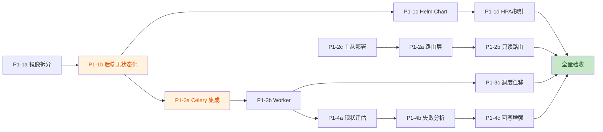

# Phase 1 生存线（0-3 月）详细落地计划

> 制定时间：2026-07-24
> 周期：12 周（2026-08-04 ~ 2026-10-26）
> 目标：消除单点瓶颈，建立水平扩展、读写分离、分布式执行与自愈 v1 基座
> 关联文档：[architecture-competitive-analysis.md](./architecture-competitive-analysis.md)

---

## 一、总览

### 1.1 范围与目标

| 子项目 | 核心目标 | 关键指标 |
|--------|----------|----------|
| P1-1 K8s 编排 + 后端无状态化 | 后端可水平伸缩 ≥10 实例，HPA 自动扩缩 | 滚动升级零停机，Pod 启动 ≤30s |
| P1-2 MySQL 读写分离 | 读流量路由至从库，主库写压力下降 ≥60% | 读 QPS ≥3x，主从延迟 ≤500ms |
| P1-3 分布式执行引擎 | 测试任务分布式调度，≥50 并发 | 任务投递到启动 ≤2s，Worker 水平扩展 |
| P1-4 自愈 v1 强化 | 元素定位失败自动恢复，成功率 ≥80% | 自愈覆盖率 ≥70% 步骤，误报率 ≤5% |

### 1.2 12 周甘特图

```
2026-08                                            2026-09                                            2026-10
W1  W2  W3  W4  W5  W6  W7  W8  W9  W10 W11 W12     W1  W2  W3  W4  W5  W6  W7  W8  W9  W10 W11 W12
│   │   │   │   │   │   │   │   │   │   │   │      │   │   │   │   │   │   │   │   │   │   │   │
├──────────────────────────────────── P1-1 K8s 编排 + 无状态化 ────────────────────────────────────┤
│ 准备 │ 镜像拆分 │ 无状态化 │ Helm Chart │ HPA/探针 │ 灰度验收 │                              │
│      ├──────────────────────────────── P1-2 读写分离 ────────────────────────────────────────┤   │
│      │ 基线 │ 路由层 │ 只读路由 │ 主从部署 │ 灰度 │ 验收 │                                    │   │
│      │      ├────────────────────────────── P1-3 分布式执行 ─────────────────────────────────┤   │
│      │      │ 架构设计 │ Celery 集成 │ Worker │ 调度迁移 │ 灰度 │ 验收 │                      │   │
│      │      │      ├──────────────────── P1-4 自愈 v1 ──────────────────────────────────┤   │   │
│      │      │      │ 现状评估 │ 失败分析 │ 回写增强 │ 指标埋点 │ 灰度 │ 验收 │            │   │   │
```

### 1.3 里程碑

| 里程碑 | 时间 | 准入条件 | 准出条件 |
|--------|------|----------|----------|
| M1 准备就绪 | W2 末 | 环境搭建完成，基线指标采集 | K8s 集群可用，MySQL 主从可用，Celery 集成方案评审通过 |
| M2 无状态化 + 读写分离 MVP | W6 末 | P1-1 镜像拆分完成，P1-2 路由层上线 | 后端 Pod 可重启不丢会话，读流量 50% 走从库 |
| M3 分布式执行 MVP | W9 末 | P1-3 Worker 上线，APScheduler 任务迁移 | 测试任务经 Celery 投递，≥20 并发稳定 |
| M4 自愈 v1 上线 | W11 末 | P1-4 失败分析 + 回写增强完成 | 自愈成功率 ≥80%，灰度 10% 租户 |
| M5 全量验收 | W12 末 | 4 个子项目灰度通过 | 全量切换，达成 1.1 全部关键指标 |

### 1.4 资源配置

| 角色 | W1-W3 | W4-W6 | W7-W9 | W10-W12 | 峰值 |
|------|-------|-------|-------|---------|------|
| 架构师 | 1 | 1 | 1 | 1 | 1 |
| 后端工程师 | 2 | 2 | 2 | 1 | 2 |
| DevOps | 1 | 1 | 0.5 | 0.5 | 1 |
| DBA | 0.5 | 1 | 0.5 | 0 | 1 |
| AI 工程师 | 0 | 0 | 0.5 | 1 | 1 |
| QA | 0.5 | 0.5 | 1 | 1 | 1 |
| **合计** | **5** | **5.5** | **5** | **4.5** | **6** |

### 1.5 子项目依赖关系



**关键路径**：P1-1b 无状态化 → P1-3a Celery 集成 → P1-3b Worker → P1-4 自愈 v1
**可并行**：P1-2 读写分离与 P1-1 无状态化在 W3-W6 并行

---

## 二、P1-1 K8s 编排 + 后端无状态化

### 2.1 目标与范围

**目标**：将单机 Docker Compose 部署迁移至 Kubernetes，后端服务无状态化，支持 HPA 水平自动伸缩。

**范围**：
- 拆分单体镜像为「前端 Nginx」「后端 API」「Worker」（Worker 镜像与后端共享，启动命令不同）
- 后端无状态化：会话/上传文件外置
- 编写 Helm Chart，支持多环境（dev/staging/prod）
- 配置 HPA、就绪/存活探针、滚动升级

**非目标**（Phase 1 不做）：
- 多租户 schema 隔离（Phase 3）
- Service Mesh（Phase 2）
- 跨集群灾备（Phase 4）

### 2.2 前置依赖

- K8s 集群可用（1.28+），`kubectl`/`helm` 已安装
- 对象存储可用（MinIO 自建 或 云厂商 S3 兼容）
- 现有 Docker Compose 部署保持运行，作为回退基线

### 2.3 任务分解（WBS）

| 任务编号 | 任务 | 工期 | 负责人 | 交付物 |
|----------|------|------|--------|--------|
| P1-1a-1 | 拆分 Dockerfile：后端 API 镜像（去除前端构建） | 2d | DevOps | `Dockerfile.api` |
| P1-1a-2 | 拆分 Worker 镜像（含 Playwright，无 Nginx） | 2d | DevOps | `Dockerfile.worker` |
| P1-1a-3 | 前端独立镜像（Nginx + dist） | 1d | DevOps | `Dockerfile.frontend` |
| P1-1a-4 | 镜像 CI 构建（GitHub Actions / GitLab CI） | 2d | DevOps | `.github/workflows/docker.yml` |
| P1-1b-1 | 会话状态外置：JWT 已无状态，验证 Rate Limit Redis 已外置 | 1d | 后端 | 验证报告 |
| P1-1b-2 | 上传文件迁移至对象存储：抽象 `StorageBackend` 接口 | 3d | 后端 | `app/services/storage/` |
| P1-1b-3 | 实现 `LocalStorageBackend` 与 `S3StorageBackend` | 2d | 后端 | 同上 |
| P1-1b-4 | 改造上传/下载端点，通过 StorageBackend 读写 | 2d | 后端 | 端点改造 + 测试 |
| P1-1b-5 | 历史 uploads 数据迁移脚本（本地 → S3） | 1d | 后端 | `scripts/migrate_uploads_to_s3.py` |
| P1-1c-1 | Helm Chart 骨架：Chart.yaml / values.yaml | 1d | DevOps | `deploy/helm/ai-testmaster/` |
| P1-1c-2 | 后端 Deployment + Service 模板 | 1d | DevOps | `templates/api-deployment.yaml` |
| P1-1c-3 | Worker Deployment 模板（独立 HPA） | 1d | DevOps | `templates/worker-deployment.yaml` |
| P1-1c-4 | 依赖中间件：MySQL/Redis 使用 Bitnami 子 Chart 或外部服务 | 2d | DevOps | `values.yaml` 依赖配置 |
| P1-1c-5 | ConfigMap / Secret 管理（环境变量注入） | 1d | DevOps | `templates/configmap.yaml` |
| P1-1c-6 | Ingress 配置（TLS 终止、路由） | 1d | DevOps | `templates/ingress.yaml` |
| P1-1d-1 | HPA：CPU ≥70% 扩容，min 2 / max 10 | 1d | DevOps | `templates/api-hpa.yaml` |
| P1-1d-2 | 就绪探针 `/health/ready`、存活探针 `/health/live` | 1d | 后端 | 端点实现 |
| P1-1d-3 | 滚动升级策略：maxSurge 1 / maxUnavailable 0 | 0.5d | DevOps | `strategy` 配置 |
| P1-1d-4 | PodDisruptionBudget（minAvailable 1） | 0.5d | DevOps | `templates/pdb.yaml` |
| P1-1e-1 | Staging 环境部署 + 灰度验证 | 3d | DevOps + QA | 部署文档 + 验收报告 |
| P1-1e-2 | 回归测试：核心流程在 K8s 下通过 | 2d | QA | 测试报告 |

### 2.4 技术方案要点

**镜像拆分原则**：
- 后端 API 镜像不含 Playwright（仅 API 服务），体积减至 ~400MB
- Worker 镜像含 Playwright + Chromium，体积 ~1.2GB，独立扩缩
- 前端镜像 Nginx + dist 静态资源，体积 ~50MB

**无状态化关键设计**：
```python
# app/services/storage/backend.py（新增，<80 行）
from abc import ABC, abstractmethod

class StorageBackend(ABC):
    @abstractmethod
    async def upload(self, key: str, data: bytes, content_type: str) -> str: ...
    @abstractmethod
    async def download(self, key: str) -> bytes: ...
    @abstractmethod
    async def presigned_url(self, key: str, expires: int) -> str: ...

# 通过构造函数注入，禁止直接 new
class StorageService:
    def __init__(self, backend: StorageBackend):
        self._backend = backend
```

**Helm Chart 结构**：
```
deploy/helm/ai-testmaster/
├── Chart.yaml
├── values.yaml              # 默认值
├── values-dev.yaml          # 环境覆盖
├── values-staging.yaml
├── values-prod.yaml
└── templates/
    ├── _helpers.tpl
    ├── api-deployment.yaml
    ├── api-hpa.yaml
    ├── api-service.yaml
    ├── worker-deployment.yaml
    ├── worker-hpa.yaml
    ├── frontend-deployment.yaml
    ├── configmap.yaml
    ├── secret.yaml
    ├── ingress.yaml
    └── pdb.yaml
```

### 2.5 风险与缓释

| 风险 | 等级 | 缓释方案 |
|------|------|----------|
| 上传文件迁移丢失 | 高 | 双写期 1 周（本地 + S3），校验 SHA256 后切流量 |
| K8s 集群不可用 | 中 | 保留 Docker Compose 部署作为回退，回退演练 1 次 |
| Worker 镜像过大拉取慢 | 中 | 使用私有镜像仓库 + 预拉取（imagePullPolicy: IfNotPresent） |
| Playwright 在容器内崩溃 | 中 | Worker 资源限制 ≥2CPU/4GB，dmesg 监控 OOM |
| Helm 配置复杂度 | 低 | 先 dev 环境验证，values 分层覆盖 |

### 2.6 验收标准

- [ ] `kubectl scale deploy/api --replicas=5` 后 5 个 Pod 全部 Ready ≤30s
- [ ] HPA 在 CPU ≥70% 时 2 分钟内扩容
- [ ] 滚动升级（`helm upgrade`）期间接口零 5xx
- [ ] 上传文件经 S3 读写，Pod 删除后文件不丢
- [ ] 核心回归测试 100% 通过（用例 ≥1197）

---

## 三、P1-2 MySQL 读写分离

### 3.1 目标与范围

**目标**：将读流量路由至 MySQL 从库，主库写压力下降 ≥60%，读 QPS 提升 ≥3x。

**范围**：
- 部署 MySQL 主从复制（1 主 1 从起步）
- 启用已就位的 secondary 引擎层（`_engine.py` 懒加载基础设施）
- 实现读写路由：写操作走主库，读操作走从库
- 主从延迟监控与告警

**非目标**：
- 多从库负载均衡（Phase 2 ProxySQL）
- 分库分表（Phase 3）

### 3.2 前置依赖

- P1-1c-4 中间件部署完成（或 MySQL 外部托管）
- `DATABASE_URL_SLAVE` 环境变量可注入
- 现有 `get_secondary_*` 接口已验证（单元测试覆盖）

### 3.3 任务分解（WBS）

| 任务编号 | 任务 | 工期 | 负责人 | 交付物 |
|----------|------|------|--------|--------|
| P1-2a-1 | 读写分离架构设计评审（路由策略、降级方案） | 1d | 架构师 | 设计文档 |
| P1-2a-2 | 实现 `ReadWriteRouter`：基于 `@readonly` 注解或方法名启发式 | 3d | 后端 | `app/db/router.py` |
| P1-2a-3 | 异步 Session 工厂改造：`get_async_read_session` / `get_async_write_session` | 2d | 后端 | `app/db/database/_session.py` 改造 |
| P1-2a-4 | 依赖注入：FastAPI `Depends` 提供 read/write session | 1d | 后端 | 端点改造示例 |
| P1-2b-1 | 识别只读端点：GET 类接口、统计报表、列表查询 | 2d | 后端 | 只读端点清单 |
| P1-2b-2 | 改造只读端点使用 `get_async_read_session` | 3d | 后端 | 端点改造 |
| P1-2b-3 | 改造 service 层只读方法接收 session 参数（去除硬编码 PrimarySession） | 3d | 后端 | service 改造 |
| P1-2b-4 | 写后立即读场景处理：强制走主库（`use_master=True` 标记） | 2d | 后端 | 主从一致性处理 |
| P1-2c-1 | MySQL 主从部署：Bitnami mysql Helm Chart 或外部 RDS | 2d | DBA | 主从实例 |
| P1-2c-2 | 主从复制配置：GTID 模式，半同步复制 | 1d | DBA | 复制配置 |
| P1-2c-3 | 从库只读锁定（`read_only=ON`，`super_read_only=ON`） | 0.5d | DBA | 配置确认 |
| P1-2c-4 | 备份与恢复演练 | 1d | DBA | 演练报告 |
| P1-2d-1 | 主从延迟监控：Prometheus mysql_exporter + `Seconds_Behind_Master` | 1d | DBA | 监控面板 |
| P1-2d-2 | 延迟告警规则：>500ms 告警，>2s 自动降级走主库 | 1d | 后端 | 降级逻辑 |
| P1-2e-1 | Staging 灰度：10% → 50% → 100% 读流量切从库 | 3d | 后端 + QA | 灰度报告 |
| P1-2e-2 | 性能基线对比：主库 QPS / 从库 QPS / P99 延迟 | 1d | QA | 性能报告 |

### 3.4 技术方案要点

**路由策略**：
```python
# app/db/router.py（新增，<100 行）
from typing import AsyncIterator
from sqlalchemy.ext.asyncio import AsyncSession
from app.db.database import (
    AsyncPrimarySessionLocal,
    get_async_secondary_session_local,
    _has_slave_url,
)

async def get_async_write_session() -> AsyncIterator[AsyncSession]:
    """写会话：始终走主库。"""
    async with AsyncPrimarySessionLocal() as session:
        yield session

async def get_async_read_session() -> AsyncIterator[AsyncSession]:
    """读会话：配置了 slave 走从库，否则降级走主库。"""
    factory = get_async_secondary_session_local() if _has_slave_url() else AsyncPrimarySessionLocal
    async with factory() as session:
        yield session
```

**写后读一致性**：
- 端点级标记：`@router.get("/...", dependencies=[Depends(require_master)])`
- 或在 service 方法内显式传 `session_source="master"`

**降级机制**：
- 延迟 >2s：`get_async_read_session` 自动返回主库 session
- 从库连接失败：重试 1 次后降级主库，告警

### 3.5 风险与缓释

| 风险 | 等级 | 缓释方案 |
|------|------|----------|
| 主从延迟导致写后读不一致 | 高 | 写后 5s 内的读强制走主库（基于 `X-Request-Timestamp`） |
| 从库故障 | 中 | 健康检查 + 自动降级主库，告警 |
| 复制中断 | 中 | GTID 模式 + 监控 `Slave_IO_Running` / `Slave_SQL_Running` |
| 只读端点误判为写 | 中 | 代码评审 + 单元测试覆盖所有只读端点 |
| 半同步复制退化为异步 | 低 | 超时配置 ≥3s，监控 `Rpl_semi_sync_master_status` |

### 3.6 验收标准

- [ ] `DATABASE_URL_SLAVE` 配置后，从库连接池正常创建
- [ ] GET 类接口读流量 100% 走从库（日志验证）
- [ ] 主库 QPS 下降 ≥60%（对比基线）
- [ ] 从库 QPS ≥ 主库 2x
- [ ] 主从延迟 P95 ≤500ms
- [ ] 写后读零不一致（自动化测试用例覆盖）
- [ ] 从库故障 30s 内降级主库，零 5xx

---

## 四、P1-3 分布式执行引擎

### 4.1 目标与范围

**目标**：测试任务经 Celery + Redis 分布式调度，Worker 水平扩展，支持 ≥50 并发执行。

**范围**：
- 引入 Celery 5.x + Redis broker
- 实现 Worker 池（与后端 API 共享镜像，启动命令不同）
- 迁移 APScheduler 现有任务至 Celery Beat
- 测试执行任务（Pipeline / 单步）走 Celery 投递
- 任务状态回写与进度查询

**非目标**：
- 跨集群 Worker（Phase 2）
- 任务优先级队列（Phase 2）
- 执行结果流式回传（Phase 2 WebSocket）

### 4.2 前置依赖

- P1-1b 后端无状态化完成（Worker 无本地状态）
- Redis 已部署（P1-1c-4）
- 测试执行引擎已 async 化（现有 `test_execution_engine_v2.py`）

### 4.3 任务分解（WBS）

| 任务编号 | 任务 | 工期 | 负责人 | 交付物 |
|----------|------|------|--------|--------|
| P1-3a-1 | 分布式执行架构设计评审（任务模型、状态机、失败重试） | 2d | 架构师 | 设计文档 |
| P1-3a-2 | 引入 Celery 依赖：`celery[redis]==5.4.0` | 0.5d | 后端 | `requirements.txt` |
| P1-3a-3 | Celery 应用工厂：`app/tasks/celery_app.py` | 2d | 后端 | `celery_app.py` |
| P1-3a-4 | 任务基类：`BaseTask`（统一日志、异常、状态回写） | 2d | 后端 | `app/tasks/base.py` |
| P1-3a-5 | 配置管理：broker/backend/并发数/超时/重试 | 1d | 后端 | `app/core/celery_config.py` |
| P1-3b-1 | 测试执行任务封装：`execute_pipeline_task(pipeline_run_id)` | 3d | 后端 | `app/tasks/test_execution.py` |
| P1-3b-2 | 异步上下文处理：Celery Worker 内 `asyncio.run` 桥接 | 2d | 后端 | 桥接工具 |
| P1-3b-3 | 任务状态回写：DB 更新 + Redis 进度缓存 | 2d | 后端 | 状态回写逻辑 |
| P1-3b-4 | 失败重试策略：指数退避，最多 3 次 | 1d | 后端 | 重试配置 |
| P1-3b-5 | Worker 启动脚本与并发配置（gevent/eventlet 池） | 1d | 后端 | `worker_start.sh` |
| P1-3c-1 | APScheduler 任务迁移：`pipeline_timeout_check` → Celery Beat | 1d | 后端 | 迁移完成 |
| P1-3c-2 | `self_test_scheduler` 迁移至 Celery Beat | 2d | 后端 | 迁移完成 |
| P1-3c-3 | 保留 APScheduler 仅作单机兜底（可选） | 1d | 后端 | 决策记录 |
| P1-3c-4 | 端点改造：触发执行改为 `task.delay()` 异步投递 | 2d | 后端 | 端点改造 |
| P1-3c-5 | 进度查询端点：从 Redis 读取实时进度 | 1d | 后端 | 端点实现 |
| P1-3d-1 | Worker HPA：基于队列长度自动扩缩 | 1d | DevOps | `worker-hpa.yaml` |
| P1-3d-2 | Worker 优雅终止：`warm_shutdown` 处理在途任务 | 1d | 后端 | 信号处理 |
| P1-3d-3 | 死信队列处理：失败任务转入 DLQ 人工介入 | 1d | 后端 | DLQ 配置 |
| P1-3e-1 | Staging 灰度：单 Worker → 5 Worker → 20 Worker | 3d | 后端 + QA | 灰度报告 |
| P1-3e-2 | 压测：50 并发任务稳定性测试 | 2d | QA | 压测报告 |

### 4.4 技术方案要点

**Celery 应用工厂**：
```python
# app/tasks/celery_app.py（新增，<80 行）
from celery import Celery
from app.core.config import settings

def create_celery_app() -> Celery:
    app = Celery(
        "ai_testmaster",
        broker=settings.REDIS_URL,
        backend=settings.REDIS_URL,
        include=["app.tasks.test_execution", "app.tasks.scheduler"],
    )
    app.conf.update(
        task_serializer="json",
        result_serializer="json",
        accept_content=["json"],
        timezone="Asia/Shanghai",
        enable_utc=True,
        task_acks_late=True,           # 任务执行完成才确认
        task_reject_on_worker_lost=True,  # Worker 崩溃任务重投
        worker_prefetch_multiplier=1,  # 避免长任务饿死队列
        task_track_started=True,
        task_time_limit=3600,
        task_soft_time_limit=3000,
    )
    return app

celery_app = create_celery_app()
```

**异步桥接**（Celery Worker 是同步进程）：
```python
# app/tasks/_async_bridge.py（新增，<50 行）
import asyncio
from functools import wraps

def async_task(coro_func):
    """将 async def 包装为 Celery 同步任务。"""
    @wraps(coro_func)
    def wrapper(*args, **kwargs):
        return asyncio.run(coro_func(*args, **kwargs))
    return wrapper
```

**任务状态回写**：
- DB：`pipeline_runs.status` / `test_tasks.status` 字段更新
- Redis：`task:{task_id}:progress` 缓存实时进度（TTL 1h）
- 查询端点优先读 Redis，回退读 DB

### 4.5 风险与缓释

| 风险 | 等级 | 缓释方案 |
|------|------|----------|
| Worker 内 async 桥接死锁 | 高 | 单 Worker 内 `asyncio.run` 串行，禁止嵌套事件循环 |
| Playwright 进程残留 | 高 | 任务结束 `browser.close()` + 定期 `pkill -f chromium` 兜底 |
| Redis broker 单点 | 中 | Phase 1 单 Redis，Phase 2 升级 Sentinel/Cluster |
| 任务重复执行 | 中 | `task_acks_late=True` + 幂等设计（基于 pipeline_run_id 去重） |
| 长任务超时 | 中 | `task_time_limit=3600`，超时强制终止 + 告警 |
| 状态回写不一致 | 中 | DB 与 Redis 双写，Redis 失败仅告警不影响主流程 |

### 4.6 验收标准

- [ ] 任务投递到 Worker 启动 ≤2s
- [ ] 20 Worker 并发 50 任务稳定运行 30 分钟无崩溃
- [ ] Worker 崩溃后任务自动重投（`task_reject_on_worker_lost` 验证）
- [ ] 任务进度查询延迟 ≤200ms（Redis 命中）
- [ ] APScheduler 任务 100% 迁移至 Celery Beat
- [ ] 现有测试用例在分布式执行下 100% 通过

---

## 五、P1-4 自愈 v1 强化

### 5.1 目标与范围

**目标**：元素定位失败时自动恢复执行，自愈成功率 ≥80%，覆盖 ≥70% 的步骤类型。

**范围**：
- 评估现有 5 个 self_healing mixin 的能力与缺口
- 增强失败分析：分类（元素消失 / DOM 变更 / 加载延迟 / 环境噪声）
- 强化定位器回写：自愈成功后持久化新定位器
- 自愈指标埋点与成功率统计
- 灰度发布与效果验证

**非目标**：
- 视觉 AI 自愈（Phase 2）
- 跨用例学习（Phase 3）
- 自动生成修复 PR（Phase 4）

### 5.2 前置依赖

- P1-3 分布式执行完成（自愈在 Worker 内执行）
- 现有 self_healing mixin 代码可运行（已验证）
- DeepSeek API 可用（自愈依赖 LLM）

### 5.3 任务分解（WBS）

| 任务编号 | 任务 | 工期 | 负责人 | 交付物 |
|----------|------|------|--------|--------|
| P1-4a-1 | 现状评估：5 个 mixin 能力矩阵、覆盖率、成功率基线 | 2d | AI | 评估报告 |
| P1-4a-2 | 失败用例采集：收集生产/测试环境定位失败样本 ≥50 | 2d | AI + QA | 样本库 |
| P1-4a-3 | 失败分类标签体系：`element_gone` / `dom_changed` / `load_delay` / `env_noise` | 1d | AI | 标签体系 |
| P1-4b-1 | 失败分析器：基于 DOM 快照 + 错误信息自动分类 | 3d | AI | `app/services/self_healing/failure_analyzer.py` |
| P1-4b-2 | 分类策略路由：`load_delay` → 重试；`dom_changed` → AI 自愈；`env_noise` → 标记跳过 | 2d | AI | 策略路由 |
| P1-4b-3 | AI 提示词优化：针对 `dom_changed` 场景提升定位准确率 | 3d | AI | 提示词模板 |
| P1-4b-4 | 多模态兜底：DOM 失败时启用视觉模型辅助定位 | 3d | AI | 视觉兜底逻辑 |
| P1-4c-1 | 定位器回写：自愈成功后更新 `test_cases.steps_json` 中的 selector | 2d | AI + 后端 | 回写逻辑 |
| P1-4c-2 | 回写审计日志：记录旧/新 selector、自愈策略、置信度 | 1d | AI | 审计表 |
| P1-4c-3 | 回写冲突处理：同一用例多次自愈结果合并策略 | 1d | AI | 合并策略 |
| P1-4d-1 | 指标埋点：自愈触发次数、成功率、平均耗时、Token 消耗 | 2d | AI | 埋点 |
| P1-4d-2 | Prometheus 指标导出：`self_heal_success_total` / `self_heal_failure_total` | 1d | AI | 指标定义 |
| P1-4d-3 | Grafana 面板：自愈成功率、分类分布、趋势 | 1d | AI | 面板 JSON |
| P1-4e-1 | 单元测试：失败分析器、策略路由、回写逻辑 | 2d | AI + QA | 测试用例 |
| P1-4e-2 | 集成测试：50 个失败样本回归 | 2d | QA | 测试报告 |
| P1-4e-3 | Staging 灰度：10% 租户开启自愈 v1 | 3d | AI + QA | 灰度报告 |
| P1-4e-4 | 效果评估：成功率、误报率、Token 成本 | 1d | AI | 评估报告 |

### 5.4 技术方案要点

**失败分析器**：
```python
# app/services/self_healing/failure_analyzer.py（新增，<120 行）
from enum import Enum
from dataclasses import dataclass

class FailureType(Enum):
    ELEMENT_GONE = "element_gone"        # 元素从 DOM 消失
    DOM_CHANGED = "dom_changed"          # DOM 结构变更但元素存在
    LOAD_DELAY = "load_delay"            # 元素未及时加载
    ENV_NOISE = "env_noise"              # 环境噪声（弹窗、网络）

@dataclass
class FailureAnalysis:
    failure_type: FailureType
    confidence: float
    suggested_strategy: str              # retry / ai_heal / skip
    evidence: dict                       # DOM 快照、错误信息

class FailureAnalyzer:
    """基于 DOM 快照与错误信息分析失败类型。"""
    def __init__(self, llm_client):
        self._llm = llm_client

    async def analyze(self, error: Exception, dom_snapshot: str) -> FailureAnalysis:
        ...
```

**回写审计表**：
```sql
CREATE TABLE self_healing_audit (
    id BIGINT PRIMARY KEY AUTO_INCREMENT,
    test_case_id INT NOT NULL,
    step_index INT NOT NULL,
    old_selector VARCHAR(512),
    new_selector VARCHAR(512),
    failure_type VARCHAR(32),
    strategy VARCHAR(32),
    confidence DECIMAL(5,2),
    token_cost INT,
    created_at DATETIME DEFAULT CURRENT_TIMESTAMP,
    INDEX idx_case (test_case_id, step_index)
);
```

### 5.5 风险与缓释

| 风险 | 等级 | 缓释方案 |
|------|------|----------|
| AI 自愈误判导致用例假通过 | 高 | 置信度 <0.7 时标记 `low_confidence`，不自动回写 |
| Token 成本失控 | 中 | 单次自愈 Token 上限 2000，超限降级为重试 |
| 回写污染用例库 | 中 | 回写前 diff 展示，支持一键回滚 |
| 视觉模型延迟过高 | 中 | 视觉兜底设 10s 超时，超时降级为失败 |
| 灰度租户体验下降 | 中 | 灰度开关实时可关，5 分钟内回退 |

### 5.6 验收标准

- [ ] 50 个失败样本自愈成功率 ≥80%
- [ ] 自愈覆盖 ≥70% 步骤类型（点击/输入/选择/断言）
- [ ] 误报率（假通过）≤5%
- [ ] 单次自愈平均耗时 ≤8s
- [ ] 单次自愈 Token 消耗 ≤2000
- [ ] 自愈回写可回滚（审计日志 + 回滚端点）
- [ ] Grafana 面板可查看成功率、分类分布、Token 成本

---

## 六、跨项目并行策略与协同点

### 6.1 协同点

| 协同项 | 涉及子项目 | 协同机制 |
|--------|------------|----------|
| Worker 镜像 | P1-1 / P1-3 | P1-1a-2 Worker 镜像需满足 P1-3 Worker 启动 Celery 命令 |
| Redis 依赖 | P1-1 / P1-2 / P1-3 | 统一 Redis 实例，DB 0=broker，DB 1=cache，DB 2=progress |
| 配置注入 | P1-1 / 全部 | Helm values 统一管理 `DATABASE_URL_SLAVE` / `REDIS_URL` / `STORAGE_BACKEND` |
| 监控面板 | P1-1 / P1-2 / P1-3 / P1-4 | 统一 Grafana，分区面板：基础设施 / 数据库 / 执行 / 自愈 |

### 6.2 并行策略

- **W1-W2**：P1-1a 镜像拆分 + P1-2a 路由层设计 + P1-3a 架构设计并行
- **W3-W6**：P1-1b 无状态化 + P1-2b 只读路由 + P1-3a Celery 集成并行
- **W7-W9**：P1-1c/d Helm + HPA + P1-3b/c Worker + 调度迁移并行
- **W10-W12**：P1-4 自愈 v1 + 全量灰度验收

---

## 七、风险矩阵汇总

| 风险编号 | 风险 | 子项目 | 等级 | 发生概率 | 缓释方案 | 负责人 |
|----------|------|--------|------|----------|----------|--------|
| R-01 | 上传文件迁移丢失 | P1-1 | 高 | 中 | 双写期 + SHA256 校验 | 后端 |
| R-02 | K8s 集群不可用 | P1-1 | 中 | 低 | Docker Compose 回退 + 演练 | DevOps |
| R-03 | 主从延迟导致不一致 | P1-2 | 高 | 中 | 写后读强制主库 + 延迟降级 | 后端 |
| R-04 | 从库故障 | P1-2 | 中 | 低 | 健康检查 + 自动降级 | DBA |
| R-05 | Worker async 桥接死锁 | P1-3 | 高 | 中 | 串行 asyncio.run + 压测验证 | 后端 |
| R-06 | Playwright 进程残留 | P1-3 | 高 | 高 | 任务后清理 + 定期 pkill | 后端 |
| R-07 | 任务重复执行 | P1-3 | 中 | 中 | acks_late + 幂等设计 | 后端 |
| R-08 | AI 自愈误判假通过 | P1-4 | 高 | 中 | 置信度阈值 + 不自动回写低置信 | AI |
| R-09 | Token 成本失控 | P1-4 | 中 | 中 | 单次上限 + 降级 | AI |
| R-10 | 灰度租户体验下降 | P1-4 | 中 | 低 | 实时开关 + 5 分钟回退 | AI |

---

## 八、验收标准汇总（M5 全量验收）

### 8.1 功能验收

| 验收项 | 指标 | 验证方式 |
|--------|------|----------|
| K8s 水平扩展 | ≥10 Pod，扩容 ≤2min | `kubectl scale` + HPA 测试 |
| 滚动升级零停机 | 升级期间 5xx=0 | 压测期间 `helm upgrade` |
| 上传文件持久化 | Pod 删除后文件可读 | S3 读写验证 |
| 读流量路由 | GET 接口 100% 走从库 | 日志采样验证 |
| 主从延迟 | P95 ≤500ms | Prometheus 查询 |
| 分布式执行 | 50 并发稳定 30min | 压测脚本 |
| 任务重投 | Worker 崩溃任务不丢 | 故障注入测试 |
| 自愈成功率 | ≥80% | 50 样本回归 |
| 自愈误报率 | ≤5% | 人工复核 |

### 8.2 性能验收

| 指标 | 基线 | 目标 | 验证方式 |
|------|------|------|----------|
| 后端 API P99 | 待采集 | ≤基线 1.1x | 压测对比 |
| 读 QPS | 单库基线 | ≥3x | 压测对比 |
| 主库 QPS | 基线 | 下降 ≥60% | 监控对比 |
| 任务投递延迟 | N/A | ≤2s | 日志时间戳 |
| 自愈平均耗时 | N/A | ≤8s | 埋点统计 |

### 8.3 质量验收

- [ ] 核心回归测试 100% 通过（用例 ≥1197）
- [ ] 新增代码覆盖率 ≥95%
- [ ] 单文件 ≤350 行
- [ ] 类型检查 `mypy` 无错
- [ ] 新增 ADR 文档（K8s 部署、读写分离、Celery 集成、自愈 v1）

---

## 九、交付物清单

### 9.1 代码交付

| 路径 | 说明 |
|------|------|
| `Dockerfile.api` / `Dockerfile.worker` / `Dockerfile.frontend` | 拆分后的镜像 |
| `app/services/storage/` | 存储抽象层（Local + S3） |
| `app/db/router.py` | 读写会话路由 |
| `app/tasks/celery_app.py` / `app/tasks/test_execution.py` | Celery 应用与任务 |
| `app/services/self_healing/failure_analyzer.py` | 失败分析器 |
| `deploy/helm/ai-testmaster/` | Helm Chart |
| `scripts/migrate_uploads_to_s3.py` | 数据迁移脚本 |

### 9.2 文档交付

| 路径 | 说明 |
|------|------|
| `docs/adr/0010-k8s-deployment.md` | K8s 部署 ADR |
| `docs/adr/0011-read-write-split.md` | 读写分离 ADR |
| `docs/adr/0012-celery-integration.md` | Celery 集成 ADR |
| `docs/adr/0013-self-healing-v1.md` | 自愈 v1 ADR |
| `docs/phase1-acceptance-report.md` | 验收报告 |

### 9.3 运维交付

| 路径 | 说明 |
|------|------|
| `deploy/grafana/phase1-dashboards.json` | Grafana 面板 |
| `deploy/prometheus/phase1-alerts.yml` | 告警规则 |
| `deploy/runbooks/phase1-*.md` | 运维手册（故障处理） |

---

## 十、下一步行动

1. **W1 启动会**：架构师召集，确认资源配置与集群就绪
2. **环境准备**：DevOps 完成 K8s dev 集群 + MinIO 部署
3. **基线采集**：QA 采集当前 API P99 / 主库 QPS / 自愈成功率基线
4. **架构评审**：P1-1 / P1-2 / P1-3 设计文档评审（W1 末）

> 各子项目启动顺序：P1-1a → P1-2a → P1-3a → P1-4a（W1-W2 并行启动）
